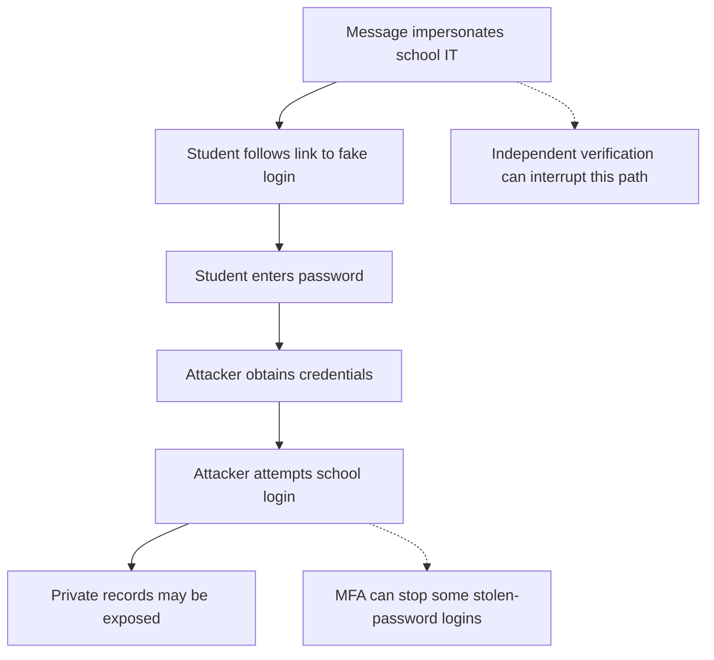

# Session 2 — Malware and social engineering

[Previous session](01-security-goals-and-risk.mdx) · [Course index](README.mdx) · [Next session](03-accounts-and-access-control.mdx)

**Time:** 60 minutes. **Goal:** Explain how an attack works, rather than simply naming it.

| Task | Minutes |
|---|---:|
| Recall the CIA triad | 5 |
| Read notes and worked example | 15 |
| Core video and question | 10 |
| Investigate the fictional message | 20 |
| Self-check and exit question | 10 |

## 1. Malware is an umbrella term

**Malware** means malicious software. Different labels describe how it spreads, how it disguises itself or what harm it causes.

| Type | Defining feature | Possible effect |
|---|---|---|
| Virus | Attaches to a host file or program; runs and spreads when infected material is executed | Changes or damages files |
| Worm | Replicates and spreads between systems without attaching to a host file | Disrupts services or delivers another malicious payload |
| Trojan | Pretends to be legitimate software | Installs hidden remote access or steals data |
| Ransomware | Extorts a victim, commonly by encrypting files or blocking access | Makes records unavailable; may accompany data theft |
| Spyware | Secretly collects information | Reveals browsing activity or credentials |

These categories overlap. A fake useful program can be a Trojan that installs spyware. Not every piece of malware is a virus, and not every malware infection requires someone to open an attachment.

## 2. Social engineering targets decisions

**Social engineering** manipulates a person into an unsafe action. **Phishing** commonly uses deceptive emails or messages to obtain information, deliver malware or persuade a person to transfer money. A targeted attempt aimed at a particular person is often called **spear phishing**.

Attackers may exploit urgency, fear, curiosity or authority. A message can contain a real name, perfect grammar and copied branding. These features do not prove it is genuine. Equally, an unusual message is a reason to verify, not proof that an attack has occurred.

**Read the diagram:** This is one possible attack route. The final outcome is not guaranteed: account permissions and authentication controls affect what the attacker can do.

## 3. Worked explanation

Weak answer: “Phishing hacks the student and steals data.”

Stronger answer: “An attacker sends a message pretending to be school IT and links to a copied login page. If the student submits credentials, the attacker can try them on the genuine service. If that login succeeds and the account can read club records, the attacker can copy members' details, compromising confidentiality.”

Notice the causal links and the conditions. Opening a message is not the same as giving away a password; clicking a link does not always mean an account is compromised.

## 4. Responding to a suspicious message

Do not use the message's contact details to establish whether it is genuine. Open a previously known school portal independently or contact the school through a known channel. Report suspicious messages using school procedures. If information has already been entered, promptly tell school IT what happened so they can secure the account and investigate.

## YouTube viewing

1. **Core:** [What is Phishing — IBM Technology](https://www.youtube.com/watch?v=gWGhUdHItto). Watch for up to 7 minutes. Then identify the action an attacker wants a victim to take and a safe way to verify the request.
2. **Optional extension:** [What is Malware? Let's Hear the Hacker's Viewpoint — IBM Technology](https://www.youtube.com/watch?v=mqzP7gJDM2s). Watch conceptually; do not reproduce any demonstrations. Explain how apparently useful software could cause harm.

## Activity — A fictional school message

> Your school storage closes in 30 minutes. Sign in at school-storage-check.example to keep your work. Do not contact IT because that will delay verification.

The address is fictional; there is no need to visit it.

1. Identify three warning signs and explain why each deserves checking.
2. Describe a possible route from this message to disclosure of contact details.
3. Suggest two controls at different points in that route.
4. Classify each case: a fake game secretly records keystrokes; malicious code attaches to a document; software independently spreads to other vulnerable devices.
5. Write 80–120 words explaining how ransomware could affect two security goals.

## Check your work

The urgent deadline, unfamiliar destination and instruction not to verify are warning signs. Safe verification can prevent credential submission; MFA may prevent a later login; least privilege limits accessible records if an account is compromised.

The fake game could be both a Trojan and spyware. The attached malicious code may be a virus when it infects host material and replicates. Independent replication describes a worm.

Ransomware commonly harms availability by preventing access. If records are copied and leaked, confidentiality is also harmed. Describe this additional action rather than assuming encryption itself leaks information.

**Exit question:** Is phishing a type of virus? Explain. It is a deceptive attack method that may deliver malware; it is not itself a virus.

**Key terms:** malware, virus, worm, Trojan, ransomware, spyware, social engineering, phishing, spear phishing.
