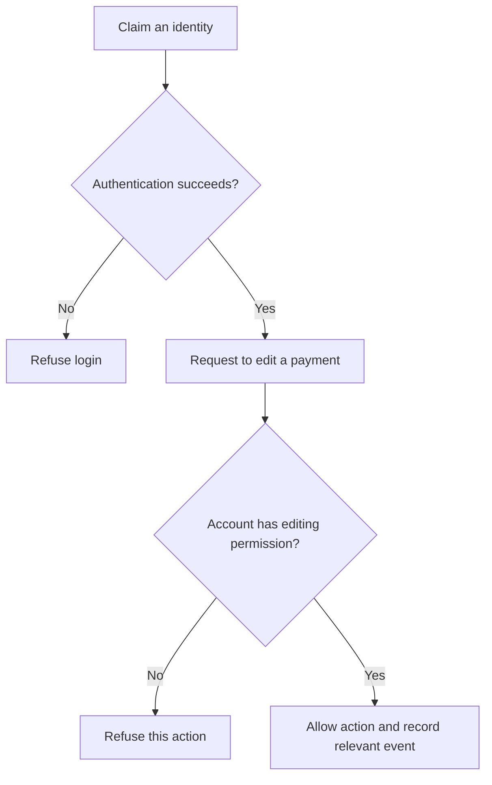

# Session 3 — Accounts and access control

[Previous session](02-malware-and-social-engineering.mdx) · [Course index](README.mdx) · [Next session](04-encryption-and-hashing.mdx)

**Time:** 60 minutes. **Goal:** Distinguish identity checks from permission checks and explain how account protections help.

| Task | Minutes |
|---|---:|
| Recall phishing and one defence | 5 |
| Read notes and diagram | 15 |
| Core video and question | 10 |
| Permissions activity and explanation | 20 |
| Check and exit question | 10 |

## 1. Identity and permission are separate

**Identification** is a claim, such as entering a username. **Authentication** checks that claim. **Authorisation** decides whether the identified account is permitted to perform a requested action.

A student might authenticate successfully and still be refused permission to edit payment records. Permission checks should apply to the requested resource and action, not just to whether somebody logged in earlier.

**Read the diagram:** Passing the first decision does not guarantee passing the second. Recording an event supports later investigation; it does not guarantee that an action was appropriate.

## 2. Password attacks and protections

An attacker may guess likely passwords, systematically try combinations, reuse credentials stolen from another site, or trick someone into disclosing a password. These methods are not all defeated by the same control.

Long, unpredictable passwords make guessing harder. Unique passwords reduce the damage when another service is breached. A password manager helps generate and store separate credentials. Replacing letters in a predictable word with familiar symbols does not necessarily make it hard to guess.

Services can limit repeated attempts and detect suspicious activity. Such controls constrain online guessing; they do not have the same effect when an attacker has stolen password hashes and is testing guesses offline.

Never use example passwords from a lesson as real passwords.

## 3. Multi-factor authentication

Authentication factors include something you **know** (password), **have** (security key) or **are** (biometric characteristic). MFA uses more than one factor type. A password plus a second password is still one type.

A stolen password may be insufficient when a separate factor is required. However, some codes can be phished and an unlocked device or stolen session can create other routes to access. Phishing-resistant methods such as suitable security keys provide stronger protection against fake-login attacks than typed one-time codes. Plan how authorised users recover access if a factor is lost.

Current practical guidance: [NCSC — Secure your important online accounts](https://www.ncsc.gov.uk/collection/small-organisations-guide-to-cyber-security/secure-your-important-online-accounts).

## 4. Least privilege and accountability

**Least privilege** means providing only the permissions necessary for a role. Individual accounts let administrators change one person's access without changing everyone's login. Removing access when someone leaves is as important as setting it up.

**Audit logs** record events such as logins and edits. They support investigation, especially when accounts are individual. They are evidence to interpret: a recorded account name does not prove which person was using a compromised account.

**Worked example:** A treasurer can edit payment status but cannot create administrator accounts. A member can view only their own payment status. The supervisor approves changes in responsibility. Each role can do its job without receiving every permission.

## YouTube viewing

1. **Core:** [Cybersecurity Architecture: Five Principles to Follow (and One to Avoid) — IBM Technology](https://www.youtube.com/watch?v=jq_LZ1RFPfU&t=260s). Watch **04:20–07:55**, the least-privilege section. Use the rest of the 10-minute window to explain why a treasurer should not automatically be an administrator.
2. **Optional:** [How to Choose a Password — Computerphile](https://www.youtube.com/watch?v=3NjQ9b3pgIg). Explain why predictable human choices matter. Treat the video as a conceptual explanation; use the current written guidance above rather than historical cracking-speed estimates.

## Activity — Design the permissions

Create a table for a member, student treasurer and teacher supervisor. Decide who may view their own payment status, view all payments, edit payments and manage permissions. Assume the application supports these restrictions.

Then answer:

1. Why is one shared account a problem even if its password is long?
2. Classify password + PIN and password + security key as single-factor or multi-factor.
3. Explain one security benefit and one usability cost of MFA.
4. Write a four-sentence explanation of why successful authentication should not give every student editing access.

## Check your work

An appropriate table gives members only their own status; treasurers can view and edit payment records; the supervisor manages permissions and can oversee records. Other decisions are acceptable when responsibilities justify them.

A shared account prevents separate permissions and weakens accountability. Password + PIN uses two knowledge secrets; password + security key combines knowledge and possession. MFA adds a barrier after password theft, while recovery procedures and device availability introduce practical costs.

**Exit question:** Explain authentication and authorisation using a library system rather than the club.

**Key terms:** identification, authentication, authorisation, MFA, least privilege, credentials, audit log.
