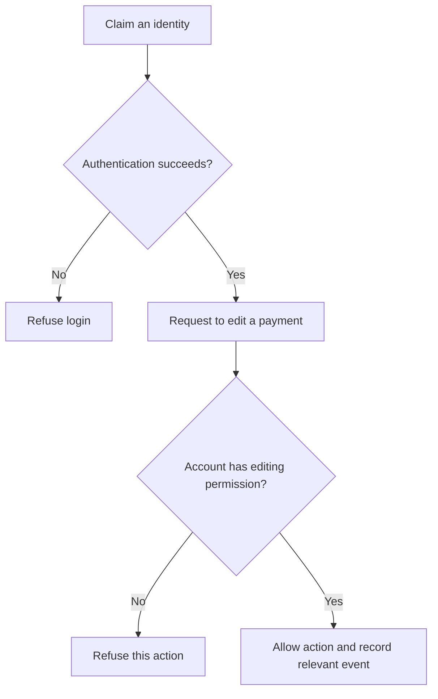

import { ArticleShell, Kicker, Headline, Dek, Byline, Hero, Lede, Callout, KeyTerms, CheckWork, Roadmap, UnitLinks } from '@site/src/components/ArticleKit';

<ArticleShell>

<Kicker>Computer Science · Security Unit · Session 3 of 8</Kicker>

<Headline>Logging in and being allowed to act are two different questions.</Headline>

<Dek>A student can authenticate perfectly — right password, right account — and still be refused permission to edit payment records. That gap between "who are you" and "what are you allowed to do" is where this session lives: password attacks, multi-factor authentication, least privilege, and the audit logs that record it all afterwards.</Dek>

<Byline>
  <strong>Session time:</strong> 60 minutes
  ·
  <strong>Homework:</strong> none this week
  ·
  Builds on Session 2's attack routes
</Byline>

<Hero
  src="/img/12DGT/computer-security/hero-03-accounts-and-access-control.jpg"
  alt="A key inserted into a keyhole in a wall."
  caption="A key that opens the door doesn't decide which rooms you're allowed into once you're inside. Photo: Amol Tyagi / Unsplash"
/>

<Lede>

**Goal:** distinguish identity checks from permission checks, and explain how account protections actually help.

| Task | Minutes |
|---|---:|
| Recall phishing and one defence | 5 |
| Read notes and diagram | 15 |
| Core video and question | 10 |
| Permissions activity and explanation | 20 |
| Check and exit question | 10 |

</Lede>

## 1. Identity and permission are separate

**Identification** is a claim — entering a username. **Authentication** checks that claim. **Authorisation** decides whether the now-identified account is permitted to perform the specific action it's requesting.

A student might authenticate successfully and *still* be refused permission to edit payment records. Permission checks should apply to the requested resource and action — not just to whether somebody logged in at some point earlier.

*Reading the diagram: passing the first decision does not guarantee passing the second. Recording an event supports later investigation — it does not, by itself, guarantee the action was appropriate.*

## 2. Password attacks and protections

An attacker may guess likely passwords, systematically try combinations, reuse credentials stolen from another site, or simply trick someone into handing one over. These are different methods, and no single control defeats all of them at once.

<Callout kind="pitfall">

Replacing letters in a predictable word with familiar symbols — "p@ssw0rd1" for "password1" — does not necessarily make it hard to guess. Attackers already expect the substitution.

</Callout>

Long, unpredictable passwords make guessing harder. Unique passwords per service limit the damage when *another* service gets breached. A password manager helps generate and store separate credentials without you having to remember them all.

Services can limit repeated login attempts and flag suspicious activity. That constrains *online* guessing — it has no effect once an attacker has stolen password hashes and is testing guesses offline, away from any rate limit.

Never use example passwords from a lesson as real passwords.

## 3. Multi-factor authentication

Authentication factors come in three families: something you **know** (a password), something you **have** (a security key), something you **are** (a biometric characteristic). MFA requires more than one *type*. A password plus a second password is still one type, dressed up as two.

<Callout kind="example">

A stolen password may not be enough on its own when a separate factor is required. But some one-time codes can still be phished, and an already-unlocked device or a stolen session can open other routes in. Phishing-resistant methods — suitable security keys — resist fake-login attacks better than typed one-time codes do. Whatever you choose, plan how authorised users recover access if a factor is lost.

</Callout>

Current practical guidance: [NCSC — Secure your important online accounts](https://www.ncsc.gov.uk/collection/small-organisations-guide-to-cyber-security/secure-your-important-online-accounts).

## 4. Least privilege and accountability

**Least privilege** means giving a role only the permissions it actually needs. Individual accounts let an administrator change *one* person's access without touching everyone else's login. Removing access promptly when someone leaves matters just as much as setting it up correctly in the first place.

**Audit logs** record events — logins, edits — and support investigation, especially where accounts are individual rather than shared. Treat them as evidence to interpret, not proof: a recorded account name doesn't guarantee which person was actually behind the keyboard if that account was compromised.

<Callout kind="example">

A treasurer can edit payment status but cannot create administrator accounts. A member can view only their own payment status. The supervisor approves changes in responsibility. Each role does its job without receiving every permission going.

</Callout>

## Watch

<Callout kind="watch">

**Core (required):** [Cybersecurity Architecture: Five Principles to Follow (and One to Avoid) — IBM Technology](https://www.youtube.com/watch?v=jq_LZ1RFPfU&t=260s). Watch **04:20–07:55**, the least-privilege section, then use the rest of the 10-minute window to explain why a treasurer should not automatically be an administrator.

**Optional:** [How to Choose a Password — Computerphile](https://www.youtube.com/watch?v=3NjQ9b3pgIg). Explain why predictable human choices matter. Treat it as a conceptual explanation — use the written guidance above rather than the video's historical cracking-speed estimates.

</Callout>

## Activity — Design the permissions

<Callout kind="activity">

Build a table for a member, a student treasurer and the teacher supervisor. Decide who may view their own payment status, view all payments, edit payments, and manage permissions. Assume the application supports these restrictions.

Then answer:

1. Why is one shared account a problem, even if its password is long?
2. Classify password + PIN, and password + security key, as single-factor or multi-factor.
3. Explain one security benefit and one usability cost of MFA.
4. Write a four-sentence explanation of why successful authentication should not, by itself, give every student editing access.

</Callout>

<CheckWork>

A defensible table gives members only their own status; treasurers can view and edit payment records; the supervisor manages permissions and can oversee everything. Other allocations are acceptable where responsibilities justify them.

A shared account prevents separate permissions and weakens accountability — you can't tell who did what. Password + PIN uses two knowledge secrets, so it's single-factor; password + security key combines knowledge and possession, so it's multi-factor. MFA adds a barrier after password theft, while recovery procedures and device availability introduce real practical costs.

</CheckWork>

<Callout kind="exit">

Explain authentication and authorisation using a library system instead of the club. What's the identity claim, what's the permission check, and where could the two diverge?

</Callout>

<KeyTerms terms={['identification', 'authentication', 'authorisation', 'MFA', 'least privilege', 'credentials', 'audit log']} />

<Roadmap length={8} current={3} />

<UnitLinks>

[**Previous session** · Malware and social engineering](02-malware-and-social-engineering.mdx)

[**Unit** · Computer Security](README.mdx)

[**Next session** · Encryption and hashing →](04-encryption-and-hashing.mdx)

</UnitLinks>

</ArticleShell>
