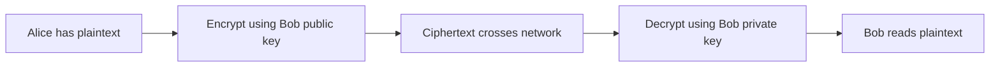
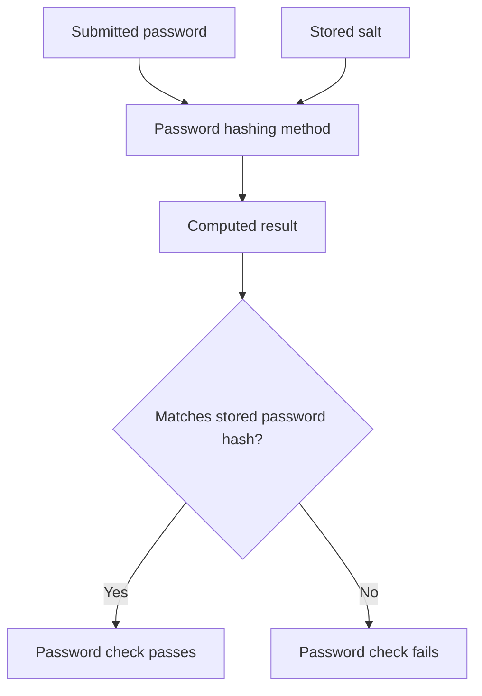

import { ArticleShell, Kicker, Headline, Dek, Byline, Hero, Lede, Callout, KeyTerms, CheckWork, Roadmap, UnitLinks } from '@site/src/components/ArticleKit';

<ArticleShell>

<Kicker>Computer Science · Security Unit · Session 4 of 8</Kicker>

<Headline>Encryption keeps a secret. Hashing keeps a promise. Don't confuse the two.</Headline>

<Dek>"Hashing is just encryption without a key" sounds reasonable and is completely wrong. One is designed to be reversed by whoever holds the right key. The other is designed never to be reversed by anyone, including you. This session builds both from the ground up — plaintext to ciphertext, and password to salted digest — and sets up the 120-minute homework that follows.</Dek>

<Byline>
  <strong>Session time:</strong> 60 minutes
  ·
  <strong>Homework:</strong> 120 minutes, Week 1
  ·
  Builds on Session 3's authentication model
</Byline>

<Hero
  src="/img/12DGT/computer-security/hero-04-encryption-and-hashing.jpg"
  alt="A wax seal being pressed onto an envelope."
  caption="A wax seal is a decent metaphor for encryption — reversible by the person with the right stamp. Hashing is closer to breaking the seal open and reading nothing back from the wax. Photo: Diana Light / Unsplash"
/>

<Lede>

**Goal:** explain what keys do, compare encryption approaches, and distinguish encryption from hashing.

| Task | Minutes |
|---|---:|
| Recall authentication and authorisation | 5 |
| Read notes and diagrams | 20 |
| Core video and question | 10 |
| Cipher and application activities | 15 |
| Self-check and exit question | 10 |

</Lede>

## 1. Making data unreadable without the key

**Plaintext** is the original, readable information. **Ciphertext** is the encrypted result. An encryption algorithm transforms plaintext using a **key**; decryption uses the appropriate key to recover it. The algorithm itself can be public — security should depend on protecting the necessary secret keys, never on hiding how the algorithm works.

Encryption can protect data **at rest** (a laptop's stored files) or **in transit** (information sent over a network). What it does *not* do: prevent all deletion, guarantee a trustworthy recipient, or protect information once an attacker can use an already-unlocked account to just read it directly.

## 2. Symmetric and asymmetric encryption

| Approach | Keys | Strength | Practical challenge |
|---|---|---|---|
| Symmetric | Sender and receiver use the same secret key | Efficient for large amounts of data | The secret must be shared and protected |
| Asymmetric | Related public and private keys | Supports communication without first sharing a secret encryption key | More computationally demanding; the public key must be authentically associated with its owner |

For **confidentiality**, Alice can encrypt a message using Bob's public key, and Bob decrypts it with his private key. Alice's private key isn't needed for this at all. Anyone may hold Bob's public key — only Bob should ever control his private one.

*Reading the diagram: this shows a conceptual public-key confidentiality operation. Real protocols often use authenticated public-key techniques to establish a session key, then switch to symmetric encryption for the bulk data — this diagram isn't a literal description of every HTTPS message.*

<Callout kind="pitfall">

Certificates help associate public keys with identities such as website domains. An HTTPS connection protects the *connection* to that domain — a fraudulent website can have HTTPS too. A padlock icon is not proof that a business or a message is honest.

</Callout>

## 3. Hashing has a completely different purpose

A **cryptographic hash function** maps input data to a fixed-length result, called a digest or hash. It's deterministic: the same input and algorithm always give the same result. It's designed to make reconstructing the input from its hash computationally infeasible — and there is no decryption key, because none exists.

Different inputs can share the same hash, simply because there are more possible inputs than fixed-length outputs. This is a **collision**. Secure hash functions make deliberately *finding* useful collisions hard — they don't make collisions mathematically impossible.

A hash can help detect a file change, if compared against a trusted expected value. But if an attacker can replace both the file *and* the expected hash, an ordinary comparison alone won't establish authenticity.

<Callout kind="example">

For password storage, use a suitable, deliberately costly password-hashing method plus a unique random **salt**. The salt is stored alongside the hash — it is not itself a secret. It stops identical passwords from producing identical stored results, and makes precomputed lookup tables far less useful. It does not make a weak password unguessable.

</Callout>

*Reading the diagram: verification calculates and compares — it never decrypts a saved password, because a hash can't be decrypted. Other login checks, including MFA, may still be required on top of this.*

## Watch

<Callout kind="watch">

**Core (required):** [Public Key Cryptography — Computerphile](https://www.youtube.com/watch?v=GSIDS_lvRv4). Watch up to 7 minutes, then use the rest of the window to label whose public and private keys are used when Alice sends Bob a secret.

**Optional:** [Hashing Algorithms and Security — Computerphile](https://www.youtube.com/watch?v=b4b8ktEV4Bg). Explain why a hash can't be treated as a unique identifier guaranteed never to collide. MD5 and SHA-1 examples are historical — don't choose them for new security designs.

**Optional, deeper:** [SHA: Secure Hashing Algorithm — Computerphile](https://www.youtube.com/watch?v=DMtFhACPnTY). Focus on the idea of a fixed-length digest; you don't need to memorise the internal mathematics. SHA-1 is not a current secure choice for collision resistance.

</Callout>

## Activities

<Callout kind="activity">

1. Encrypt **SAFE** by shifting each letter three positions forward, wrapping after Z. Decrypt your result. Identify the plaintext, ciphertext and key.
2. Explain why trying every possible shift makes this cipher unsuitable for real protection.
3. Choose encryption or password hashing for (a) a document that must later be read and (b) stored password-verification information. Justify both.
4. Explain one benefit and one limitation of encrypting the club laptop.
5. A student says, "A salted password hash cannot be guessed." Correct the claim.

</Callout>

<CheckWork>

SAFE becomes **VDIH**, with a shift key of 3. There are only 26 shifts including the unchanged alphabet, so exhaustive testing is trivial — this is a teaching model, not modern encryption.

Encrypt a confidential document that must later be read. Store password-verification data using suitable salted password hashing. Laptop encryption reduces exposure after theft, when the thief lacks the key or an unlocked session — it does not replace a backup. An attacker can still hash password guesses using the stored salt and compare results; costly hashing just makes each guess slower.

</CheckWork>

<Callout kind="exit">

Why is "hashing is encryption without a key" misleading? Hashing is designed for one-way computation and comparison; encryption is designed to be reversed with the right key. Neither is a lesser version of the other — they solve different problems.

</Callout>

<KeyTerms terms={['plaintext', 'ciphertext', 'key', 'symmetric', 'asymmetric', 'public key', 'private key', 'digest', 'collision', 'salt']} />

## Week 1 homework — 120 minutes total

<Callout kind="homework">

Four parts, roughly two hours total. Do them across the week rather than in one sitting — retrieval practice works better spaced out, which is rather the point of Part A.

</Callout>

### A. Retrieval cards — 30 minutes

Create 12 cards. Include the CIA goals; threat versus vulnerability; phishing; two malware categories; authentication versus authorisation; MFA; least privilege; encryption; hashing; and backups. Put a question on one side and an explanation with an example on the other. Test yourself before looking at the answer.

### B. Harmless file-recovery exercise — 30 minutes

1. Create a folder called `security-course-practice` and a disposable text file containing three fictional payment records.
2. Copy the file into a separate `practice-copy` folder. Change one record in the original.
3. Recover the earlier contents by copying the saved version into a third folder called `recovered`. Do not overwrite or delete existing personal work.
4. Compare the recovered file with your recorded original contents. Write what was recovered and which later change was absent.
5. Explain why two folders on one device are only a *model* of backup: device failure or theft could remove both at once.

If file operations are unavailable, simulate the same process with three paper versions and explain the same limitations.

### C. Extended response — 40 minutes

Write 250–350 words evaluating: **"A strong password makes encryption and backups unnecessary."**

Explain the different threat each control addresses, how it works, and a limitation. Use the club laptop as your example.

### D. Self-assessment — 20 minutes

Check that your response explains password guessing/access, encryption/confidentiality and backup/recovery. It should recognise that a password can be phished, encrypted files can still be deleted, and backups can be out of date or exposed. Finish with a supported judgement that the controls are complementary. Rewrite any sentence that only says "it is safer."

<Roadmap length={8} current={4} />

<UnitLinks>

[**Previous session** · Accounts and access control](03-accounts-and-access-control.mdx)

[**Unit** · Computer Security](README.mdx)

[**Next session** · Networks and layered protection →](05-networks-and-layered-protection.mdx)

</UnitLinks>

</ArticleShell>
