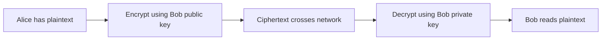
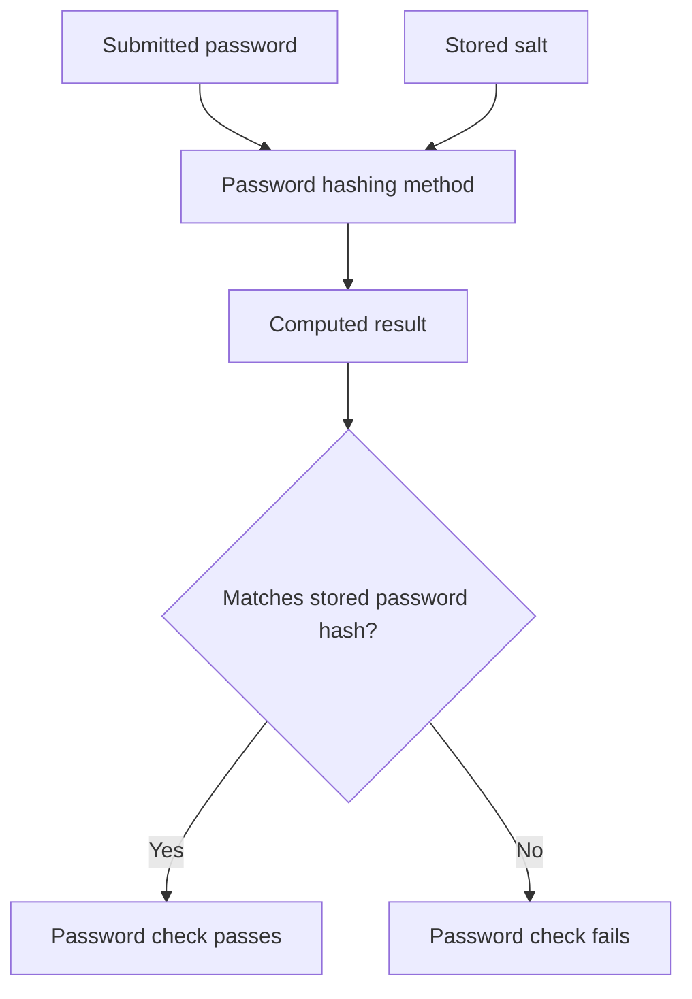

# Session 4 — Encryption and hashing

[Previous session](03-accounts-and-access-control.mdx) · [Course index](README.mdx) · [Next session](05-networks-and-layered-protection.mdx)

**Time:** 60 minutes, followed by the **120-minute Week 1 homework** below.

**Goal:** Explain what keys do, compare encryption approaches and distinguish encryption from hashing.

| Task | Minutes |
|---|---:|
| Recall authentication and authorisation | 5 |
| Read notes and diagrams | 20 |
| Core video and question | 10 |
| Cipher and application activities | 15 |
| Self-check and exit question | 10 |

## 1. Making data unreadable without the key

**Plaintext** is the original readable information. **Ciphertext** is the encrypted result. An encryption algorithm transforms plaintext using a **key**; decryption uses the appropriate key to recover it. The algorithm can be public: security should depend on protecting the necessary secret keys, not hiding the algorithm.

Encryption can protect data **at rest**, such as a laptop's stored files, or **in transit**, such as information sent over a network. It does not prevent all deletion, guarantee a trustworthy recipient or protect information once an attacker can use an already unlocked account to read it.

## 2. Symmetric and asymmetric encryption

| Approach | Keys | Strength | Practical challenge |
|---|---|---|---|
| Symmetric | Sender and receiver use the same secret key | Efficient for large amounts of data | The secret must be shared and protected |
| Asymmetric | Related public and private keys | Supports communication without first sharing a secret encryption key | More computationally demanding; the public key must be authentically associated with its owner |

For **confidentiality**, Alice can encrypt a message using Bob's public key, and Bob decrypts with his private key. Alice's private key is not needed for this operation. Anyone may possess Bob's public key, but only Bob should control his private key.

**Read the diagram:** It shows a conceptual public-key confidentiality operation. Actual protocols often use authenticated public-key techniques to establish a session key, then symmetric encryption for the bulk data. This diagram is not a literal description of every HTTPS message.

Certificates help associate public keys with identities such as website domains. An HTTPS connection protects the connection to that domain; a fraudulent website can also have HTTPS. A padlock is not proof that a business or message is honest.

## 3. Hashing has a different purpose

A **cryptographic hash function** maps input data to a fixed-length result, called a digest or hash. It is deterministic: the same input and algorithm give the same result. It is designed to make reconstructing an input from its hash computationally infeasible, and there is no decryption key.

Different inputs can have the same hash because there are more possible inputs than fixed-length outputs. This is a **collision**. Secure cryptographic hash functions make deliberately finding useful collisions difficult; they do not make collisions mathematically impossible.

A hash can help detect a file change if compared with a trusted expected value. If an attacker can replace both the file and the expected hash, an ordinary hash comparison alone will not establish authenticity.

For password storage, use a suitable deliberately costly password-hashing method and a unique random **salt**. The salt is stored with the hash; it is not a secret password. It prevents identical passwords from automatically having identical stored results and makes precomputed lookup tables less useful. It does not make weak passwords unguessable.

**Read the diagram:** Verification calculates and compares results. It does not decrypt the saved password. Other login checks, including MFA, may still be required.

## YouTube viewing

1. **Core:** [Public Key Cryptography — Computerphile](https://www.youtube.com/watch?v=GSIDS_lvRv4). Watch for up to 7 minutes and use the remaining viewing window to label whose public and private keys are used when Alice sends Bob a secret.
2. **Optional:** [Hashing Algorithms and Security — Computerphile](https://www.youtube.com/watch?v=b4b8ktEV4Bg). Explain why a hash cannot be treated as a unique identifier guaranteed never to collide. MD5 and SHA-1 examples are historical; do not choose them for new security designs.
3. **Optional deeper explanation:** [SHA: Secure Hashing Algorithm — Computerphile](https://www.youtube.com/watch?v=DMtFhACPnTY). Focus on the idea of a fixed-length digest. You do not need to memorise the internal mathematics; SHA-1 is not a current secure choice for collision resistance.

## Activities

1. Encrypt **SAFE** by shifting each letter three positions forward, wrapping after Z. Decrypt your result. Identify the plaintext, ciphertext and key.
2. Explain why trying every possible shift makes this cipher unsuitable for real protection.
3. Choose encryption or password hashing for (a) a document that must later be read and (b) stored password-verification information. Justify both.
4. Explain one benefit and one limitation of encrypting the club laptop.
5. A student says, “A salted password hash cannot be guessed.” Correct the claim.

## Check your work

SAFE becomes **VDIH**, with a shift key of 3. There are only 26 shifts including the unchanged alphabet, so exhaustive testing is easy. This is a teaching model, not modern encryption.

Encrypt a confidential recoverable document. Store password-verification data using suitable salted password hashing. Laptop encryption reduces exposure after theft when the thief lacks access to the key or an unlocked session. It does not replace a backup. An attacker can still hash password guesses using the stored salt and compare results; costly hashing makes this slower.

**Exit question:** Why is “hashing is encryption without a key” misleading? Hashing is designed for one-way computation and comparison, while encryption is designed to be reversed with an appropriate key.

**Key terms:** plaintext, ciphertext, key, symmetric, asymmetric, public key, private key, digest, collision, salt.

## Week 1 homework — 120 minutes total

### A. Retrieval cards — 30 minutes

Create 12 cards. Include the CIA goals; threat versus vulnerability; phishing; two malware categories; authentication versus authorisation; MFA; least privilege; encryption; hashing; and backups. Put a question on one side and an explanation with an example on the other. Test yourself before looking at the answer.

### B. Harmless file-recovery exercise — 30 minutes

1. Create a folder called `security-course-practice` and a disposable text file containing three fictional payment records.
2. Copy the file into a separate `practice-copy` folder. Change one record in the original.
3. Recover the earlier contents by copying the saved version into a third folder called `recovered`. Do not overwrite or delete existing personal work.
4. Compare the recovered file with your recorded original contents. Write what was recovered and which later change was absent.
5. Explain why two folders on one device are only a model of backup: device failure or theft could remove both.

If file operations are unavailable, simulate the same process with three paper versions and explain the same limitations.

### C. Extended response — 40 minutes

Write 250–350 words evaluating: **“A strong password makes encryption and backups unnecessary.”**

Explain the different threat each control addresses, how it works and a limitation. Use the club laptop as your example.

### D. Self-assessment — 20 minutes

Check that your response explains password guessing/access, encryption/confidentiality and backup/recovery. It should recognise that a password can be phished, encrypted files can be deleted and backups can be out of date or exposed. Finish with a supported judgement that the controls are complementary. Rewrite any sentence that only says “it is safer”.
