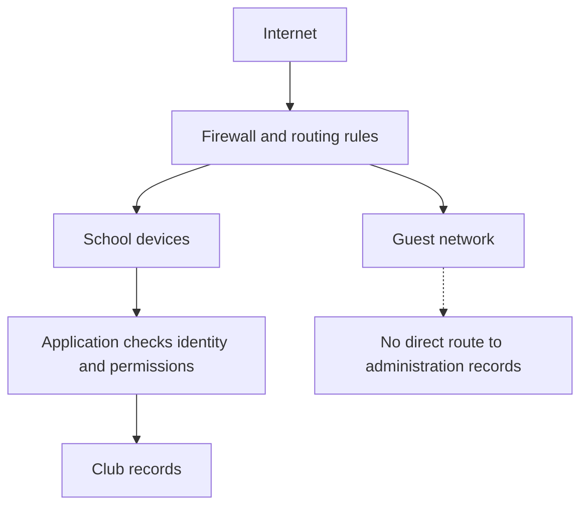

import { ArticleShell, Kicker, Headline, Dek, Byline, Hero, Lede, Callout, KeyTerms, CheckWork, Roadmap, UnitLinks } from '@site/src/components/ArticleKit';

<ArticleShell>

<Kicker>Computer Science · Security Unit · Session 5 of 8</Kicker>

<Headline>No single control stops everything. That's not a flaw — it's the whole design principle.</Headline>

<Dek>A firewall doesn't know if a login page is fake. Anti-malware doesn't catch everything. A lock doesn't stop someone borrowing the laptop they're authorised to carry. None of that means any of them are pointless — it means security works in layers, each one covering what the last one misses. This session is about building that stack, and about the attack that doesn't try to get in at all: denial of service.</Dek>

<Byline>
  <strong>Session time:</strong> 60 minutes
  ·
  <strong>Homework:</strong> none this week
  ·
  Builds on Sessions 1–4's individual controls
</Byline>

<Hero
  src="/img/12DGT/computer-security/hero-05-networks-and-layered-protection.jpg"
  alt="A network switch with multiple ethernet cables plugged into it."
  caption="Every cable is a route in and out — segmentation is deciding which of them are allowed to talk to which. Photo: User_Pascal / Unsplash"
/>

<Lede>

**Goal:** match controls to threats, and explain why any one protection, alone, is insufficient.

| Task | Minutes |
|---|---:|
| Recall encryption and backup differences | 5 |
| Read notes and diagram | 15 |
| Core video and question | 10 |
| Network decisions and scenarios | 20 |
| Check and exit question | 10 |

</Lede>

## 1. What a firewall does

Networked devices exchange data in packets. A **firewall** permits or blocks traffic according to configured rules. Depending on its capabilities, it may inspect source and destination addresses, ports, connection state or application information. A port helps identify a network service — you don't need to memorise port numbers for this course.

A firewall can sit on an individual device or between whole networks, and it can control traffic in either direction. Rules matter enormously: a badly configured firewall can just as easily permit unwanted access as block legitimate work.

<Callout kind="pitfall">

A firewall can't be assumed to identify every malicious message. If web browsing is allowed at all, a user can still reach a convincing fake login page straight through it. Nor does a firewall stop someone physically walking off with the laptop.

</Callout>

## 2. Separating networks

**Network segmentation** places devices into groups and restricts communication between them. The club's guest Wi-Fi shouldn't hand visitors unrestricted access to administration systems just because they're on the same premises. Segmentation reduces how far an attacker can travel after compromising one single device.

*Reading the diagram: guest access and school access run under different rules entirely. Being on the school network still doesn't grant permission to read every record — the dotted branch is a blocked route, not an allowed connection that just happens to be unused.*

## 3. Complementary controls

| Control | How it helps | Limitation |
|---|---|---|
| Security updates | Repair known software weaknesses | Do not fix every unknown flaw or prevent all social engineering |
| Anti-malware | Detects known malicious patterns or suspicious behaviour | Can miss threats or produce false alarms |
| Restricted installation | Limits what users can install or run | Requires management and may delay legitimate work |
| Segmentation | Restricts movement between device groups | Depends on correct rules and does not fix an already-compromised device |
| Physical locks | Reduce unauthorised physical access | Can be bypassed; do not protect a device an authorised user takes home |
| Staff/student education | Helps people recognise and report risky requests | People still make mistakes |
| Logging and monitoring | Help identify suspicious events and support investigation | Need review and response; recording alone does not block harm |

**Defence in depth** combines controls so one failure doesn't automatically cascade into the worst outcome. Combining independent protections is far more useful than repeating the same weak control twice.

<Callout kind="example">

A fake attachment slips past a mail filter. Restricted execution may stop it running. If it runs anyway, limited user permissions and network segmentation may constrain how far it reaches. A protected backup may support recovery afterwards. Each stage does a different job, and none of them guarantees success on its own.

</Callout>

## 4. Denial of service

A **denial-of-service** attack aims to make a service unavailable — for example, by exhausting its capacity. A **distributed** denial-of-service attack does this using many sources at once. It doesn't need to steal a single piece of information to still be damaging. Filtering, provider support and resilient service design can all help, but a single school firewall can't be assumed to absorb unlimited incoming traffic on its own.

## Watch

<Callout kind="watch">

**Core (required):** [What is a Firewall? — PowerCert Animated Videos](https://www.youtube.com/watch?v=kDEX1HXybrU). Watch up to 7 minutes, then explain the difference between *blocking a connection* and *deciding whether a message is trustworthy* — they are not the same job.

**Optional, targeted:** [Cybersecurity Architecture: Five Principles to Follow (and One to Avoid) — IBM Technology](https://www.youtube.com/watch?v=jq_LZ1RFPfU&t=65s). Watch **01:05–04:20**, the defence-in-depth section. Give three club controls that each play a genuinely different role.

</Callout>

## Activities

<Callout kind="activity">

**A. Apply these fictional rules**

Assume rules are checked from top to bottom and the first match decides:

1. Block guest devices from the administration network.
2. Allow school devices to use the records application.
3. Allow guest devices to browse the public web.
4. Block all other traffic.

Decide what happens when: a guest requests the records application on the administration network; a guest browses a public website; a school device requests the records application. Does that final allowed request automatically permit *editing*? Explain.

**B. Choose layers**

For each case, select two complementary controls, explain their mechanisms, and name a remaining risk:

- A student installs a fake robot-design application.
- A visitor brings an infected device to guest Wi-Fi.
- The club laptop is left in an unlocked classroom.

</Callout>

<CheckWork>

The guest administration request is blocked; guest public browsing is allowed; the school application connection is allowed. Application authentication and authorisation must still decide whether editing is actually permitted — reaching the application is not the same as being allowed to change it.

Suitable pairs include restricted installation with anti-malware; segmentation with kept-updated school devices; and locked storage with disk encryption. Be specific about what each half does: disk encryption limits exposure *after* theft, while locked storage reduces the *likelihood* of theft happening at all.

</CheckWork>

<Callout kind="exit">

Explain why a firewall, antivirus software and a backup are not interchangeable — each protects against a different kind of failure.

</Callout>

<KeyTerms terms={['packet', 'firewall', 'rule', 'segmentation', 'defence in depth', 'security update', 'monitoring', 'denial of service']} />

<Roadmap length={8} current={5} />

<UnitLinks>

[**Previous session** · Encryption and hashing](04-encryption-and-hashing.mdx)

[**Unit** · Computer Security](README.mdx)

[**Next session** · Backups and incident response →](06-backups-and-incident-response.mdx)

</UnitLinks>

</ArticleShell>
