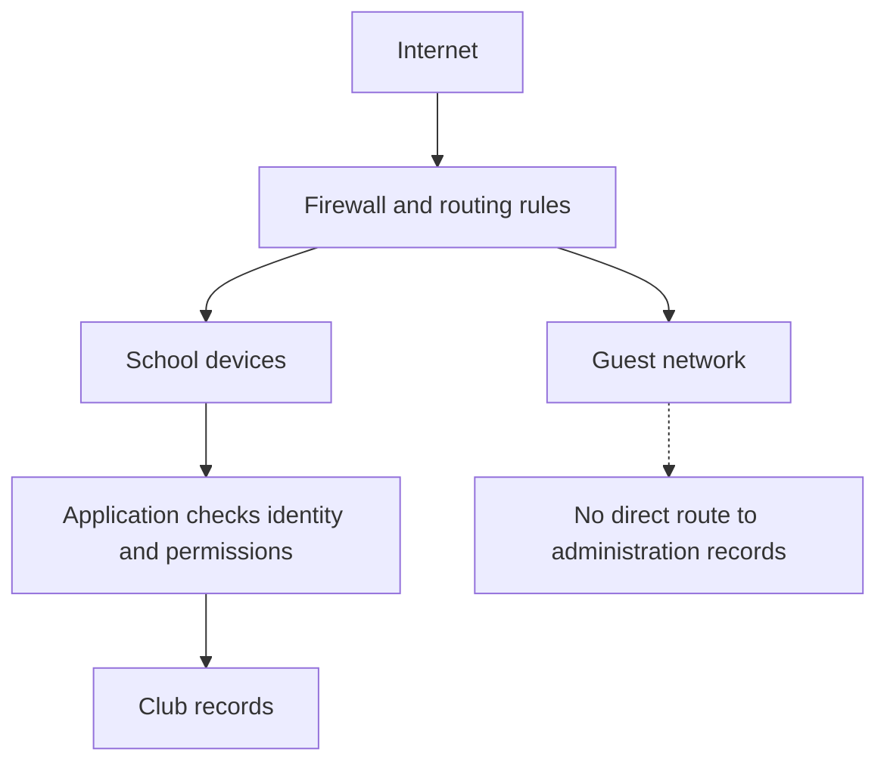

# Session 5 — Networks and layered protection

[Previous session](04-encryption-and-hashing.mdx) · [Course index](README.mdx) · [Next session](06-backups-and-incident-response.mdx)

**Time:** 60 minutes. **Goal:** Match controls to threats and explain why one protection is insufficient.

| Task | Minutes |
|---|---:|
| Recall encryption and backup differences | 5 |
| Read notes and diagram | 15 |
| Core video and question | 10 |
| Network decisions and scenarios | 20 |
| Check and exit question | 10 |

## 1. What a firewall does

Networked devices exchange data in packets. A **firewall** permits or blocks traffic according to configured rules. Depending on its capabilities, it may inspect source and destination addresses, ports, connection state or application information. A port helps identify a network service; you do not need to memorise port numbers for this course.

A firewall can operate on an individual device or between networks. It can control traffic in either direction. Rules matter: a badly configured firewall can permit unwanted access or block legitimate work.

It cannot be assumed to identify every malicious message. If web browsing is allowed, a user may still reach a convincing fake login page. Nor does a firewall prevent someone physically taking a laptop.

## 2. Separating networks

**Network segmentation** places devices into groups and restricts communication between them. The club's guest Wi-Fi should not provide visitors with unrestricted access to administration systems. Separation reduces the routes an attacker can take after compromising one device.

**Read the diagram:** Guest access and school access have different rules. Being on the school network still does not grant permission to read every record. The dotted branch describes a blocked route, not an allowed connection.

## 3. Complementary controls

| Control | How it helps | Limitation |
|---|---|---|
| Security updates | Repair known software weaknesses | Do not fix every unknown flaw or prevent all social engineering |
| Anti-malware | Detects known malicious patterns or suspicious behaviour | Can miss threats or produce false alarms |
| Restricted installation | Limits what users can install or run | Requires management and may delay legitimate work |
| Segmentation | Restricts movement between device groups | Depends on correct rules and does not fix an already compromised device |
| Physical locks | Reduce unauthorised physical access | Can be bypassed; do not protect a device taken home by an authorised user |
| Staff/student education | Helps people recognise and report risky requests | People still make mistakes |
| Logging and monitoring | Help identify suspicious events and support investigation | Need review and response; recording alone does not block harm |

**Defence in depth** combines controls so that one failure does not automatically lead to the worst outcome. It is more useful to combine independent protections than to repeat the same weak control.

**Worked example:** A fake attachment passes through a mail filter. Restricted execution may prevent it running. If it runs, limited user permissions and network separation may constrain its reach. A protected backup may support recovery. Each stage has a different purpose, and none guarantees success.

## 4. Denial of service

A **denial-of-service** attack aims to make a service unavailable, for example by exhausting its capacity. A **distributed** denial-of-service attack uses many sources. It need not steal information. Filtering, provider support and resilient service design can help, but a single school firewall cannot be assumed to absorb unlimited incoming traffic.

## YouTube viewing

1. **Core:** [What is a Firewall? — PowerCert Animated Videos](https://www.youtube.com/watch?v=kDEX1HXybrU). Watch for up to 7 minutes. Then explain the difference between blocking a connection and deciding whether a message is trustworthy.
2. **Optional targeted viewing:** [Cybersecurity Architecture: Five Principles to Follow (and One to Avoid) — IBM Technology](https://www.youtube.com/watch?v=jq_LZ1RFPfU&t=65s). Watch **01:05–04:20**, the defence-in-depth section. Give three club controls with different roles.

## Activities

### A. Apply these fictional rules

Assume rules are checked from top to bottom and the first match decides:

1. Block guest devices from the administration network.
2. Allow school devices to use the records application.
3. Allow guest devices to browse the public web.
4. Block all other traffic.

Decide what happens when a guest requests the records application on the administration network; a guest browses a public website; and a school device requests the records application. Does the final allowed request automatically permit editing? Explain.

### B. Choose layers

For each case, select two complementary controls, explain their mechanisms and name a remaining risk:

- A student installs a fake robot-design application.
- A visitor brings an infected device to guest Wi-Fi.
- The club laptop is left in an unlocked classroom.

## Check your work

The guest administration request is blocked; guest public browsing is allowed; the school application connection is allowed. Application authentication and authorisation must still decide whether editing is permitted.

Suitable pairs include restricted installation with anti-malware; segmentation with updated school devices; and locked storage with disk encryption. Be specific: disk encryption limits exposure after theft, while locked storage reduces the likelihood of theft.

**Exit question:** Explain why a firewall, antivirus software and a backup are not interchangeable.

**Key terms:** packet, firewall, rule, segmentation, defence in depth, security update, monitoring, denial of service.
