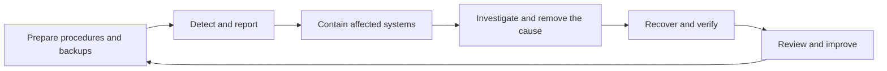

import { ArticleShell, Kicker, Headline, Dek, Byline, Hero, Lede, Callout, KeyTerms, CheckWork, Roadmap, UnitLinks } from '@site/src/components/ArticleKit';

<ArticleShell>

<Kicker>Computer Science · Security Unit · Session 6 of 8</Kicker>

<Headline>A backup answers one question. Recovery time answers a completely different one.</Headline>

<Dek>At 2pm on Thursday, the club laptop displays a ransom demand. The last successful backup ran Wednesday at 6pm. A treasurer wants to restore immediately from the drive that's stayed plugged in the whole time. This session is what you need before that moment arrives — what actually counts as a backup, three ways to structure one, and why "restore it" is not the same instruction as "the incident is over."</Dek>

<Byline>
  <strong>Session time:</strong> 60 minutes
  ·
  <strong>Homework:</strong> none this week
  ·
  Builds on Session 5's layered controls
</Byline>

<Hero
  src="/img/12DGT/computer-security/hero-06-backups-and-incident-response.jpg"
  alt="An external hard drive resting on a wooden desk."
  caption="A drive that's permanently plugged in is convenient — and reachable by exactly the same malware as the machine it's backing up. Photo: Andrey Matveev / Unsplash"
/>

<Lede>

**Goal:** explain recovery choices, and plan a sensible response to an incident.

| Task | Minutes |
|---|---:|
| Recall three complementary controls | 5 |
| Read notes and diagram | 20 |
| Core video and question | 10 |
| Recovery scenario | 15 |
| Check and exit question | 10 |

</Lede>

## 1. A copy must be recoverable

A **backup** is a copy retained so data can be recovered after loss or unwanted change. A real plan specifies what is copied, how often, where it is held, who can access it, how long versions are retained, and how restoration is actually *tested* — not just assumed to work.

<Callout kind="pitfall">

Synchronisation keeps locations aligned — it may faithfully copy a deletion, or an encrypted replacement, straight to the "backup" too. A synchronised service can offer useful version history, but that only supports recovery if earlier versions genuinely remain available and protected. Don't assume synchronisation alone is a complete backup plan.

</Callout>

Copies should survive the incidents affecting the original. Separate protected storage helps when a laptop fails outright. Offline or suitably protected immutable copies help resist malicious alteration. A permanently attached writable drive may be reachable by exactly the same malware as the laptop it's meant to be protecting. Backups containing personal data also need their own access controls and appropriate encryption.

See [NCSC — Data security](https://www.ncsc.gov.uk/collection/10-steps/data-security) for practical guidance on separate copies, retained versions and restoration testing.

## 2. Three backup approaches

| Type | What is copied | Traditional restoration needs |
|---|---|---|
| Full | All selected data | The selected full backup |
| Incremental | Changes since the most recent backup in the chain | The full backup and each needed later incremental |
| Differential | Changes since the last full backup | The full backup and the selected later differential |

Incremental backups can save copying time and storage, but a long chain complicates recovery. Differential backups tend to grow as changes accumulate, while recovery itself needs fewer sets. Actual products may package restoration differently — these are the underlying concepts. See [AWS — Comparing backup strategies](https://aws.amazon.com/compare/the-difference-between-incremental-differential-and-other-backups/).

<Callout kind="example">

After Sunday's full backup, Monday changes file A and Tuesday changes file B. Tuesday's incremental contains only B's changes; Tuesday's differential contains the changes to *both* A and B since Sunday. To reconstruct Tuesday using traditional incrementals, you need Sunday, Monday and Tuesday together.

</Callout>

## 3. Time matters in two different ways

Ask: **how much recent work could we lose?** Then ask, separately: **how long can we operate without the system at all?** These are two different requirements, and a plan that only answers one of them is incomplete.

If the last successful backup is Wednesday at 6pm and the incident happens Thursday at 2pm, up to 20 hours of changes may be missing. That is *not* a prediction that restoration itself takes 20 hours — those are separate numbers. A restoration test is what actually establishes whether files can be recovered, and how long the process takes.

## 4. Responding to an incident

At school, promptly report the incident to a teacher or authorised IT staff through a known channel. Record visible symptoms, the time, the device, and what happened just before. Do not improvise a cleanup or erase evidence. Follow the school's containment instructions.

The wider response is normally led by authorised staff:

*Reading the diagram: this is a learning model, not a rigid universal sequence — investigation and containment can overlap. Recovery is followed by verification and improvement, not simply "turn it back on again."*

<Callout kind="pitfall">

A backup restores *data* — it does not, by itself, remove an attacker's access or undo information theft. Staff must address the cause, secure affected access, and verify the recovery environment. Backups made after the compromise began, but before anyone noticed, may themselves contain malicious material.

</Callout>

## Watch

<Callout kind="watch">

**Core (required):** [Incremental vs Differential Backup, & Full — Explained — PowerCert Animated Videos](https://www.youtube.com/watch?v=o-83E6levzM). Watch for up to 7 minutes, then use the remaining window to draw which backup sets are needed for Tuesday's recovery in the worked example above.

**Optional extension:** [Cybersecurity Architecture: Response — IBM Technology](https://www.youtube.com/watch?v=Jk79QJCxPkM). Focus on who has to act after detection. Ignore enterprise product names and historical breach statistics — explain why monitoring *without* a response plan is insufficient on its own.

</Callout>

## Activity — Thursday's incident

<Callout kind="activity">

At 2pm Thursday, the club laptop displays a ransom demand and its files can't be opened. The last successful backup is Wednesday at 6pm. A treasurer says to restore immediately from a drive that has remained connected the whole time.

1. Calculate the maximum period of changes missing from that backup.
2. Explain two reasons to involve IT *before* attempting restoration.
3. Explain why the connected drive may not provide a reliable recovery source.
4. Describe two checks needed before declaring recovery successful.
5. Explain why recovery does not settle the separate question of whether contact details were stolen.

</Callout>

<CheckWork>

The missing interval is 20 hours. IT should contain the incident, preserve relevant evidence, investigate the cause, and verify safe recovery before anything is declared fixed. The connected backup drive might also have been altered or encrypted along with everything else.

Check that the chosen backup is usable and appropriate, that restored records actually open and are sufficiently complete, and that the recovered environment no longer carries the original compromise. A proper test also confirms authorised users can work again. Disclosure is a separate confidentiality issue entirely: restored records do not retrieve the copies an attacker already took.

</CheckWork>

<Callout kind="exit">

Explain the difference between reducing data loss and reducing recovery time. They sound similar and are answered by completely different parts of a plan.

</Callout>

<KeyTerms terms={['backup', 'restoration', 'synchronisation', 'version history', 'full', 'incremental', 'differential', 'containment']} />

<Roadmap length={8} current={6} />

<UnitLinks>

[**Previous session** · Networks and layered protection](05-networks-and-layered-protection.mdx)

[**Unit** · Computer Security](README.mdx)

[**Next session** · Design a security plan →](07-design-a-security-plan.mdx)

</UnitLinks>

</ArticleShell>
