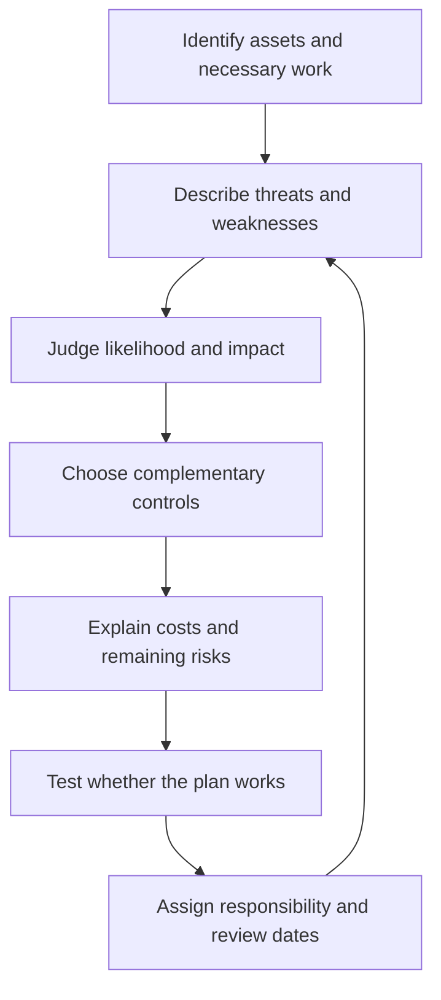

import { ArticleShell, Kicker, Headline, Dek, Byline, Hero, Lede, Callout, KeyTerms, CheckWork, Roadmap, UnitLinks } from '@site/src/components/ArticleKit';

<ArticleShell>

<Kicker>Computer Science · Security Unit · Session 7 of 8</Kicker>

<Headline>Buying a security product is not a plan. Explaining your reasoning is.</Headline>

<Dek>Six sessions of individual controls now have to become one coherent document: a one-page security plan for the Harbour School Robotics Club, justified line by line against its actual risks — not a shopping list of "MFA, a firewall and encryption" with no explanation of why. This is where the unit stops being about naming controls and starts being about defending choices.</Dek>

<Byline>
  <strong>Session time:</strong> 60 minutes
  ·
  <strong>Homework:</strong> none this week
  ·
  Draws on every session so far
</Byline>

<Hero
  src="/img/12DGT/computer-security/hero-07-design-a-security-plan.jpg"
  alt="A detailed architectural blueprint drawing."
  caption="A plan names what must work, what could go wrong, and what you're trading off to prevent it — an architect's drawing, not a materials list. Amsterdam City Archives, 1924 / Unsplash"
/>

<Lede>

**Goal:** produce a practical plan, and justify every choice using the scenario itself.

| Task | Minutes |
|---|---:|
| Recall controls and risks | 5 |
| Read the planning notes | 10 |
| Core video and question | 5 |
| Write your plan | 30 |
| Self-review and improvement | 10 |

</Lede>

## 1. Start with what must work

<Callout kind="case">

The Harbour School Robotics Club has 80 members, two treasurers and a teacher supervisor. It stores contact details and payment records. A shared laptop sometimes goes home. The club has a small budget and limited IT support. It must be able to recover records within one school day.

The original arrangement has one shared password, editing access for all members, and no separate backup. Your plan should improve this arrangement while keeping administration manageable — not lock the club out of running itself.

</Callout>

Write down assets and necessary activities *before* choosing technology. Members need their own payment status; they don't need everyone's contact details. Treasurers need to update payments; they don't automatically need to manage system accounts. The supervisor needs oversight and an agreed route to school IT.

## 2. Link every control to a reason

*Reading the diagram: a plan is a reasoned cycle. Buying a security product is not the starting point, and writing the plan down is not the end of the process.*

A useful sentence pattern:

> Because **[specific weakness]** could allow **[specific harm]**, use **[control]**. It works by **[mechanism]**, protecting **[security goal]**. However, **[limitation]**, so **[complementary measure or justified trade-off]**.

<Callout kind="example">

**Worked paragraph:** Because the laptop leaves school, loss could expose members' contact details. Full-disk encryption protects stored information when an unauthorised finder lacks the key and can't use an unlocked session. This supports confidentiality. It does not recover a missing device or its only copy of the records, so a separate recoverable backup is also needed.

</Callout>

## 3. Evaluate rather than list

<Callout kind="pitfall">

"Use MFA, a firewall and encryption" is a *list*. Evaluation explains why those specific choices suit this specific club, and what they cost in money, effort or inconvenience.

</Callout>

For a small dataset, frequent full backups may be simpler to manage than a long incremental chain — a larger dataset might change that judgement entirely. More frequent backups reduce possible missing changes, but need suitable storage and management to match. Limiting permissions reduces opportunities for damage, but requires access to actually be updated when roles change.

Priority depends on context. Avoid inventing numerical likelihoods, and avoid claiming any one control solves every problem. Label your assumptions — for example, assume the school-approved records application supports individual permissions.

## 4. Make the plan testable

"Keep backups" is incomplete. Specify who checks success and who performs a restoration test. "Only treasurers can edit" should be tested with fictional member and treasurer roles in an authorised test environment, or described as a paper walkthrough — do not change actual school permissions for this lesson.

Use acceptance statements: "A member cannot edit another member's payment"; "The supervisor can recover a sample record within one school day"; "An outgoing treasurer's editing access is removed." These describe observable outcomes, not intentions.

## Watch

<Callout kind="watch">

**Core (required):** [Cybersecurity Architecture: Five Principles to Follow (and One to Avoid) — IBM Technology](https://www.youtube.com/watch?v=jq_LZ1RFPfU&t=475s). Watch **07:55–09:50**, separation of duties. Use the remaining 5-minute window to explain why oversight of financial changes can help even when treasurers are trusted.

**Optional review:** [What is the CIA Triad — IBM Technology](https://www.youtube.com/watch?v=kPPFNrlN3zo). Rewatch it with your draft plan open. Find a control for each goal, and identify which goal has the weakest coverage.

</Callout>

## Your main activity — One-page security plan

<Callout kind="activity">

Use these six headings. Aim for about 400–550 words plus a compact permissions table.

1. **Priority risks:** Name three risks, explain likelihood and impact qualitatively, and select your first priority.
2. **Controls:** Recommend five controls. Link each to a mechanism and a security goal. Include prevention, a way to detect problems, and recovery.
3. **Permissions:** Define the member, treasurer and supervisor roles. State any application assumptions.
4. **Recovery:** Give a schedule, protected storage arrangement, responsible person and restoration-test procedure. Address the one-school-day target directly.
5. **Response:** State what a student reports, to whom, and through which known channel. Describe what authorised IT staff handle from there.
6. **Trade-offs and checks:** Explain two costs or limitations, and give two observable tests.

</Callout>

## Self-review — 12-point learning checklist

Award **0** for missing, **1** for partial, **2** for clearly explained, in each category.

| Category | What earns 2 points |
|---|---|
| Risks | Three scenario-specific risks and a justified priority |
| Controls | Five complementary controls with mechanisms, including detection and recovery |
| Permissions | Roles have justified access; members do not receive unnecessary rights |
| Recovery | Frequency, protected location, responsibility and a test tied to the recovery target |
| Response | Prompt reporting and appropriate IT-led containment/investigation/recovery |
| Evaluation | Two meaningful trade-offs and two observable checks |

Aim for **10/12**, then go back and improve your lowest-scoring category. This is a learning checklist, not an examination grade.

<CheckWork label="Reveal model elements to compare after drafting">

A defensible plan might combine individual accounts with MFA, restricted editing, disk encryption, protected versioned backups, and monitored account/edit logs. It could specify nightly backups, a weekly success review and a monthly sample restoration, with frequency increased if a day's missing changes becomes unacceptable. These frequencies are example design choices, not universal rules.

The teacher should own oversight and coordinate with school IT; students should not be assigned unsupervised system administration. A recovery-time target must be *tested*, not assumed from the backup schedule alone. A usable plan also names what happens when a treasurer leaves.

</CheckWork>

<Callout kind="exit">

Explain one change you would make if the club grew from 80 to 8,000 members. A strong answer connects the changed scale to impact, access administration or recovery requirements — not just "we'd need more security."

</Callout>

<KeyTerms terms={['justification', 'trade-off', 'residual risk', 'acceptance check', 'separation of duties']} />

<Roadmap length={8} current={7} />

<UnitLinks>

[**Previous session** · Backups and incident response](06-backups-and-incident-response.mdx)

[**Unit** · Computer Security](README.mdx)

[**Next session** · Assessment and revision →](08-assessment-and-revision.mdx)

</UnitLinks>

</ArticleShell>
