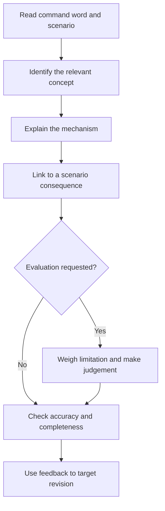

# Session 8 — Assessment and revision

[Previous session](07-design-a-security-plan.mdx) · [Course index](README.mdx)

**Time:** 60 minutes, followed by **120 minutes of Week 2 homework**.

**Goal:** Explain security concepts accurately under time pressure and use feedback to improve.

The questions and marking scheme are original course material. They have not been mapped to the inaccessible past papers or an official exam-board standard.

## This session's timetable

| Task | Minutes |
|---|---:|
| Closed-notes assessment, including a final check | 40 |
| Mark and annotate answers | 15 |
| Choose revision priorities | 5 |

The notes below are a reference for marking and homework. Begin the timed questions with your notes and the marking guide closed. **Do not watch videos before or during the assessment**; use the optional links during the allocated homework revision time.

## Assessment — 30 marks

Suggested timings total 40 minutes. Write in full sentences where explanation is requested. A list of control names does not explain how they work.

### Question 1 — Security goals [6 marks; 6 minutes]

Define confidentiality, integrity and availability. Give a different relevant school example for each.

### Question 2 — Phishing [4 marks; 5 minutes]

Explain how a fake school-login message could lead to unauthorised access to confidential student records.

### Question 3 — Account security [4 marks; 5 minutes]

Distinguish authentication from authorisation. Explain how MFA could reduce the risk from a stolen password.

### Question 4 — Cryptography [6 marks; 8 minutes]

Compare symmetric and asymmetric encryption, including their keys and one practical difference. Explain how password hashing differs from encryption and how a stored password hash can be used during login.

### Question 5 — Evaluate protections [6 marks; 8 minutes]

A club uses a firewall, one shared password and a backup drive permanently connected to its laptop. All members can edit payment records. Recommend three improvements. Explain how each addresses a specific weakness.

### Question 6 — Recovery [4 marks; 5 minutes]

Explain two reasons why restoring a backup may not completely resolve a ransomware incident.

### Final check [3 minutes]

Check that each answer addresses the question, names the mechanism and uses the scenario. Make sure your explanation does not claim any control guarantees perfect security.

---

## Stop here until your 40 minutes are finished

## Marking guide

Credit equivalent accurate wording. Award only the points stated below, up to each question's maximum. Do not award a second mark for repeating an idea. These are learning marks, not official grades.

### Question 1 — 6 marks

- Confidentiality: access/disclosure only to authorised people [1]; matching example such as keeping student contact details private [1].
- Integrity: protecting accuracy against inappropriate alteration [1]; matching example such as only authorised staff changing grades [1].
- Availability: authorised access when needed [1]; matching example such as a working submission service at the deadline [1].

### Question 2 — 4 marks

- A deceptive message impersonates a trusted school source [1].
- The victim is directed to a fake login and submits credentials [1].
- The attacker uses captured credentials to attempt access to the genuine service [1].
- If successful and permissions allow, the attacker reads/copies private records, compromising confidentiality [1].

Accept another coherent phishing route with equivalent causal detail. Do not require a claim that the attempt must succeed.

### Question 3 — 4 marks

- Authentication verifies a claimed identity [1].
- Authorisation determines permitted resources/actions [1].
- MFA requires different factor types, such as a password and security key [1].
- An attacker with only the password may lack the additional factor and be unable to complete login [1].

### Question 4 — 6 marks

- Symmetric encryption uses the same secret key for encryption/decryption [1].
- Asymmetric encryption uses a related public/private pair [1].
- For confidentiality, encrypt with the recipient's public key and decrypt with their private key [1].
- A practical comparison: symmetric encryption is efficient for bulk data, or asymmetric techniques help address prior secret-key sharing while requiring authentic public keys [1].
- Hashing is designed to be one-way rather than decryptable like encryption [1].
- Login recomputes a suitable password hash using the stored salt and compares it with the stored result [1].

### Question 5 — 6 marks

Award **1 mark for each appropriate improvement + 1 for its linked mechanism**, for three different improvements. Examples:

- Individual accounts enable separate access changes and clearer accountability.
- Restricted editing limits who can alter payment records, reducing unauthorised or accidental changes.
- MFA makes the shared/stolen password alone insufficient for some login attacks; ideally combine with individual accounts.
- A separate protected backup reduces the chance malware can alter both original and recovery copy.

Other well-explained improvements can earn credit if they address a specific stated weakness. “A better firewall” without explaining the relevant weakness is not sufficient.

### Question 6 — 4 marks

Award **1 mark for a reason + 1 for its explanation**, for any two distinct reasons:

- Backup age: changes after the saved recovery point may be missing.
- Stolen information: restoring files cannot undo an attacker's disclosure of copied data.
- Ongoing compromise: unresolved malicious access or vulnerable software could cause reinfection.
- Unsafe recovery source: a backup made after compromise may contain malicious material.

## Improve the quality of your answers

| Command word | What to do |
|---|---|
| Identify/state | Name the relevant item directly |
| Describe | Say what happens or give defining features |
| Explain | Connect cause, mechanism and consequence |
| Compare | Make direct statements about both items |
| Justify | Support a choice with scenario-specific reasons |
| Evaluate | Weigh benefits and limitations and reach a supported judgement |

Weak: “Backups stop ransomware.”

Improved: “A protected backup can restore records made inaccessible by ransomware. It does not prevent the initial infection, may omit recent changes and cannot reverse theft of personal data.”

**Read the diagram:** Match the depth to the command. A definition question does not require an essay; an evaluation question needs more than a definition.

## YouTube review choices

Choose a video only after identifying the concept you need to revise. These links are optional and fit inside the homework revision block by replacing some flashcard time.

1. [Cybersecurity: Crash Course Computer Science #31 — CrashCourse](https://www.youtube.com/watch?v=bPVaOlJ6ln0). General review: pause after a familiar concept and explain it with a new example before continuing.
2. [Hashing Algorithms and Security — Computerphile](https://www.youtube.com/watch?v=b4b8ktEV4Bg). Cryptography review: explain why hashing is not reversible encryption. Older algorithm examples are historical, not recommendations.
3. [Cybersecurity Architecture: Response — IBM Technology](https://www.youtube.com/watch?v=Jk79QJCxPkM). Recovery review: explain what still needs attention after files are restored. Do not memorise historical statistics or product names.

## Set your revision priorities — 5 minutes

| Score | Suggested next action |
|---|---|
| 24–30 | Strengthen evaluation and practise unfamiliar scenarios |
| 18–23 | Revisit the sessions linked to lost marks and rewrite explanations |
| 0–17 | Rebuild the weakest concepts with notes and worked examples, then retry those questions |

These bands guide study; they do not predict an official exam grade. Pick two priorities from the actual mistakes, not just the total.

## Week 2 homework — 120 minutes total

### A. Correct and explain — 40 minutes

For every lost mark, record the missing idea, the relevant session and an improved answer. Then cover the guide and explain the answer aloud. If you received full marks, write two harder scenario questions and answer them with mechanisms and limitations.

### B. Transfer to a new setting — 40 minutes

An online shop stores customer addresses and orders. Staff work remotely. A public website accepts orders, and a separate staff system manages fulfilment. The shop wants to resume order handling within four hours of a failure.

Recommend four controls in 250–350 words. For each, identify the threat or weakness, mechanism, benefit and limitation. Justify the first priority and state any assumptions.

**Self-check:** Your answer should distinguish public and staff access, limit staff permissions, protect customer data and plan recovery against the four-hour target. Examples include MFA for staff, least privilege, protected recoverable backups and patched systems. Other choices can work when justified. A nightly backup schedule alone does not prove four-hour recovery.

### C. Delayed retrieval — 25 minutes

On a different day, answer ten glossary questions without notes. Correct the weakest three. If useful, spend up to ten minutes of this block on one review video, then close it and explain the relevant concept from memory.

### D. Final reflection — 15 minutes

Compare your Session 1 baseline answers with what you know now. Record three improvements and one remaining question. Review your Session 7 plan and make one change informed by the assessment.

## Completion checklist

- [ ] I can distinguish a threat, vulnerability and control.
- [ ] I can apply all three security goals to unfamiliar situations.
- [ ] I can explain phishing and malware without confusing them.
- [ ] I can distinguish authentication and authorisation.
- [ ] I can compare encryption and hashing accurately.
- [ ] I can justify complementary controls and explain limitations.
- [ ] I can distinguish backup frequency from recovery time.
- [ ] I have marked and corrected my assessment and completed the transfer task.
