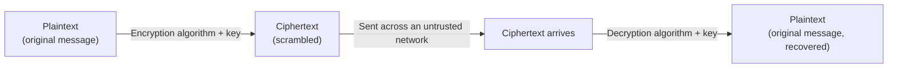

import { ArticleShell, Kicker, Headline, Dek, Byline, Hero, Lede, Callout, KeyTerms, CheckWork, Roadmap, UnitLinks } from '@site/src/components/ArticleKit';

<ArticleShell>

<Kicker>Computer Science · Encryption Unit · Session 1 of 8</Kicker>

<Headline>Every message you send today has already been scrambled, on purpose.</Headline>

<Dek>A text to a friend, a card tap at the supermarket, a login to your school portal — each one is turned into unreadable nonsense before it travels, then turned back. This session is about why that happens, and what "encryption" actually means underneath the padlock icon.</Dek>

<Byline>
  <strong>Session time:</strong> 60 minutes
  ·
  <strong>Homework:</strong> none this session
</Byline>

<Hero src="/img/12DGT/encryption/hero-01-what-encryption-protects.jpg" alt="A padlock and gold credit cards resting on a computer keyboard." caption="Photo: Towfiqu barbhuiya / Unsplash" />

<Lede>

**Goal:** explain what plaintext and ciphertext are, why encryption exists, and name real technologies that depend on it.

| Time | Segment |
|---|---|
| 0–10 min | Diagnostic: what do you already trust with your data? |
| 10–25 min | Explaining plaintext, ciphertext, and the encryption/decryption cycle |
| 25–40 min | Worked example: a message across three real systems |
| 40–50 min | Activity: spot the encryption |
| 50–60 min | Exit question and key terms |

</Lede>

## Before you start

<Callout kind="diagnostic">

Without looking anything up, write down three apps or systems you used today that you assume are "secure." For each one, write one sentence on *what* you think it's protecting — your identity, your money, your messages, something else? Keep this list — you'll check it against what you learn today.

</Callout>

## Plaintext, ciphertext, and the two-way street

**Plaintext** is any information in its original, readable form — the words you typed, the card number on your bank statement, the photo on your phone. **Ciphertext** is what that information looks like after it has been run through an **encryption algorithm** together with a **key**: a scrambled block of data that looks like random noise to anyone who intercepts it.

Encryption only matters because it's reversible for the *right* people and effectively irreversible for everyone else. The same algorithm that turns plaintext into ciphertext (encryption) can turn it back again (decryption) — but only if you also have the correct key. Lose the key, and the ciphertext is just noise, even to the people who sent it.

This is the one idea the entire unit builds on. Every session from here adds detail about *which* algorithm, *whose* key, and *what problem* that solves — but the plaintext → ciphertext → plaintext cycle never changes.

<Callout kind="example" title="Worked example: one message, three real systems">

Say you send "meet at 4pm" to a friend on **WhatsApp**. Three separate encryption systems are involved before that message is read:

1. **WhatsApp's messaging layer** uses the Signal Protocol to encrypt the message on your phone. It travels across the internet as ciphertext the whole way, and only your friend's phone holds the key to decrypt it — not even Meta (WhatsApp's owner) can read it. This is called **end-to-end encryption**.
2. **Your phone's connection to the internet** — whether Wi-Fi or mobile data — is itself typically encrypted (WPA for Wi-Fi, or the mobile network's own encryption), protecting the connection *point to point* even before WhatsApp's own encryption is added.
3. If you'd instead logged into `web.whatsapp.com` in a browser, that connection would also be wrapped in **HTTPS** — a third layer, which Session 3 covers in detail.

Three different technologies, three different jobs, all doing the same underlying thing: turning plaintext into ciphertext so an eavesdropper only ever sees noise.

</Callout>

## Why this exists at all

Encryption exists because data travels through places you don't control: shared Wi-Fi, other companies' servers, cables under the ocean. Without it, anyone positioned along that path — a stranger on the same café Wi-Fi, an intern at your internet provider, a government intercepting international cable traffic — could simply read your data as it passed by. Encryption doesn't stop someone from *intercepting* the data; it stops them from being able to *understand* it.

This matters for far more than messaging apps. **Apple** encrypts the data on an iPhone so that a stolen phone is (mostly) useless to a thief without the passcode. **Banks** encrypt transactions between your card, the terminal, and their servers so a skimmed card number is scrambled nonsense. **Amazon**, and every other online retailer, encrypts your checkout page so your card details aren't sent across the internet in plain view. **Google** encrypts traffic between your browser and its search servers by default. In each case, the underlying goal is the same: keep the plaintext readable only to the people who are supposed to read it.

<Callout kind="pitfall">

A common mistake is thinking encryption stops data being *stolen*. It doesn't — a hacker can still copy ciphertext off a server. What encryption stops is the stolen data being *understood*. This is why a company can suffer a data breach (ciphertext copied) without customer information actually being exposed (because it stays unreadable without the key) — and why Session 6 asks what happens when that protection isn't good enough.

</Callout>

## Activity: spot the encryption

For each scenario below, write down: (a) what is being protected, and (b) who the encryption is trying to keep it hidden from.

1. Tapping a debit card on an EFTPOS terminal at a supermarket.
2. Sending a photo through iMessage between two iPhones.
3. Typing your school portal password into the login page.
4. A hospital transmitting a patient's file to a specialist at another hospital.
5. Opening your car or garage door with a wireless remote.

<CheckWork>

1. **EFTPOS tap:** protects your card and account details from anyone intercepting the wireless signal between card and terminal, and from the terminal to the bank's servers.
2. **iMessage photo:** protects the photo's content from Apple itself, your mobile carrier, and anyone intercepting the connection — only the two phones involved hold the keys.
3. **Portal login:** protects your password (and, once logged in, your personal school data) from anyone watching network traffic between your device and the school's server.
4. **Hospital transfer:** protects sensitive health information from being read by anyone outside the two hospitals — a legal requirement in most health systems, not just good practice.
5. **Garage door remote:** protects the signal from being copied or guessed by someone nearby who wants to open the door without permission. (Session 5 looks at how this specific example has changed enormously over the last 30 years.)

</CheckWork>

## Exit question

In your own words: what is the difference between plaintext and ciphertext, and why does encryption need to be reversible for some people but not others?

<KeyTerms terms={['plaintext', 'ciphertext', 'encryption', 'decryption', 'key', 'end-to-end encryption']} />

<Roadmap length={8} current={1} />

<UnitLinks>

[← Back to unit overview](README.mdx)

[Next → Session 2: Symmetric encryption](02-symmetric-encryption.mdx)

</UnitLinks>

</ArticleShell>
