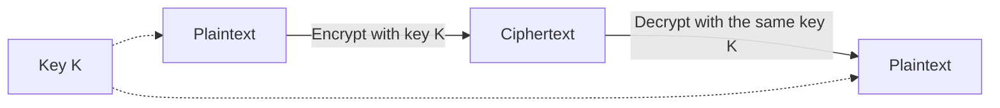

import { ArticleShell, Kicker, Headline, Dek, Byline, Hero, Lede, Callout, KeyTerms, CheckWork, Roadmap, UnitLinks } from '@site/src/components/ArticleKit';

<ArticleShell>

<Kicker>Computer Science · Encryption Unit · Session 2 of 8</Kicker>

<Headline>One key, shared by both sides — and a 1980s garage door that got it badly wrong.</Headline>

<Dek>Symmetric encryption is the oldest and simplest idea in this unit: the same key locks and unlocks the message. It's also exactly what a cheap 1980s garage door remote used — with twelve tiny switches standing in for the key. Comparing that remote to a modern one shows both what symmetric encryption gets right, and the one big problem it can't solve on its own.</Dek>

<Byline>
  <strong>Session time:</strong> 60 minutes
  ·
  <strong>Homework:</strong> none this session
</Byline>

<Hero src="/img/12DGT/encryption/hero-02-symmetric-encryption.jpg" alt="Two hands, each holding an identical key, held up against a blue sky." caption="Photo: MinuteKEY / Unsplash" />

<Lede>

**Goal:** explain how symmetric (shared-key) encryption works, name AES as the current standard, and identify the "key exchange problem" it creates.

| Time | Segment |
|---|---|
| 0–10 min | Diagnostic: the garage door problem |
| 10–30 min | Explaining symmetric encryption and AES |
| 30–45 min | Worked example: dip switches to rolling codes |
| 45–55 min | Activity: strengths and limits of a shared key |
| 55–60 min | Exit question and key terms |

</Lede>

## Before you start

<Callout kind="diagnostic">

If you and a friend want to pass notes in class that no one else can read, the simplest system is to agree on a secret code beforehand — the same code both of you use to write and to read. What's the obvious risk with this plan? Hold that thought.

</Callout>

## Symmetric encryption: one key, both directions

**Symmetric encryption** uses exactly one key to both encrypt and decrypt. Whoever holds that key can turn plaintext into ciphertext, and whoever holds a copy of the *same* key can turn it back. It's called "symmetric" because the process is identical in both directions — nothing changes depending on which way you're going.

The current, internationally trusted standard for this kind of encryption is **AES (Advanced Encryption Standard)**. AES is not a company's private invention — it was selected in 2001 by the US National Institute of Standards and Technology (NIST) after an open competition, and it's now used enormously widely: it secures Wi-Fi traffic (as part of WPA2 and WPA3), encrypts files on phones and laptops, and protects data at rest for banks and cloud providers, including services like **Amazon Web Services**, which offers AES encryption by default for stored customer data. Session 7 looks at whether AES will stay trustworthy as computing power increases.

<Callout kind="case" title="Case file: the garage door remote, then and now">

Older garage door and car remotes (common through the 1980s and into the 1990s) used a **fixed code**, physically set using a row of tiny **dip switches** inside the remote and the receiver — often 8 to 12 of them, each one either on or off. That pattern of switches *was* the "key": press the button, and the remote transmits that fixed pattern every single time.

The problem is obvious once you say it aloud: a fixed signal can be recorded. Anyone with a simple radio receiver could capture the signal once, then replay it whenever they liked — a **replay attack**. With only 12 switches, there are also just 2¹² = 4096 possible combinations, few enough that an attacker could feasibly try every one.

Modern remotes fix this using a **rolling code** system (built on symmetric encryption, using a shared secret key programmed into both the remote and the receiver at manufacture). Every time the button is pressed, the remote sends a *different* code, generated from the shared key plus a counter that increments with every press. The receiver — holding the same key and counter — can verify the code is correct and expected, but a recorded transmission can't simply be replayed, because the code changes every time and the receiver rejects anything it's already seen or that's out of sequence.

This is still symmetric encryption at its core: **the remote and the receiver must both already hold the same secret key.** That's the one problem symmetric encryption never solves by itself, and it's exactly the problem Session 3 exists to answer.

</Callout>

## Activity: strengths and limits

Answer both parts for each scenario:

1. A school issues every staff member a USB drive with the same encryption password, to protect files if the drive is lost.
2. Two spies agree on a shared codeword before a mission begins, then use it for every message during the mission.

For each: (a) is this symmetric encryption, and why? (b) what happens if the shared key/password/codeword is ever discovered by someone else?

<CheckWork>

1. Yes — one shared key (the password) both encrypts and decrypts every drive. If it leaks, every drive issued with that password is compromised at once, not just one.
2. Yes — a shared codeword is a symmetric key by another name. If the codeword is intercepted or one spy is compromised, every past and future message using that codeword is readable to whoever has it — and there's no way to tell the other party "the key is compromised" without a way to reach them securely, which is the same key-exchange problem the garage door example ran into.

</CheckWork>

<Callout kind="pitfall">

A common mistake is describing AES as "unbreakable." It's more accurate to say AES is currently **computationally infeasible** to break by brute force with existing computers — trying every possible key would take far longer than is practical. That's a statement about today's computing power, not a permanent guarantee, which is exactly why Session 7 discusses what quantum computers could change.

</Callout>

## Exit question

Explain, in your own words, why a fixed-code garage door remote from the 1980s was vulnerable to a replay attack, and how a modern rolling-code remote prevents it — while still being an example of symmetric encryption.

<KeyTerms terms={['symmetric encryption', 'shared key', 'AES', 'replay attack', 'rolling code', 'key exchange problem']} />

<Roadmap length={8} current={2} />

<UnitLinks>

[← Session 1: What encryption protects](01-what-encryption-protects.mdx)

[Back to unit overview](README.mdx)

[Next → Session 3: Public-key encryption and HTTPS](03-public-key-encryption-and-https.mdx)

</UnitLinks>

</ArticleShell>
