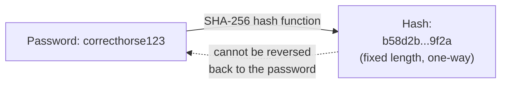
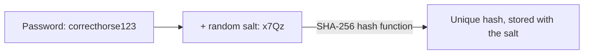

import { ArticleShell, Kicker, Headline, Dek, Byline, Hero, Lede, Callout, KeyTerms, CheckWork, Roadmap, UnitLinks } from '@site/src/components/ArticleKit';

<ArticleShell>

<Kicker>Computer Science · Encryption Unit · Session 4 of 8</Kicker>

<Headline>If a website can email you your old password, that website has already failed.</Headline>

<Dek>Encryption is reversible on purpose — with the right key, ciphertext becomes plaintext again. Passwords need the opposite guarantee: even the website storing them should never be able to recover what you typed. That's a different tool entirely, called hashing, and it's the difference between a password breach that's a minor inconvenience and one that's a disaster.</Dek>

<Byline>
  <strong>Session time:</strong> 60 minutes
  ·
  <strong>Homework:</strong> 120 minutes, due start of Session 5
</Byline>

<Hero src="/img/12DGT/encryption/hero-04-hashing-and-passwords.jpg" alt="Hands typing on a laptop showing a cloud account dashboard." caption="Photo: Bluestonex / Unsplash" />

<Lede>

**Goal:** explain how hashing differs from encryption, what salting adds, and why a "forgot password" email that reveals your old password is a red flag.

| Time | Segment |
|---|---|
| 0–10 min | Diagnostic: reversible or not? |
| 10–30 min | Explaining hashing, SHA-256, and salting |
| 30–45 min | Worked example: the "forgot password" red flag |
| 45–55 min | Activity: password managers and generators |
| 55–60 min | Exit question and key terms, then homework |

</Lede>

## Before you start

<Callout kind="diagnostic">

If a website can email you a "reminder" of your exact original password, what does that tell you about how that website is storing it? Write one sentence, then keep reading.

</Callout>

## Hashing: one-way, on purpose

A **hash function** takes any input — a password, a file, a whole document — and produces a fixed-length string of characters called a **hash** (or digest). Unlike encryption, hashing is **one-way**: there is no key that turns a hash back into the original input. The same input always produces the same hash, but there is no practical way to run the process backwards.

The current widely trusted standard is **SHA-256** (Secure Hash Algorithm, 256-bit), used across the software industry — including by companies like **Microsoft** and **Google** — to verify that a downloaded file hasn't been tampered with, and to store passwords securely.

When you create an account, a well-built system never stores your actual password. It stores the *hash* of your password. When you log in later, it hashes what you typed and compares the two hashes — if they match, you typed the right password, even though the system never stored (or even briefly kept) the original.

<Callout kind="pitfall">

A common mistake is calling this "password encryption." It isn't — encryption is deliberately reversible with a key; hashing is deliberately *not* reversible at all. If a company's marketing or documentation says passwords are "encrypted," that's worth being sceptical of: properly built systems hash passwords, they don't encrypt them.

</Callout>

## Salting: stopping the shortcut

Hashing alone has one weakness: the same password always produces the same hash. If two users both choose "password123", their stored hashes would be identical — and attackers maintain huge pre-built tables of common passwords and their hashes (called **rainbow tables**) specifically to exploit this.

**Salting** fixes this by adding a random, unique string (the **salt**) to each password *before* hashing it, and storing the salt alongside the hash. Two users with the same password now produce two completely different hashes, and pre-built tables become useless, because the attacker would need a fresh table for every possible salt.

## Worked example: the "forgot password" red flag

<Callout kind="example">

Imagine you click "forgot password" on a website, and a few minutes later you receive an email stating: *"Your password is: Tigers2019!"*

This is a serious warning sign. For the website to email you your **exact original password**, it must have stored that password in a form it could read back — either as plain, unprotected text, or using reversible encryption instead of one-way hashing. If that database is ever breached, every user's actual password is exposed, not just an unreadable hash.

A well-built system cannot do this even if it wanted to, because it never has your original password after the moment you first set it — only a hash. Instead, a "forgot password" flow should always send you a **time-limited reset link**, letting you choose a brand-new password, which is then hashed and stored the same way as before. If you ever receive an email with your literal, exact password in it, that's a strong signal the company's security practices are outdated — and a real reason to change that password everywhere else you've reused it.

</Callout>

## Activity: password managers and generators

Many services, including **Apple** (iCloud Keychain), **Google** (Google Password Manager) and independent tools like **Bitwarden** and **1Password**, offer to generate and store long, random passwords for you.

1. What's the advantage of a randomly generated password like `qX9!mL2vRp&4Zk` over something memorable like `Tigers2019!`?
2. Password managers store all of a user's passwords in one place, protected by one master password. What's the advantage of this, and what's the risk?
3. Should the same strong, randomly generated password ever be reused across multiple different websites?

<CheckWork>

1. A long random password draws from a huge range of possible characters and has no dictionary word or personal pattern to guess — dramatically increasing how long a brute-force or dictionary attack would take.
2. Advantage: every account can have a unique, strong password without the user needing to remember dozens of them. Risk: the master password becomes a single point of failure — if it's guessed, weak, or the password manager itself is ever breached, every stored password is potentially exposed at once.
3. No. Even a very strong password should never be reused, because if any *one* of those websites is breached and that password is exposed, every other account using it becomes vulnerable too — strength doesn't protect against reuse.

</CheckWork>

## Exit question

Explain, using the terms "hash" and "salt," why a website storing salted password hashes is safer than one storing plain passwords — even if both are eventually breached.

<KeyTerms terms={['hash function', 'SHA-256', 'one-way', 'salting', 'rainbow table', 'password manager']} />

## Week 1 homework

<Callout kind="homework">

**Time budget:** roughly two hours, due at the start of Session 5. Work in your own time, across the week if that suits you better than one sitting.

</Callout>

### The task: research one real company's encryption

Choose **one** real company or organisation not already covered in detail this week (avoid re-using WhatsApp, Apple's iMessage, or AES/NIST as your main example — pick something different, such as a bank, a airline booking system, a streaming service, a government service, or a company from this achievement standard's usual list: **Microsoft, Amazon, Google, Meta, Tencent/WeChat, or ByteDance/TikTok**).

### A. Identify (20 minutes)

Find one credible, publicly available source (the company's own security or trust page is usually the best starting point) that describes how your chosen company uses encryption. Note the source.

### B. Describe (40 minutes)

In 150–250 words, describe:
- What specifically is being encrypted (messages, stored files, payment details, health records, etc.)
- Whether it's likely symmetric, public-key, or a hashing situation — and why you think so
- What the encryption is protecting against (a named risk, not just "hackers")

### C. Opportunity (30 minutes)

The 91898 assessment often asks what **opportunity** encryption provides — a way it improves something, solves a known problem, or opens up new functionality. In 80–120 words, explain one genuine opportunity this company's use of encryption creates (for the company, for its users, or both).

### D. Self-check (30 minutes)

Swap your write-up with a classmate if possible, or re-read it after a break. Check: did you name the company and technology specifically? Did you avoid vague phrases like "it keeps data safe" without saying *from what*? Revise anything that's too generic.

<Roadmap length={8} current={4} />

<UnitLinks>

[← Session 3: Public-key encryption and HTTPS](03-public-key-encryption-and-https.mdx)

[Back to unit overview](README.mdx)

[Next → Session 5: Encryption in everyday tech](05-encryption-in-everyday-tech.mdx)

</UnitLinks>

</ArticleShell>
