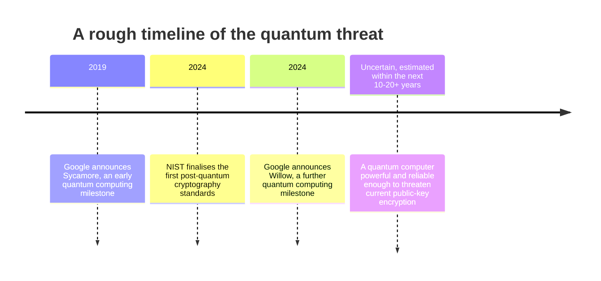

import { ArticleShell, Kicker, Headline, Dek, Byline, Hero, Lede, Callout, KeyTerms, CheckWork, Roadmap, UnitLinks } from '@site/src/components/ArticleKit';

<ArticleShell>

<Kicker>Computer Science · Encryption Unit · Session 7 of 8</Kicker>

<Headline>The lock is fine. The question is how long the world stays unable to pick it.</Headline>

<Dek>Every "unbreakable" encryption standard in history has eventually needed replacing — not because it was flawed, but because computing power caught up with it. Quantum computing is the next such shift, and unusually, the industry has been preparing for it years before it's expected to actually arrive.</Dek>

<Byline>
  <strong>Session time:</strong> 60 minutes
  ·
  <strong>Homework:</strong> none this session
</Byline>

<Hero src="/img/12DGT/encryption/hero-07-future-proofing-encryption.jpg" alt="A server and networking equipment rack, with status lights and cabling." caption="Photo: Kevin Ache / Unsplash" />

<Lede>

**Goal:** explain why encryption needs to be future-proofed, describe the quantum computing threat, and name a real response already underway.

| Time | Segment |
|---|---|
| 0–10 min | Diagnostic: what "unbreakable" really means |
| 10–30 min | Explaining the quantum threat and its timeline |
| 30–45 min | Worked example: post-quantum cryptography |
| 45–55 min | Activity: encrypted today, exposed tomorrow |
| 55–60 min | Exit question and key terms |

</Lede>

## Before you start

<Callout kind="diagnostic">

Session 2 described AES as "computationally infeasible" to break, not "impossible." What's the practical difference between those two words, and why might a careful exam answer always use the first phrase rather than the second?

</Callout>

## Why encryption needs future-proofing

Encryption standards are only as strong as the computing power available to attack them. AES and the mathematics behind public-key encryption (Session 3) rely on problems that would take today's ordinary computers an impractically long time to solve by brute force — long enough to be useless to an attacker in practice. **Future-proofing** means preparing for the point when that stops being true, either because ordinary computers become dramatically faster, or because an entirely different kind of computer changes what "impractically long" means.

## The quantum computing threat

**Quantum computers** are a fundamentally different kind of computer, built on quantum mechanics rather than the classical bits (0s and 1s) that ordinary computers use. Companies including **Google** and **IBM** have been building and steadily scaling up experimental quantum computers through the 2020s — Google's Sycamore (2019) and Willow (2024) chips were both presented as milestones in this progress.

The concern for encryption specifically is that a sufficiently powerful, reliable quantum computer could run algorithms — most importantly one called **Shor's algorithm** — that solve the mathematical problems underlying public-key encryption (Session 3) dramatically faster than any classical computer, potentially undermining it. AES-based symmetric encryption (Session 2) is considered less immediately at risk, though a large enough quantum computer would still weaken it and is expected to need larger keys to stay safe.

<Callout kind="pitfall">

A common mistake is describing quantum computers as "already able to break encryption today." As of the mid-2020s, existing quantum computers are not yet powerful or reliable enough to run these attacks against real-world encryption — the concern is about a genuine future threat, and *when* that threshold might be crossed is genuinely uncertain and actively debated among researchers, with estimates ranging from within the next decade to considerably longer.

</Callout>

## Worked example: post-quantum cryptography

<Callout kind="example">

Rather than waiting for a capable quantum computer to appear, the US National Institute of Standards and Technology (**NIST**) — the same organisation that standardised AES back in 2001 — ran a multi-year international competition to design new encryption methods that are believed to resist attacks from both classical *and* quantum computers. In August 2024, NIST published the first finalised **post-quantum cryptography** standards.

This is sometimes called being **"crypto-agile"** or preparing for **"harvest now, decrypt later"** attacks: some organisations are concerned that an adversary could copy and store encrypted data *today*, with no ability to decrypt it yet, simply waiting until a capable quantum computer exists years from now to decrypt it retroactively. For data that needs to stay confidential for decades — health records, government secrets, some financial records — that risk matters *right now*, even though the quantum computer capable of the attack doesn't yet exist.

This is the key distinction the 91898 exam has asked about directly: data that is **already encrypted and simply stored** faces a different kind of quantum risk (it could be harvested now and decrypted later) than data that **still needs to be encrypted in the future** (which can potentially use post-quantum methods from the start).

</Callout>

## Activity: encrypted today, exposed tomorrow

For each scenario, explain whether the "harvest now, decrypt later" risk applies, and why.

1. A hospital's confidential patient records, encrypted and stored for the required 20-year retention period.
2. A one-time verification code texted to confirm a coffee shop loyalty account, valid for 5 minutes.
3. A national government's classified diplomatic communications, sent today.

<CheckWork>

1. Yes, significantly — the data needs to stay confidential for two decades, well within a plausible window for quantum computing to advance, so data encrypted today with a vulnerable method could be harvested now and decrypted later within its useful lifetime.
2. No, effectively — the code is only useful for five minutes; even if it were somehow decrypted years from now, it would be worthless by then.
3. Yes, often especially so — some government and diplomatic communications are considered sensitive for decades, making them one of the highest-priority cases for adopting post-quantum methods early.

</CheckWork>

## Exit question

Explain the difference between the quantum risk to data that is already encrypted and stored, and the quantum risk to data that still needs to be encrypted in the future — and why that difference matters for deciding what to future-proof first.

<KeyTerms terms={['future-proofing', 'quantum computing', "Shor's algorithm", 'post-quantum cryptography', 'harvest now, decrypt later']} />

<Roadmap length={8} current={7} />

<UnitLinks>

[← Session 6: The human side of encryption](06-the-human-side-of-encryption.mdx)

[Back to unit overview](README.mdx)

[Next → Session 8: Practice assessment](08-practice-assessment.mdx)

</UnitLinks>

</ArticleShell>
