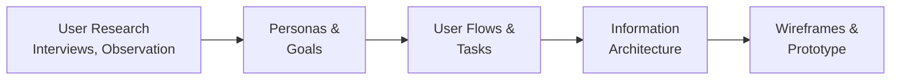

# 1. User Research & Personas

## Purpose of These Notes

These notes explain:
- why you design for *users*, not for yourself
- how to research user needs
- how to create personas to guide design decisions
- how user research directly impacts your design

---

## Key Concepts

By the end of this topic, you must understand:

- **User-centred design:** Decisions should be driven by user needs, not designer preferences
- **User research:** Systematic investigation of user goals, behaviours, and pain points
- **Personas:** Representative user profiles used to keep design focused on real needs
- **Evidence-based design:** Design choices should be traceable to research findings

> If you cannot explain *why* you made a design decision based on user research, it's not evidence of user-centred thinking.

---

## Core Explanation

### Why User Research Matters

Many designers make this mistake: *"I like this design, so users will like it."*

This is backwards. Users are not designers. They:
- have different goals and priorities
- encounter different pain points
- navigate differently than you expect
- may have disabilities you don't have

**User research prevents you from designing for yourself.**

### What User Research Reveals

Research answers questions like:

- Who are the primary users?
- What tasks do they want to accomplish?
- What frustrates them about similar websites?
- What barriers do they face (accessibility, literacy, technology)?
- What brings them to your site?
- What would make them leave?

Without answers to these questions, you're guessing.

### Research Methods

Research doesn't require an expensive lab. Simple methods include:

#### Interviews
- Sit down with users and ask open-ended questions
- *"Tell me about the last time you looked for X on a website. What happened?"*
- Listen for pain points, not validation

#### Surveys
- Ask multiple users structured questions
- Useful for gathering patterns across many people
- Supplement with follow-up interviews for detail

#### Observation
- Watch users interact with a competitor's site or your prototype
- Notice what they click, where they get stuck, what they ignore
- *"Think aloud"* protocol: ask them to explain their reasoning as they explore

#### Card Sorting
- Give users cards with content labels and ask them to group logically
- Reveals how users mentally organize information (and how that differs from your assumptions)

### Creating Personas

A **persona** is a fictional but realistic user profile that represents a user segment.

Personas capture:
- Demographics (age, job, location, skills)
- Goals and motivations
- Pain points and frustrations
- Typical tasks and workflows
- Contextual information (how they access the site, what devices they use)

**Example persona:**

```
Name: Alex, 45
Role: Marketing Manager at a mid-size tech company
Tech comfort: Comfortable; uses multiple devices daily
Goal: Find cost-effective SaaS tools for team collaboration
Pain point: Overwhelmed by marketing jargon; wants simple, honest product descriptions
Device: Primarily laptop; sometimes mobile during meetings
Typical task: Research during lunch break; needs quick comparisons
```

**Why personas matter:**
- They give names and faces to abstract user groups
- They prevent designer bias ("I would do X" → "Would Alex do X?")
- They guide decisions: *"This button placement confuses Alex; change it"*
- They create empathy: you're designing for a real person, not an idea

### From Research to Design Decisions

Research findings should directly shape your wireframes and layout:



Each step traces back to user needs.

---

## Worked Example: Conceptual Reasoning

**Scenario:** You're designing a booking website for a local climbing gym.

**Without user research:**
- You put the booking button in the top-right corner because that's where buttons usually go
- You use climbing-specific jargon because you're a climber
- You design on desktop because that's what you use
- Result: Users can't find booking, don't understand terminology, abandon on mobile

**With user research:**

You interview 5 climbers and ask:
- *"What frustrates you about booking gyms online?"*
- *"Where do you look first when you visit a gym's website?"*
- *"What's confusing about the booking process?"*

**You discover:**

- Most users visit on mobile (standing in the gym, about to book)
- New climbers don't know climbing terminology (don't use jargon)
- Users expect booking to be visible above the fold (first thing you see)
- Users want price and availability instantly, not buried in details

**Your design changes:**

- Mobile-first layout with prominent "Book Now" button
- Plain language: "Beginner climbing" not "top-rope lead progression"
- Price and availability cards on the homepage
- Simple 3-step booking flow instead of a 10-step form

**Why this works:** Every decision traces back to what users told you.

---

## Common Misconceptions

### Misconception 1: *"My users are just like me"*

**Why it's wrong:** You're a designer/developer. Your users are:
- less technical (often)
- busier
- less patient with interface quirks
- potentially using assistive technology

**Correct thinking:** Assume users are different. Research confirms how they're different.

### Misconception 2: *"User research takes too long"*

**Why it's wrong:** You can conduct basic research in a few hours:
- 5 interviews: 2 hours
- 10 survey responses: 1 hour
- Observe 3 people using a competitor site: 1 hour

That's 4 hours for research that prevents 10 hours of redesign later.

**Correct thinking:** Research is fast if you ask the right questions and listen carefully.

### Misconception 3: *"One persona is enough"*

**Why it's wrong:** Most products have multiple user types with different goals:
- A climbing gym site has beginners (want lessons, safe environment) and experienced climbers (want challenging routes)
- Designing for both without distinction fails both

**Correct thinking:** Create 2–3 personas for different user segments. Prioritize which one is primary.

### Misconception 4: *"User research means users always tell you the right answer"*

**Why it's wrong:** Users don't always know what they need. They might say:
- *"I want it faster"* (but actually need clearer instructions, not speed)
- *"I like this competitor's site"* (but abandon it every time they visit)

**Correct thinking:** Watch *what* users do, not just *what* they say. Observe behavior. Ask why.

---

## Assessment Relevance

In **AS91901**, you must submit:

- **Evidence of user research:** Interview notes, survey responses, or observation logs
- **Personas derived from research:** Fictional users representing your target audience
- **Design decisions traced to research:** You explain *why* you made layout choices based on what users told you

**In your design critique**, your teacher will ask:
- *"Who is Alex? What did they tell you?"*
- *"How did Alex's feedback change your wireframe?"*
- *"Why is the booking button in this location?"* → Expected answer: *"Because users looked for it there"*

If you can't trace your design back to research, it's not evidence of user-centred thinking.

---

## External Resources

### Interviews & User Research Methods
- **[Nielsen Norman – User Research Methods](https://www.nngroup.com/articles/user-research-methods/)** – Comprehensive overview of research techniques
- **[Interaction Design Foundation – User Research](https://www.interaction-design.org/literature/topics/user-research)** – Free resource on research planning and execution

### Personas
- **[Creating Personas (Interaction Design Foundation)](https://www.interaction-design.org/literature/article/personas)** – Guide to persona creation
- **[Persona Templates](https://www.nngroup.com/articles/persona/)** – Free templates to structure personas

### Videos
- **[Don't Make Me Think – Steve Krug](https://www.youtube.com/watch?v=gSvqqcRcnR4)** – Classic usability and user research primer
- **[What is User Research? (IDF)](https://www.youtube.com/watch?v=jPDFNVWZ7z0)** – Clear overview of research types and methods

---

## Key Vocabulary

- **Contextual inquiry:** Observing users in their natural environment (where they actually use your product)
- **Empathy:** Understanding user goals and emotions, not just what they do
- **Interview:** One-on-one conversation to understand user needs and behaviors
- **Observation:** Watching users interact with products without directing them
- **Persona:** Representative user profile created from research data
- **Qualitative research:** Detailed understanding of *why* users behave a certain way (interviews, observation)
- **Quantitative research:** Numerical data about *how many* or *how often* (surveys, analytics)
- **Survey:** Structured questions asked to multiple users to identify patterns
- **User-centred design:** Approach where design decisions are driven by user needs, not assumptions
- **User research:** Systematic investigation to understand user goals, behaviors, and pain points

---

## Next Steps

You now understand why and how to research users. In the next topic, [Information Architecture & Wireframing](02_information-architecture-wireframing.md), you'll learn how to use this research to structure your website's content and layout.

---

*End of Topic 1: User Research & Personas*
