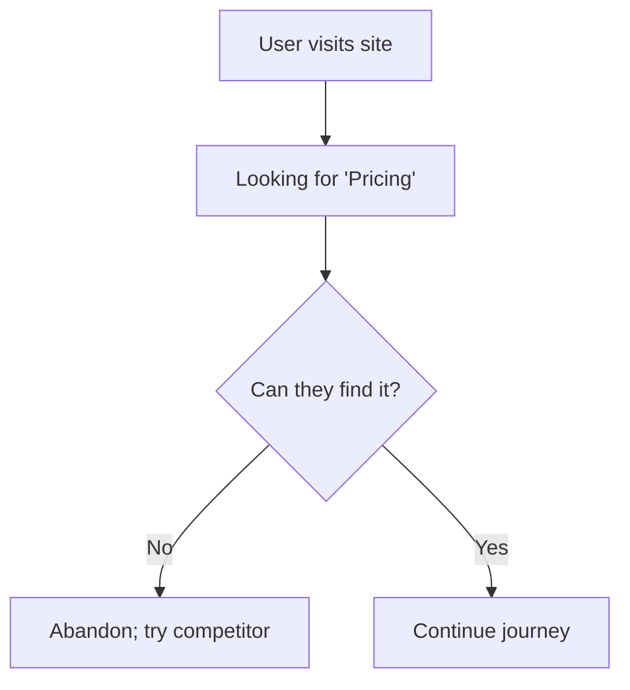
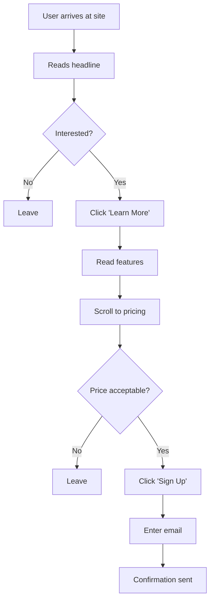

# 2. Information Architecture & Wireframing

## Purpose of These Notes

These notes explain:
- how to organize website content logically (information architecture)
- how to sketch layouts (wireframing)
- how wireframes communicate design intent without visual distraction
- how to evolve wireframes based on user feedback

---

## Key Concepts

By the end of this topic, you must understand:

- **Information architecture (IA):** The structure and organization of content
- **Wireframe:** A low-fidelity blueprint showing layout, structure, and user interaction flow
- **User flow:** The steps a user takes to complete a task
- **Hierarchy:** What users see first, second, third (priority ordering)

> Wireframes are not pretty; they're fast. They let you test structure before investing in visual design.

---

## Core Explanation

### What Is Information Architecture?

Information architecture (IA) answers: *"How should content be organized so users find what they need?"*

It includes:
- **Navigation structure:** How pages are organized (hierarchy: what's at the top level? what's nested?)
- **Labeling:** What do you call sections? (Users must understand labels instantly)
- **Search and filtering:** If your site is large, how do users search or narrow results?
- **Content grouping:** What content belongs together? (Grouping related items reduces cognitive load)

### Why IA Matters

Poor IA creates frustrated users:



Good IA makes it obvious.

### Card Sorting: A Research Method for IA

**Card sorting** is a simple research technique to discover how users organize information:

1. Write content labels on index cards (e.g., "Pricing", "Blog", "FAQ", "Contact")
2. Ask users to group cards into logical categories
3. Observe how they organize; ask *why*
4. Notice patterns (do most users group "FAQ" with "Help" or "Product Info"?)
5. Use patterns to inform your navigation structure

**Example:** A SaaS tool might organize differently based on user mental models:
- **Developer mental model:** Features → Documentation → Pricing
- **Manager mental model:** Pricing → Case Studies → Features

Understanding these patterns prevents misalignment.

### Wireframes: Low-Fidelity Blueprints

A **wireframe** is a sketch of a page showing:
- **Layout:** Where content blocks go
- **Navigation:** How users move between pages
- **Hierarchy:** What's prominent vs. secondary
- **Interaction:** Where buttons/inputs are and what happens when clicked

**What wireframes do NOT show:**
- Colours, fonts, or visual styling
- Specific images or graphics
- Brand identity
- Final visual design

**Why wireframes are valuable:**

Wireframes let you:
- Test structure quickly (1–2 hours, not days)
- Focus on user flow, not aesthetics
- Iterate without attachment ("it's just a sketch")
- identify layout problems early
- get feedback on information organization

### Creating Wireframes

#### Tools
- Paper and pencil (fastest)
- Whiteboard (good for group discussion)
- Figma, Sketch, Adobe XD (digital, shareable, testable)
- Balsamiq (specifically designed for wireframing)

#### Structure
A basic webpage wireframe includes:

```
┌─────────────────────────────────────┐
│   Header / Logo / Navigation        │
├─────────────────────────────────────┤
│ Hero Section / Call-to-Action       │
├──────────────┬──────────────────────┤
│              │                      │
│   Sidebar    │    Main Content      │
│              │                      │
├──────────────┴──────────────────────┤
│   Footer: Links, Contact, Social    │
└─────────────────────────────────────┘
```

Include:
- Navigation labels
- Button labels
- Content blocks (roughly to scale)
- Placeholders for images/videos

#### Fidelity Levels

**Low-fidelity (paper sketches):**
- Pros: Fast, informal, encourages iteration
- Cons: Hard to test interactivity, share digitally

**Medium-fidelity (digital boxes and labels):**
- Pros: Clearer than paper, interactive links possible
- Cons: Takes longer to create

**High-fidelity (detailed wireframes):**
- Pros: Shows exact spacing and interaction
- Cons: Takes time; designers get attached; hard to iterate

**Typical workflow:** Low → Medium → High fidelity as you validate structure.

### User Flows

A **user flow** is a step-by-step diagram showing how users accomplish a task:



User flows reveal:
- Where do users get stuck?
- What questions do they ask before progressing?
- What would make them abandon?

---

## Worked Example: Conceptual Reasoning

**Scenario:** Redesigning a university course registration website.

**Research finding:** Students struggle to find course descriptions.

**Your IA challenge:** Where should "course description" live?

**Option A: Nested deep**
```
Navigation → Academics → Departments → Courses → Description
```
**Problem:** 4 clicks; students give up before reaching it.

**Option B: Top-level link**
```
Navigation → Courses (shows search + description inline)
```
**Problem:** Navigation is cluttered; desktop-only design doesn't scale to mobile.

**Option C: Search-first**
```
Navigation → Search
(Search returns: Course ID, Title, Instructor, Description, Schedule—all on one card)
```
**Why this works:** Matches student behavior (they search by course ID, not by walking through departments).

**Wireframe evolution:**

Your first wireframe shows Option A (hierarchical nav).

You show it to 3 students. They all:
- Ignore the navigation menu
- Look for a search box
- Get frustrated when they have to click through levels

**Insight:** Students expect search, not browse.

**Revised wireframe:** Search box front-and-centre, results show full course info inline.

**Result:** Faster to registration, fewer abandoned sessions.

---

## Common Misconceptions

### Misconception 1: *"My wireframe needs to look good"*

**Why it's wrong:** If your wireframe looks polished, people critique the colours and fonts instead of the structure. You get feedback on aesthetics, not layout.

**Correct thinking:** Keep wireframes rough. Use black boxes and Arial. This signals: *"This is a draft about structure, not a finished design."*

### Misconception 2: *"I should wireframe every page"*

**Why it's wrong:** Some pages are standard templates. Wireframe the unique ones (homepage, key task flows).

**Correct thinking:** Wireframe:
- Homepage and key landing pages
- Pages where users accomplish critical tasks
- Pages with complex layouts

Standard pages (About, Contact) can use a template.

### Misconception 3: *"Wireframes are created once, then discarded"*

**Why it's wrong:** Wireframes are your primary design artifact before visual design. You iterate them based on testing.

**Correct thinking:** Wireframes are testing and iteration tools. Expect to create multiple versions as you learn what works.

### Misconception 4: *"Information architecture is just a menu"*

**Why it's wrong:** IA is bigger than navigation. It includes:
- How content is grouped and labelled
- How search works
- How users filter or refine
- The conceptual model (is this a store, a library, a community?)

**Correct thinking:** IA is the invisible structure that makes everything else work.

---

## Assessment Relevance

In **AS91901**, you must submit:

- **Wireframes showing evolution:** At least 2 iterations showing how feedback shaped your layout
- **Information architecture diagram:** How are pages/sections organized? (can be a simple site map)
- **User flows:** How do users accomplish key tasks?
- **Design rationale:** Why did you choose this layout? (Answer: because users research showed this structure is intuitive)

**In your design critique**, your teacher will ask:
- *"Walk me through this wireframe. How would a user find [feature]?"*
- *"Why did you move this element between version 1 and 2?"*
- *"What research informed this navigation structure?"*

Wireframes are evidence of structured thinking and iteration.

---

## External Resources

### Information Architecture
- **[A List Apart – Information Architecture 101](https://alistapart.com/article/infoarch101/)** – Clear explanation of IA principles
- **[The Information Architecture Institute](https://www.iainstitute.org/)** – Resources and community for IA professionals

### Wireframing
- **[Nielsen Norman – Wireframes](https://www.nngroup.com/articles/wireframes/)** – Best practices for wireframe creation
- **[Wireframing Kit (Figma Community)](https://www.figma.com/community)** – Free templates for wireframing

### Card Sorting
- **[How to Conduct Card Sorting (Nielsen Norman)](https://www.nngroup.com/articles/card-sorting-define-ia/)** – Detailed guide to running card sorting exercises
- **[Optimal Workshop](https://www.optimalworkshop.com/)** – Tool for digital card sorting (some free features)

### Videos
- **[Web Design Basics – Wireframing (Interaction Design Foundation)](https://www.youtube.com/watch?v=qpH7nxVuS14)** – Video overview of wireframing principles
- **[Information Architecture Basics](https://www.youtube.com/watch?v=RQSXfsXO7yE)** – IA explained visually

---

## Key Vocabulary

- **Card sorting:** Research method where users group content labels to reveal mental models
- **Hierarchy:** The order and prominence of elements (most important → least important)
- **Information architecture (IA):** Organization of website content, labeling, and navigation
- **Navigation:** System allowing users to move between pages and sections
- **User flow:** Diagram showing the steps a user takes to complete a task
- **Wireframe:** Low-fidelity blueprint of page layout, structure, and interaction

---

## Next Steps

You now understand how to structure content and sketch layouts. In the next topic, [Visual Design Principles](03_visual-design-principles.md), you'll learn how to apply colour, typography, and visual hierarchy to create high-fidelity prototypes.

---

*End of Topic 2: Information Architecture & Wireframing*
