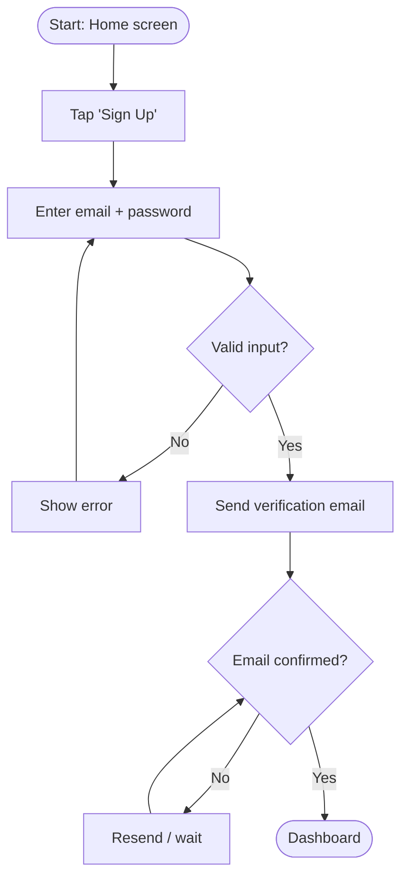
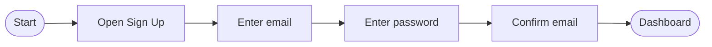
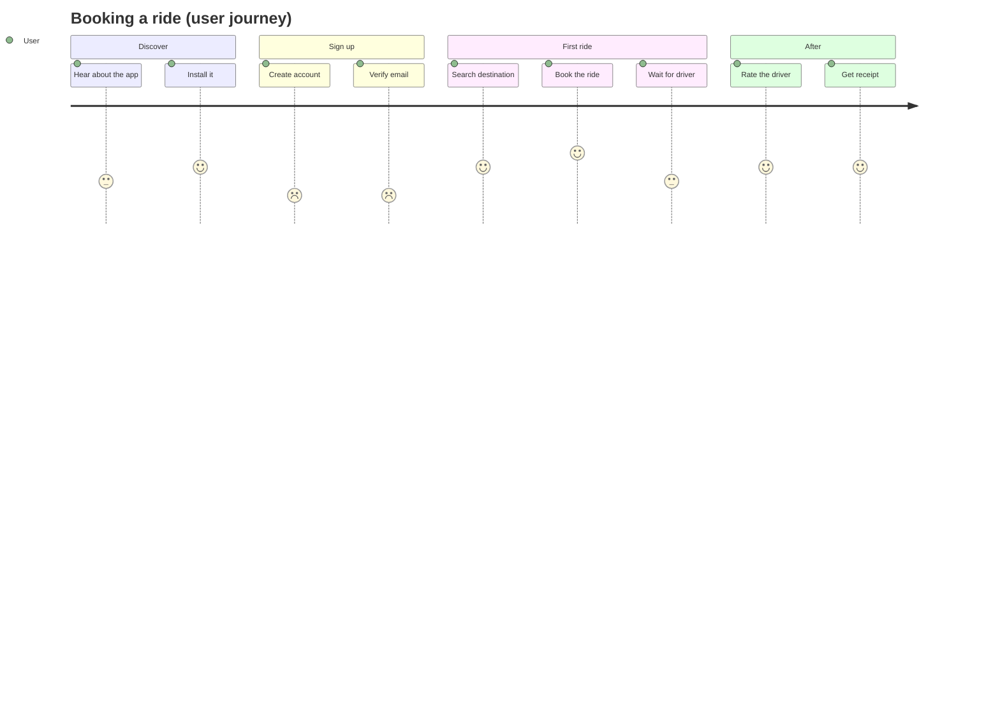
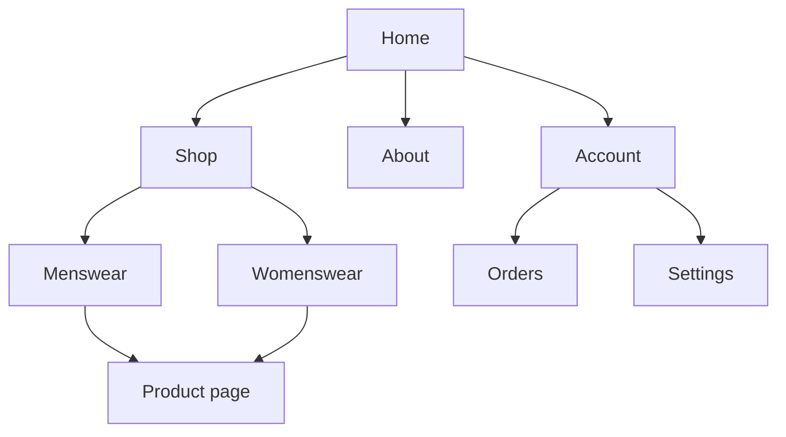
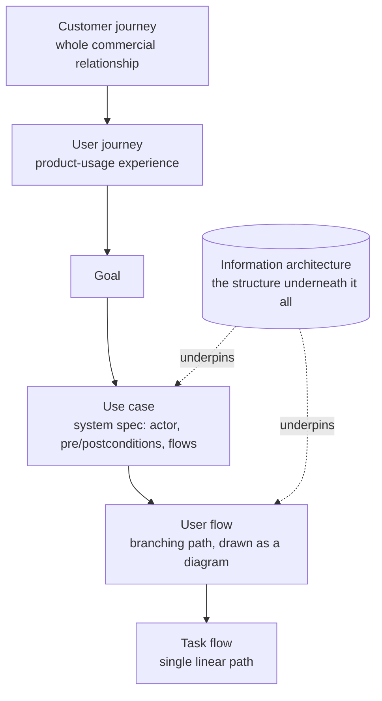
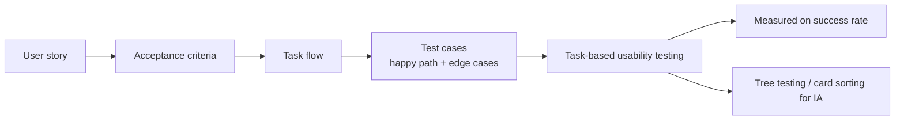

# 2. UX Task Terminology: Use Cases, Flows, Journeys, and Architecture

## Purpose of These Notes

Once you know **who** you're designing for (Topic 1), you need a shared vocabulary for **how they move through your product**. These notes explain:
- the difference between use cases, user flows, task flows, and journey maps
- where information architecture fits relative to those flows
- the testing vocabulary (user stories, acceptance criteria, test cases) that turns a flow into something verifiable

You'll use this vocabulary constantly across the rest of the unit — Topic 3 builds your information architecture, and Topic 7 tests the flows you map here.

Most of these terms line up on one axis — *zoomed in on the system* → *zoomed out on the whole experience*. **Information architecture is the exception**: it sits on a different axis entirely (structure, not path). Getting that straight is the whole game.

> [!warning] Synonyms masquerading as distinct terms
> **User flow**, **user flow diagram**, and **UX flows** are essentially the same concept at slightly different framings. Don't teach them as three separate things — teach one concept and note the naming variants. Same trap applies to **UX journey**, which has no canonical definition.

**▶ Watch (overview):** [What is UX, anyway? — ft. Dr. Jakob Nielsen (NN/g)](https://www.youtube.com/watch?v=8PM6KxV8GRc)

## Grouped by Altitude

### System-spec level

#### Use case

From software engineering (originally UML / Ivar Jacobson), **not** design. A structured specification of how an *actor* (a user, or another system) interacts with your system to achieve a single goal.

Parts of a proper use case:

- **Actor** — who or what initiates it
- **Preconditions** — what must be true before it starts
- **Main success scenario** — numbered steps of the ideal path
- **Alternate flows** — what happens when things branch or fail
- **Postconditions** — what's true once it's done

System-centric. Answers *"what must the system do so the user can accomplish X?"* Covers **all** paths including failures — which is what makes it useful for building and testing.

**▶ Watch:** [Understanding Use-Cases & User Stories (Geekific)](https://www.youtube.com/watch?v=a3v4-KmDbQA) — also nails the use-case vs user-story distinction below.

### Interface-path level

#### User flow

A design artefact showing the concrete path a user takes through your interface to complete a task — screen by screen, click by click — with decision points where the path branches.

Note the diamonds — the branches are what make this a *user* flow rather than a task flow.

**▶ Watch:** [How to Make a UX User Flow — with an example, 5 min](https://www.youtube.com/watch?v=MWwdrA6Ss80)

#### User flow diagram

The **visual artefact** of a user flow (the thing rendered above). In practice "user flow" already usually *is* a diagram, so this term just makes the deliverable explicit — the distinction is thin. Conventions borrowed from flowcharts:

- **Rounded / stadium shapes** — start and end points
- **Rectangles** — screens or states
- **Diamonds** — decision points / branches
- **Arrows** — direction of travel

#### Task flow

A **single, linear** path for one scenario — *no branching*, one user, one way through. Contrast the diagram below with the branching user flow above.

For testing, your task flows are effectively your test scripts.

#### UX flows

A loose, non-canonical umbrella term. Usually just means "user flows," sometimes used to bundle user flows + task flows + wireflows together. **Treat with suspicion** — if a colleague hands you a "UX flow," ask what they actually mean. The ambiguity is in the field, not in your understanding.

### Experience level

#### User journey

Usually a *user journey map*. Captures the user's whole experience of achieving a goal across time and touchpoints, and adds a layer the flows don't: the user's **thoughts, emotions, and pain points** at each stage, plus opportunities to improve. Focused on **product usage**.

The emotion line is the defining feature — here it's the 1–5 satisfaction score per step:

The dips (account creation, waiting) are exactly the pain points a journey map exists to surface.

#### Customer journey

Broader than a user journey, and from a different tradition (marketing / customer experience). Covers the **entire commercial relationship**: awareness → consideration → purchase → onboarding → usage → retention → advocacy — including non-product touchpoints like ads, sales calls, billing, and marketing emails.

> [!info] User vs Customer — the distinction that matters
> A **user** operates the product. A **customer** is in the commercial relationship. They're often *not the same person* — think a child using an app a parent paid for, or a B2B tool bought by a manager but used by staff. Roughly: **user journey ⊂ customer journey**.

**▶ Watch:** [Customer Journey Mapping 101 (NN/g)](https://www.youtube.com/watch?v=2W13ext26kQ) — the 5 components of a journey map.

#### UX journey

No canonical definition. Most people use it as a synonym for "user journey"; some mean specifically the experience *inside* the product. Like "UX flows" — ask before assuming.

## The Orthogonal One

### Information architecture (IA)

Not a path at all — the **structure** the paths move through. IA is the organisation, labelling, and navigation of content so users can find things and complete tasks. Its components:

- **Organisation schemes** — how content is grouped
- **Labelling systems** — what things are called
- **Navigation systems** — how users move around
- **Search systems** — how users query

Deliverables: **sitemaps, taxonomies, content inventories, card-sort results, navigation schemes.** A sitemap is the classic IA artefact:

The key mental model: **flows are routes; IA is the map they're drawn on.** You can have a flawless user flow and users still fail, because the IA buried the entry point three menus deep. Bad IA breaks good flows.

**▶ Watch:** [What Is Information Architecture? — UX Design Guide (CareerFoundry)](https://www.youtube.com/watch?v=OJLfjgVlwDo)

## How They Nest

**▶ Watch (how the layers connect):** [Create User Flow Diagrams From Customer Journey Maps (Headway)](https://www.youtube.com/watch?v=pcCUP23X9g8) — shows the hand-off from journey map down to flow.

## Terms for Testing "A Task the User Is Trying to Do"

The terms above describe the *landscape*. These verify it works.

| Term | What it is | Why it matters for testing |
|---|---|---|
| **User story** | "As a [role], I want [action] so that [benefit]" | Usually the unit you build *and test* against |
| **Acceptance criteria** | Conditions that make a story "done" | Your pass/fail conditions — the single most useful concept for rigorous testing |
| **Scenario** | Short narrative of a persona reaching a goal in context | Frames usability tests so conditions resemble reality |
| **Test case** | QA artefact: inputs, steps, *expected results* | A **false friend** with "use case" — use case describes intent; test case verifies it |
| **Happy path vs edge cases** | Ideal run vs boundary/failure conditions | Only testing the happy path is the most common testing failure |
| **Task success rate / error rate / time on task** | Quantitative usability metrics | Turns "it seemed fine" into a hard number |
| **Task analysis (HTA)** | Breaking a task into sub-steps | Works out *what* to test before deciding *how* |
| **Job to be done (JTBD)** | The user's underlying motivation | Stops you testing whether a feature works while missing whether it solves the real problem |

### Testing IA specifically

Because IA is structural, it needs its own methods that the flow-based ones don't cover:

- **Card sorting** — users group and label content; reveals how *they* expect things organised
- **Tree testing** — users find items in your navigation structure with no visual design; isolates whether the IA itself works
- **First-click testing** — where users click first to start a task (strong predictor of task success)

## The Chain That Matters Most

Write the acceptance criteria well and testing becomes checking each criterion rather than clicking around hoping.

## Further Watching — All Links

- [What is UX, anyway? — ft. Dr. Jakob Nielsen (NN/g)](https://www.youtube.com/watch?v=8PM6KxV8GRc)
- [Understanding Use-Cases & User Stories (Geekific)](https://www.youtube.com/watch?v=a3v4-KmDbQA)
- [How to Make a UX User Flow — with an example, 5 min](https://www.youtube.com/watch?v=MWwdrA6Ss80)
- [Create User Flow Diagrams From Customer Journey Maps (Headway)](https://www.youtube.com/watch?v=pcCUP23X9g8)
- [Customer Journey Mapping 101 (NN/g)](https://www.youtube.com/watch?v=2W13ext26kQ)
- [What Is Information Architecture? — UX Design Guide (CareerFoundry)](https://www.youtube.com/watch?v=OJLfjgVlwDo)

---

## Next Steps

You now have a shared vocabulary for tasks, flows, and journeys. In the next topic, [Information Architecture & Wireframing](03_information-architecture-wireframing.mdx), you'll put IA into practice by structuring content and sketching layouts.

---

*End of Topic 2: UX Task Terminology*
