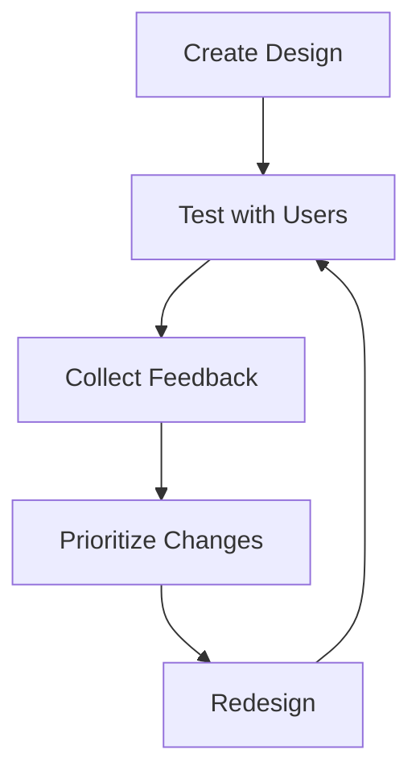

# 7. Design Iteration & Feedback

## Purpose of These Notes

These notes explain:
- how to systematically improve designs based on feedback
- how to prioritize changes
- how to document the iteration cycle
- why iteration is central to professional design

---

## Key Concepts

By the end of this topic, you must understand:

- **Iteration:** Repeating a cycle of design → test → feedback → improve
- **Actionable feedback:** Specific problems with clear solutions
- **Design rationale:** Why you made specific changes
- **Evidence of improvement:** Before/after comparisons showing impact

> Iteration is not failure; it's the standard way professional design works.

---

## Core Explanation

### The Iteration Cycle



This cycle repeats until the design is strong enough to submit.

### Organizing Feedback

#### Categorize Issues

Group feedback by theme:
- **Navigation:** "I couldn't find the menu"
- **Clarity:** "I didn't understand what that button does"
- **Visual design:** "The colours don't match the brand"
- **Accessibility:** "The text is too small"
- **Performance:** "The site was slow to load"

Grouping reveals patterns.

#### Assess Impact and Effort

For each issue:
- **Impact:** How many users affected? How critical is it?
- **Effort:** How much time to fix?

Create a priority matrix:

```
High Impact / Low Effort = FIX FIRST
  (e.g., button is hard to find; make it bigger)

High Impact / High Effort = FIX SECOND
  (e.g., navigation structure is confusing; redesign)

Low Impact / Low Effort = FIX THIRD
  (e.g., small typo; fix it)

Low Impact / High Effort = CONSIDER SKIPPING
  (e.g., one user wanted a feature; it's complex to add)
```

### Documenting Iteration

#### Iteration Journal

Keep a log of changes and why you made them:

```
ITERATION 1:
User feedback: "I couldn't find the booking button"
Change: Made button larger, changed to bright green
Rationale: Size and colour increase visibility
Next test result: All users found it immediately ✓

ITERATION 2:
User feedback: "I don't understand what 'Premium Plan' means"
Change: Changed label to "Premium Plan – $99/month with unlimited features"
Rationale: Clarity; specific pricing and features
Next test result: Users understood immediately ✓

ITERATION 3:
User feedback: "The form felt overwhelming with 10 fields"
Change: Divided form into two pages (required info, optional info)
Rationale: Reduce cognitive load
Next test result: Form completion time improved by 30% ✓
```

#### Before/After Comparisons

Show visually how things changed:

[Image: Old button] → [Image: New button]  
Old: 30px high, light blue, small text  
New: 50px high, bright green, bold text  
Impact: 100% of users found it on first try

### When to Stop Iterating

You can't iterate forever. Stop when:
- **Major issues are resolved:** Critical usability problems are fixed
- **Testing shows consistent success:** Most users complete tasks without confusion
- **Diminishing returns:** Additional feedback is minor (one user's preference vs. patterns)
- **Time is up:** Assessment deadline is approaching

Professional designers balance perfection with practicality.

---

## Worked Example: Conceptual Reasoning

**Scenario:** Booking website for a climbing gym.

**ITERATION 1: Initial Design**
- Booking button in bottom-right corner
- Small, blue button
- Label: "Book"

**User testing (3 users):**
- All 3 users missed the button on homepage
- Took average of 2 minutes to find it
- Issue: Low visibility

**Change:**
- Move button to top-center (above fold)
- Increase size to 50px
- Change to bright green
- Label: "Book Now"

**Rationale:**
- Position: Above the fold (visible without scrolling)
- Size: Larger = more visible
- Colour: Green = action/CTA
- Label: "Now" creates urgency

**ITERATION 2: Revised Design**
- Large green "Book Now" button at top
- Users finding it immediately now ✓
- But new issue: Form is confusing

**User feedback:**
- "I don't know what 'Time Slot' means"
- "Why are there so many fields?"
- "I'm not sure if I need to enter my belting level"

**Change:**
- Clarify labels: "Time Slot" → "Preferred Time & Date"
- Add help text: "Optional: Your climbing experience helps us assign appropriate routes"
- Divide required vs. optional fields visually
- Mark required fields with * and "Required information"

**Rationale:**
- Clarity: Explicit labels reduce confusion
- Progressive disclosure: Separate required from nice-to-have
- Help text: Explains why information is requested

**ITERATION 3: Refined Design**
- Booking button is effective ✓
- Form is clearer ✓
- New issue: Mobile view breaks

**User feedback (testing on mobile):**
- Button is too large on small screens
- Form fields stack awkwardly
- Hard to see all options

**Change:**
- Make button responsive: Large on desktop, medium on tablet, smaller on mobile
- Use responsive grid for form layout
- Collapse optional fields into "Show More" section on mobile
- Test breakpoints: 320px, 768px, 1024px

**Rationale:**
- Responsive design: Works across all devices
- Progressive enhancement: Essential info visible; nice-to-have hidden
- Mobile-first: Optimize for smallest screens first

**ITERATION 4: Final Design**
- Desktop: ✓ Easy button, clear form
- Mobile: ✓ Responsive, streamlined form
- Accessibility: ✓ High contrast, keyboard navigable, screen reader friendly

**Testing result:** 95%+ of users complete booking without help.

---

## Common Misconceptions

### Misconception 1: *"Iteration means my first design was bad"*

**Why it's wrong:** Even professional designers iterate. It's the standard process.

**Correct thinking:** Iteration is how all good design happens. It's not failure; it's learning.

### Misconception 2: *"I should implement every piece of feedback"*

**Why it's wrong:** Some feedback is one person's preference. You'd chase your tail forever.

**Correct thinking:** Prioritize. Implement high-impact, low-effort changes. Ignore edge cases.

### Misconception 3: *"Iteration stops when I submit"*

**Why it's wrong:** In a real project, iteration continues after launch (based on analytics and user behavior).

**Correct thinking:** For this assessment, iteration stops at submission. But in the real world, it never stops.

### Misconception 4: *"I need to change everything based on feedback"*

**Why it's wrong:** Some changes might fix one issue but create others. Test incrementally.

**Correct thinking:** Change one thing at a time. Test. Then change another thing. This isolates impact.

---

## Assessment Relevance

In **AS91901**, iteration is central:

- **Evidence of iteration:** Your submission includes v1 and v2 wireframes, showing evolution
- **Iteration journal:** Documented feedback and changes
- **Design rationale:** Explanations for why you changed things
- **Testing evidence:** Before/after comparisons with quantifiable impact

Your teacher will ask:
- *"Why did you make this change?"*
- *"What feedback prompted this revision?"*
- *"How did users respond to your change?"*

Iteration shows thinking. Designs don't appear fully formed; they improve through evidence.

---

## Iteration Checklist

Before submitting, verify:

- [ ] **Feedback documented:** All user testing notes are recorded
- [ ] **Changes prioritized:** Issues ranked by impact and effort
- [ ] **Iterations tracked:** Journal documents each cycle
- [ ] **Before/after:** Visual comparisons showing improvements
- [ ] **Impact measured:** Testing shows if changes worked
- [ ] **Rationale explained:** You can articulate *why* you made each change
- [ ] **Pattern identified:** Changes based on multiple users, not one outlier

---

## External Resources

### Iteration & Feedback
- **[Design Thinking Process (Interaction Design Foundation)](https://www.interaction-design.org/literature/article/the-5-stages-of-the-design-thinking-process)** – Systematic iteration framework
- **[Design Critique Best Practices](https://www.nngroup.com/articles/design-critiques/)** – How to give and receive feedback

### Tools for Tracking
- **[Figma Version History](https://help.figma.com/en/articles/7322589-view-file-versions-and-restore-a-previous-version)** – Built-in version tracking
- **[Notion Templates](https://www.notion.so/)** – Document iteration process
- **[GitHub Issues](https://docs.github.com/en/issues/tracking-your-work-with-issues)** – Track design tasks and feedback

---

## Key Vocabulary

- **Actionable feedback:** Specific, testable feedback with a clear solution
- **Design critique:** Structured feedback on a design
- **Diminishing returns:** Point where additional effort yields minimal improvement
- **Iteration:** Cycle of design → test → feedback → improve
- **Prioritization:** Deciding which changes to make first based on impact and effort
- **Rationale:** Reasoning behind a design decision
- **Refinement:** Small improvements to an existing design
- **Usability improvement:** Measurable increase in how well users can accomplish tasks

---

## Conclusion

Design is iterative. Professional designers expect to revise their work multiple times. Your job is to:
1. Create an initial design
2. Test with real users
3. Listen to feedback without defensiveness
4. Make prioritized changes
5. Verify improvements through re-testing
6. Document the process

This cycle of improvement is what separates amateur from professional design.

---

*End of Topic 7: Design Iteration & Feedback*  
*End of Unit 1: Web Design & UX Principles*
