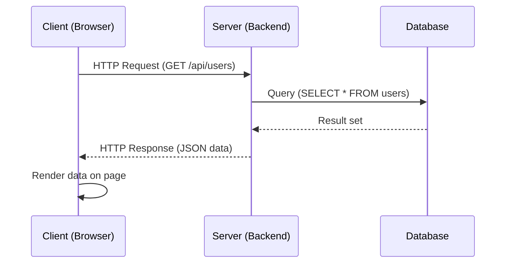
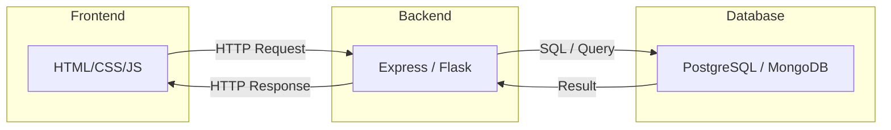
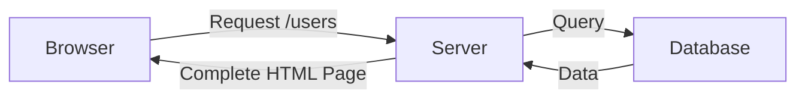
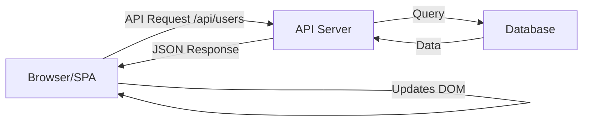
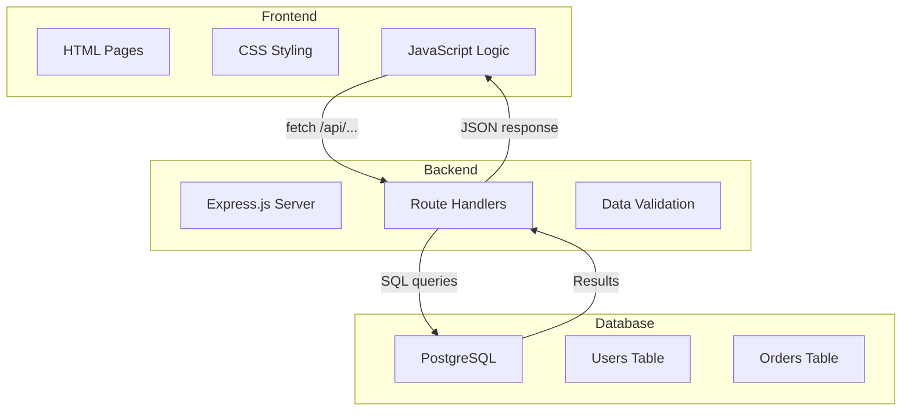

# [FS-3.1] Web Application Architecture

## Why This Matters

Before you write a single line of code, you need to understand **how a web application is structured**. A full-stack app is not one program — it is multiple programs working together across a network.

For AS91903, your architecture diagram and design rationale are assessed. You must be able to explain how your frontend, backend, and database communicate.

---

## The Client-Server Model

Every web application follows the same fundamental pattern:

1. The **client** (browser) sends a request
2. The **server** (backend) processes it
3. The server sends a response
4. The client displays the result



This happens every time you load a page, submit a form, or click a button that fetches data.

---

## The Three Tiers

A full-stack web application has three distinct layers:

| Tier | Name | Responsibility | Technology |
|------|------|----------------|------------|
| 1 | **Frontend** (Presentation) | What the user sees and interacts with | HTML, CSS, JavaScript |
| 2 | **Backend** (Application) | Business logic, data processing, API endpoints | Node.js/Express, Python/Flask |
| 3 | **Database** (Data) | Persistent storage and retrieval | PostgreSQL, MySQL, MongoDB |

### Why Separate Them?

- **Independent development:** Frontend and backend can be built and tested separately
- **Independent deployment:** Update the frontend without touching the backend
- **Scalability:** If the backend is slow, scale just the backend
- **Security:** The database is never directly accessible from the browser

---

## How the Tiers Communicate



- Frontend ↔ Backend: communicate over **HTTP** using **JSON**
- Backend ↔ Database: communicate using **SQL** (relational) or a **query API** (NoSQL)
- Frontend ↔ Database: **never directly** — always through the backend

> ⚠️ The browser should **never** connect to your database directly. That would expose credentials and allow anyone to read or modify your data.

---

## HTTP: The Language of the Web

Every frontend-to-backend communication uses HTTP (HyperText Transfer Protocol).

### HTTP Methods

| Method | Purpose | Example |
|--------|---------|---------|
| **GET** | Retrieve data | `GET /api/users` — get all users |
| **POST** | Create new data | `POST /api/users` — create a new user |
| **PUT** | Update existing data | `PUT /api/users/5` — update user 5 |
| **DELETE** | Remove data | `DELETE /api/users/5` — delete user 5 |

### HTTP Status Codes

| Code | Meaning | When |
|------|---------|------|
| **200** | OK | Request succeeded |
| **201** | Created | New resource created (after POST) |
| **400** | Bad Request | Client sent invalid data |
| **401** | Unauthorized | Not logged in |
| **403** | Forbidden | Logged in but not allowed |
| **404** | Not Found | Resource doesn't exist |
| **500** | Internal Server Error | Something broke on the server |

You will use these in your API responses. A well-designed API returns the **correct status code** for each situation.

---

## Request and Response Structure

### HTTP Request (from browser)

```
GET /api/users/5 HTTP/1.1
Host: localhost:3000
Accept: application/json
Authorization: Bearer eyJhbGciOi...
```

Key parts:
- **Method + URL:** What you want to do and where
- **Headers:** Metadata (authentication, content type)
- **Body** (for POST/PUT): The data being sent

### HTTP Response (from server)

```
HTTP/1.1 200 OK
Content-Type: application/json

{
  "id": 5,
  "name": "Alice",
  "email": "alice@school.nz"
}
```

Key parts:
- **Status code:** Did it work?
- **Headers:** Metadata about the response
- **Body:** The actual data (usually JSON)

---

## JSON: The Data Format

**JSON (JavaScript Object Notation)** is the standard format for sending data between frontend and backend.

```json
{
  "id": 1,
  "name": "Alice",
  "email": "alice@school.nz",
  "subjects": ["Digital Tech", "Maths", "Physics"],
  "is_active": true
}
```

### Rules

- Keys are strings in double quotes
- Values can be: strings, numbers, booleans, arrays, objects, or `null`
- No trailing commas
- No comments

Both JavaScript and Python can parse and produce JSON natively:

```javascript
// JavaScript
const data = JSON.parse(responseText);    // string → object
const json = JSON.stringify(data);        // object → string
```

```python
# Python
import json
data = json.loads(response_text)          # string → dict
json_text = json.dumps(data)             # dict → string
```

---

## Architecture Patterns for Your Project

### Pattern 1: Server-Rendered (Monolithic)

The backend generates complete HTML pages and sends them to the browser.



**Examples:** Flask with Jinja templates, Express with EJS  
**Pros:** Simple, fewer moving parts  
**Cons:** Slower interactions (full page reload for every action)

### Pattern 2: API + Single Page Application (SPA)

The backend only serves JSON data. The frontend is a separate JavaScript application that calls the API and updates the page dynamically.



**Examples:** React + Express API, Vue + Flask API  
**Pros:** Fast, interactive, clear separation  
**Cons:** More complex, two codebases to manage

### Which Should You Choose?

For AS91903, either pattern is acceptable. Choose based on your skill level:

| If you're comfortable with... | Choose |
|-------------------------------|--------|
| HTML/CSS + basic JavaScript | Server-rendered (Flask/Jinja or Express/EJS) |
| JavaScript + async/await + fetch | API + SPA (React/Vue/Vanilla JS + Express/Flask API) |

---

## Designing Your Architecture

For your project specification, you need an **architecture diagram**. Here's a template:



Your diagram should show:
- The three tiers clearly labelled
- The specific technologies you're using
- How data flows between tiers
- Key entities in your database

---

## Folder Structure

Organise your project so the separation is visible:

### Server-Rendered (Express + EJS)

```
project/
├── server.js              # Entry point
├── routes/
│   ├── users.js           # User-related routes
│   └── orders.js          # Order-related routes
├── views/
│   ├── layout.ejs         # Base template
│   ├── users.ejs          # User list page
│   └── orders.ejs         # Order list page
├── public/
│   ├── css/
│   │   └── style.css
│   └── js/
│       └── main.js
├── models/
│   └── db.js              # Database connection
├── package.json
└── README.md
```

### API + Separate Frontend

```
project/
├── backend/
│   ├── server.js
│   ├── routes/
│   │   ├── users.js
│   │   └── orders.js
│   ├── models/
│   │   └── db.js
│   └── package.json
├── frontend/
│   ├── index.html
│   ├── css/
│   │   └── style.css
│   └── js/
│       ├── app.js
│       └── api.js          # API call functions
└── README.md
```

---

## Common Mistakes

1. **No architecture diagram** — jumping into code without designing the system
2. **Frontend talks directly to database** — a security and design violation
3. **Everything in one file** — 2000 lines of JavaScript with no separation
4. **Mixing concerns** — HTML generation inside database query functions
5. **No clear API contract** — frontend and backend developers (or your future self) don't know what endpoints exist
6. **Ignoring error responses** — only handling the happy path; no thought about what happens when things fail

---

## Key Vocabulary

- **API:** Application Programming Interface — the contract between frontend and backend
- **Client:** The browser or application making requests
- **Endpoint:** A specific URL on the server that handles a particular request
- **HTTP:** HyperText Transfer Protocol — how browsers and servers communicate
- **JSON:** JavaScript Object Notation — standard data exchange format
- **Server:** The backend application that processes requests and returns responses
- **SPA:** Single Page Application — frontend that updates without full page reloads
- **Three-tier architecture:** Separation into presentation, application, and data layers

---

## Next Steps

Continue to [2. Frontend Fundamentals](02_frontend-fundamentals.mdx) to learn how to build the presentation layer of your application.

---

*End of Topic 1: Web Application Architecture*
