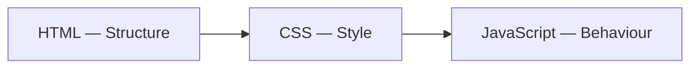

# [FS-3.2] Frontend Fundamentals

## Why This Matters

The frontend is what users see and interact with. A backend that works perfectly is useless if the frontend is broken, confusing, or doesn't display data correctly.

For AS91903, your frontend must demonstrate **clear structure, responsive design, and meaningful interaction with the backend**.

---

## The Three Frontend Languages

Every web page is built with three languages, each with a distinct role:

| Language | Role | Analogy |
|----------|------|---------|
| **HTML** | Structure and content | The skeleton |
| **CSS** | Appearance and layout | The clothing |
| **JavaScript** | Behaviour and interaction | The muscles |



They work together but should be kept in **separate files**. Don't mix CSS into HTML attributes or put JavaScript inline in HTML tags.

---

## HTML: Structure

HTML defines **what** is on the page, not how it looks.

### Semantic HTML

Use elements that describe their **purpose**, not their appearance:

| ❌ Non-semantic | ✅ Semantic | Why |
|----------------|------------|-----|
| `<div class="header">` | `<header>` | Screen readers and search engines understand it |
| `<div class="nav">` | `<nav>` | Clearly identifies navigation |
| `<div class="main">` | `<main>` | Identifies primary content |
| `<div class="footer">` | `<footer>` | Identifies page footer |
| `<b>Important</b>` | `<strong>Important</strong>` | Semantic emphasis, not just bold |

### Page Template

```html
<!DOCTYPE html>
<html lang="en">
<head>
    <meta charset="UTF-8">
    <meta name="viewport" content="width=device-width, initial-scale=1.0">
    <title>My Application</title>
    <link rel="stylesheet" href="css/style.css">
</head>
<body>
    <header>
        <h1>My Application</h1>
        <nav>
            <a href="/">Home</a>
            <a href="/users">Users</a>
        </nav>
    </header>

    <main>
        <section id="content">
            <!-- Dynamic content goes here -->
        </section>
    </main>

    <footer>
        <p>&copy; 2026 My Application</p>
    </footer>

    <script src="js/app.js"></script>
</body>
</html>
```

Key points:
- `<meta name="viewport">` is **required** for responsive design
- CSS goes in `<head>`, JavaScript goes before `</body>`
- Use semantic elements (`header`, `nav`, `main`, `section`, `footer`)

### Forms

Forms are how users send data to your backend:

```html
<form id="user-form">
    <label for="name">Name:</label>
    <input type="text" id="name" name="name" required>

    <label for="email">Email:</label>
    <input type="email" id="email" name="email" required>

    <button type="submit">Create User</button>
</form>
```

- Every `<input>` needs a `<label>` with a matching `for` attribute (accessibility)
- Use appropriate `type` values (`email`, `number`, `date`) for built-in validation
- Use `required` for mandatory fields

---

## CSS: Styling and Layout

### Box Model

Every HTML element is a box with four layers:

```
┌─────────────── margin ───────────────┐
│ ┌──────────── border ──────────────┐ │
│ │ ┌────────── padding ──────────┐  │ │
│ │ │                              │  │ │
│ │ │         content              │  │ │
│ │ │                              │  │ │
│ │ └──────────────────────────────┘  │ │
│ └────────────────────────────────────┘ │
└────────────────────────────────────────┘
```

```css
.card {
    margin: 16px;          /* space outside the border */
    border: 1px solid #ccc; /* visible border */
    padding: 16px;         /* space inside the border */
    width: 300px;          /* content width */
}
```

> Use `box-sizing: border-box` so padding and border are included in the width. Add this to every project:

```css
*, *::before, *::after {
    box-sizing: border-box;
}
```

### Flexbox: One-Dimensional Layout

Use Flexbox for laying out items in a **row or column**:

```css
/* Navigation bar — items in a row */
nav {
    display: flex;
    gap: 16px;
    align-items: center;
}

/* Card stack — items in a column */
.card-list {
    display: flex;
    flex-direction: column;
    gap: 12px;
}
```

Key Flexbox properties:
- `display: flex` — activate Flexbox on the container
- `flex-direction` — `row` (default) or `column`
- `justify-content` — horizontal alignment (`center`, `space-between`, `flex-start`)
- `align-items` — vertical alignment (`center`, `stretch`, `flex-start`)
- `gap` — space between items
- `flex-wrap: wrap` — allow items to wrap to next line

### CSS Grid: Two-Dimensional Layout

Use Grid for **rows and columns** together:

```css
/* Dashboard layout */
.dashboard {
    display: grid;
    grid-template-columns: 250px 1fr;
    grid-template-rows: 60px 1fr;
    gap: 16px;
    height: 100vh;
}

.sidebar { grid-row: 1 / -1; }
.header  { grid-column: 2; }
.content { grid-column: 2; }
```

### When to Use Which?

| Layout Need | Use |
|------------|-----|
| Nav bar (items in a row) | Flexbox |
| Card grid (equal columns) | Grid |
| Centering one item | Flexbox |
| Full page layout (header, sidebar, content) | Grid |
| Items of varying width in a row | Flexbox with `flex-wrap` |

---

## Responsive Design

Your application must work on **desktop, tablet, and mobile**.

### Mobile-First Approach

Write CSS for mobile first, then add rules for larger screens:

```css
/* Base styles (mobile) */
.card-grid {
    display: grid;
    grid-template-columns: 1fr;
    gap: 16px;
    padding: 16px;
}

/* Tablet (768px and up) */
@media (min-width: 768px) {
    .card-grid {
        grid-template-columns: repeat(2, 1fr);
    }
}

/* Desktop (1024px and up) */
@media (min-width: 1024px) {
    .card-grid {
        grid-template-columns: repeat(3, 1fr);
    }
}
```

### Responsive Tips

- Use `%`, `vw`, `rem` instead of fixed `px` for widths
- Set `max-width` on content containers to prevent lines stretching across wide screens
- Use `min-width` media queries (mobile-first), not `max-width`
- Test at 320px, 768px, and 1024px widths

---

## JavaScript: DOM Manipulation

The **DOM (Document Object Model)** is the browser's representation of your HTML as a tree of objects. JavaScript can read and change the DOM to update what the user sees.

### Selecting Elements

```javascript
// By ID (returns one element)
const form = document.getElementById('user-form');

// By CSS selector (returns first match)
const header = document.querySelector('header');

// By CSS selector (returns all matches)
const cards = document.querySelectorAll('.card');
```

### Changing Content

```javascript
// Set text content
document.getElementById('status').textContent = 'Loading...';

// Set HTML content (be careful — sanitise user data first)
document.getElementById('user-list').innerHTML = '<li>Alice</li>';

// Change attributes
document.getElementById('profile-img').src = 'alice.jpg';

// Change styles
document.getElementById('alert').style.display = 'none';
```

### Creating Elements

```javascript
function createUserCard(user) {
    const card = document.createElement('div');
    card.className = 'card';

    const name = document.createElement('h3');
    name.textContent = user.name;

    const email = document.createElement('p');
    email.textContent = user.email;

    card.appendChild(name);
    card.appendChild(email);

    return card;
}

// Add to page
const container = document.getElementById('user-list');
container.appendChild(createUserCard({ name: 'Alice', email: 'alice@school.nz' }));
```

> ⚠️ Use `textContent` when inserting user-provided data. Using `innerHTML` with unsanitised input creates **Cross-Site Scripting (XSS)** vulnerabilities.

### Event Handling

```javascript
// Form submission
document.getElementById('user-form').addEventListener('submit', function(event) {
    event.preventDefault();  // stop page reload

    const name = document.getElementById('name').value;
    const email = document.getElementById('email').value;

    // Send to API (covered in Topic 6: Integration)
    createUser({ name, email });
});

// Button click
document.getElementById('delete-btn').addEventListener('click', function() {
    if (confirm('Are you sure?')) {
        deleteUser(userId);
    }
});
```

---

## Fetch API: Calling Your Backend

The `fetch` function sends HTTP requests from JavaScript. This is how your frontend communicates with your API.

### GET Request (Retrieve Data)

```javascript
async function getUsers() {
    const response = await fetch('/api/users');

    if (!response.ok) {
        throw new Error(`HTTP error: ${response.status}`);
    }

    const users = await response.json();
    return users;
}
```

### POST Request (Create Data)

```javascript
async function createUser(userData) {
    const response = await fetch('/api/users', {
        method: 'POST',
        headers: {
            'Content-Type': 'application/json'
        },
        body: JSON.stringify(userData)
    });

    if (!response.ok) {
        throw new Error(`HTTP error: ${response.status}`);
    }

    const newUser = await response.json();
    return newUser;
}
```

### Putting It Together

```javascript
// Load users when page loads
async function loadUsers() {
    const container = document.getElementById('user-list');
    container.textContent = 'Loading...';

    try {
        const users = await getUsers();
        container.innerHTML = '';
        users.forEach(user => {
            container.appendChild(createUserCard(user));
        });
    } catch (error) {
        container.textContent = 'Failed to load users.';
        console.error(error);
    }
}

document.addEventListener('DOMContentLoaded', loadUsers);
```

---

## Frontend File Organisation

```
frontend/
├── index.html
├── users.html
├── css/
│   ├── style.css          # Global styles
│   └── components.css     # Reusable component styles
└── js/
    ├── app.js             # Page initialisation
    ├── api.js             # All fetch calls to backend
    └── dom.js             # DOM manipulation helpers
```

Keep API calls in a **separate file** from DOM manipulation. This makes testing and debugging easier.

---

## Common Mistakes

1. **Inline styles and scripts** — CSS in `style=""` attributes and JS in `onclick=""` makes code unmaintainable
2. **No semantic HTML** — `<div>` for everything; screen readers can't navigate the page
3. **No responsive design** — page looks fine on your laptop but broken on mobile
4. **Using `innerHTML` with user data** — XSS vulnerability; use `textContent` instead
5. **No error handling on fetch** — page breaks silently when the API is down
6. **No loading states** — user sees a blank page while data loads

---

## Key Vocabulary

- **DOM:** Document Object Model — the browser's tree representation of HTML
- **Event listener:** Code that runs when a user action occurs (click, submit, keypress)
- **Fetch:** JavaScript API for making HTTP requests
- **Flexbox:** CSS layout method for one-dimensional arrangement
- **Grid:** CSS layout method for two-dimensional arrangement
- **Media query:** CSS rule that applies styles based on screen size
- **Responsive design:** Design that adapts to different screen sizes
- **Semantic HTML:** Using elements that describe their purpose (header, nav, main)
- **XSS:** Cross-Site Scripting — a security vulnerability from injecting untrusted HTML

---

## Next Steps

Continue to [3. Backend Development](03_backend-development.mdx) to learn how to build the server that powers your application.

---

*End of Topic 2: Frontend Fundamentals*
