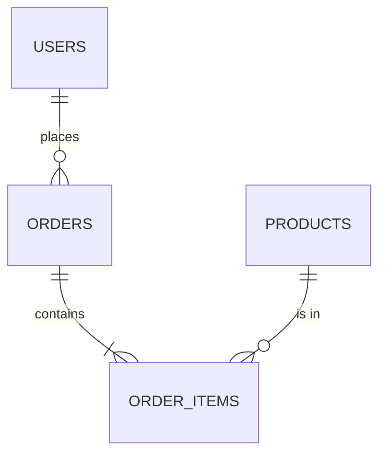

# [FS-3.5] Database Design

## Why This Matters

Your database is the **permanent memory** of your application. If your schema is poorly designed, every query will be slow, buggy, or produce wrong results. Fix the design first; the code follows naturally.

For AS91903, you must submit a **database schema with design rationale** — not just tables, but an explanation of why they're structured that way.

---

## Relational vs Document Databases

| Feature | Relational (SQL) | Document (NoSQL) |
|---------|------------------|-------------------|
| Structure | Tables with rows and columns | Collections of JSON-like documents |
| Schema | Fixed — define columns before inserting data | Flexible — documents can have different fields |
| Relationships | Foreign keys between tables | Embedded documents or references |
| Query language | SQL | Database-specific (e.g., MongoDB queries) |
| Examples | PostgreSQL, MySQL, SQLite | MongoDB, Firebase |
| Best for | Structured data with clear relationships | Flexible or nested data |

For most AS91903 projects, a **relational database** (PostgreSQL or SQLite) is recommended. Structured data with relationships is the norm for web applications.

---

## Relational Database Concepts

### Tables

A table stores one type of entity. Each row is a record; each column is an attribute.

```
users table:
┌────┬──────────┬──────────────────┬─────────────┐
│ id │ name     │ email            │ role        │
├────┼──────────┼──────────────────┼─────────────┤
│ 1  │ Alice    │ alice@school.nz  │ admin       │
│ 2  │ Bob      │ bob@school.nz    │ student     │
│ 3  │ Charlie  │ charlie@school.nz│ student     │
└────┴──────────┴──────────────────┴─────────────┘
```

### Primary Keys

Every table needs a **primary key** — a unique identifier for each row. Usually an auto-incrementing integer called `id`.

### Foreign Keys

A **foreign key** links one table to another. It stores the primary key of a related record.

```
orders table:
┌────┬─────────┬────────────┬────────┐
│ id │ user_id │ product    │ amount │
├────┼─────────┼────────────┼────────┤
│ 1  │ 1       │ Widget     │ 29.99  │
│ 2  │ 2       │ Gadget     │ 49.99  │
│ 3  │ 1       │ Sprocket   │ 19.99  │
└────┴─────────┴────────────┴────────┘
```

`user_id` is a foreign key pointing to `users.id`. This creates a **one-to-many** relationship: one user can have many orders.

---

## Designing a Schema

### Step 1: Identify Entities

List the main things your application manages:
- Users
- Products
- Orders
- Reviews

### Step 2: Identify Attributes

For each entity, list what data you need to store:

| Entity | Attributes |
|--------|-----------|
| User | id, name, email, password_hash, role, created_at |
| Product | id, name, description, price, stock_count |
| Order | id, user_id, total, status, created_at |
| Order Item | id, order_id, product_id, quantity, unit_price |

### Step 3: Identify Relationships



- One user places **many** orders (one-to-many)
- One order contains **many** order items (one-to-many)
- One product appears in **many** order items (one-to-many)

### Step 4: Write the SQL

```sql
CREATE TABLE users (
    id SERIAL PRIMARY KEY,
    name VARCHAR(100) NOT NULL,
    email VARCHAR(255) UNIQUE NOT NULL,
    password_hash VARCHAR(255) NOT NULL,
    role VARCHAR(20) DEFAULT 'student',
    created_at TIMESTAMP DEFAULT CURRENT_TIMESTAMP
);

CREATE TABLE products (
    id SERIAL PRIMARY KEY,
    name VARCHAR(100) NOT NULL,
    description TEXT,
    price DECIMAL(10, 2) NOT NULL CHECK (price >= 0),
    stock_count INTEGER DEFAULT 0 CHECK (stock_count >= 0)
);

CREATE TABLE orders (
    id SERIAL PRIMARY KEY,
    user_id INTEGER NOT NULL REFERENCES users(id),
    total DECIMAL(10, 2) NOT NULL,
    status VARCHAR(20) DEFAULT 'pending',
    created_at TIMESTAMP DEFAULT CURRENT_TIMESTAMP
);

CREATE TABLE order_items (
    id SERIAL PRIMARY KEY,
    order_id INTEGER NOT NULL REFERENCES orders(id) ON DELETE CASCADE,
    product_id INTEGER NOT NULL REFERENCES products(id),
    quantity INTEGER NOT NULL CHECK (quantity > 0),
    unit_price DECIMAL(10, 2) NOT NULL
);
```

---

## Normalization

**Normalization** eliminates redundant data by splitting it into related tables.

### ❌ Unnormalized

```
orders table:
┌────┬────────┬─────────────────┬────────────┬────────┐
│ id │ user   │ user_email      │ product    │ amount │
├────┼────────┼─────────────────┼────────────┼────────┤
│ 1  │ Alice  │ alice@school.nz │ Widget     │ 29.99  │
│ 2  │ Bob    │ bob@school.nz   │ Gadget     │ 49.99  │
│ 3  │ Alice  │ alice@school.nz │ Sprocket   │ 19.99  │
└────┴────────┴─────────────────┴────────────┴────────┘
```

Problems:
- Alice's name and email are stored **twice** — if she changes email, you must update every row
- **Update anomaly:** change email in one row but not another → inconsistent data
- **Delete anomaly:** delete all of Alice's orders → lose her user data

### ✅ Normalized

Separate tables for users and orders, linked by `user_id`:

```
users: { id: 1, name: "Alice", email: "alice@school.nz" }
orders: { id: 1, user_id: 1, product: "Widget", amount: 29.99 }
orders: { id: 3, user_id: 1, product: "Sprocket", amount: 19.99 }
```

Alice's details are stored **once**. Orders reference her by ID.

---

## SQL Queries

### Basic CRUD

```sql
-- Create
INSERT INTO users (name, email, password_hash)
VALUES ('Alice', 'alice@school.nz', '$2b$10$...');

-- Read all
SELECT id, name, email, role FROM users;

-- Read one
SELECT * FROM users WHERE id = 5;

-- Update
UPDATE users SET email = 'newalice@school.nz' WHERE id = 5;

-- Delete
DELETE FROM users WHERE id = 5;
```

### Filtering and Sorting

```sql
-- Filter
SELECT * FROM users WHERE role = 'admin';

-- Sort
SELECT * FROM products ORDER BY price DESC;

-- Pagination
SELECT * FROM users ORDER BY id LIMIT 20 OFFSET 40;

-- Search (case-insensitive)
SELECT * FROM products WHERE LOWER(name) LIKE '%widget%';
```

### Joins

Combine data from related tables:

```sql
-- Get all orders with user names
SELECT orders.id, users.name, orders.total, orders.status
FROM orders
JOIN users ON orders.user_id = users.id;

-- Get order items with product details
SELECT
    oi.quantity,
    oi.unit_price,
    p.name AS product_name
FROM order_items oi
JOIN products p ON oi.product_id = p.id
WHERE oi.order_id = 42;
```

### Aggregate Functions

```sql
-- Count users by role
SELECT role, COUNT(*) AS count FROM users GROUP BY role;

-- Total revenue per user
SELECT users.name, SUM(orders.total) AS total_spent
FROM users
JOIN orders ON users.id = orders.user_id
GROUP BY users.name
ORDER BY total_spent DESC;
```

---

## Connecting to the Database

### Node.js + PostgreSQL (pg)

```javascript
// models/db.js
const { Pool } = require('pg');

const pool = new Pool({
    connectionString: process.env.DATABASE_URL
});

module.exports = {
    query: (text, params) => pool.query(text, params)
};
```

```javascript
// routes/users.js
const db = require('../models/db');

router.get('/', async (req, res) => {
    const { rows } = await db.query('SELECT id, name, email FROM users');
    res.json(rows);
});

router.post('/', async (req, res) => {
    const { name, email } = req.body;
    const { rows } = await db.query(
        'INSERT INTO users (name, email) VALUES ($1, $2) RETURNING *',
        [name, email]
    );
    res.status(201).json(rows[0]);
});
```

> ⚠️ Always use **parameterized queries** (`$1`, `$2`). Never concatenate user input into SQL strings — that creates **SQL injection** vulnerabilities.

### Python + SQLite

```python
# models/db.py
import sqlite3

def get_db():
    conn = sqlite3.connect('app.db')
    conn.row_factory = sqlite3.Row
    return conn
```

```python
# routes/users.py
from models.db import get_db

@app.route('/api/users', methods=['GET'])
def get_users():
    db = get_db()
    users = db.execute('SELECT id, name, email FROM users').fetchall()
    return jsonify([dict(row) for row in users])

@app.route('/api/users', methods=['POST'])
def create_user():
    data = request.get_json()
    db = get_db()
    cursor = db.execute(
        'INSERT INTO users (name, email) VALUES (?, ?)',
        (data['name'], data['email'])
    )
    db.commit()
    return jsonify({"id": cursor.lastrowid, **data}), 201
```

---

## SQL Injection Prevention

**SQL injection** is one of the most dangerous web vulnerabilities. It happens when user input is inserted directly into SQL queries.

### ❌ Vulnerable

```javascript
// NEVER do this
const query = `SELECT * FROM users WHERE email = '${req.body.email}'`;
```

If the user enters `' OR 1=1 --` as the email, the query becomes:
```sql
SELECT * FROM users WHERE email = '' OR 1=1 --'
```
This returns **all users**.

### ✅ Safe (Parameterized)

```javascript
const { rows } = await db.query(
    'SELECT * FROM users WHERE email = $1',
    [req.body.email]
);
```

The database treats the parameter as a **value**, not as SQL code. Injection is impossible.

---

## Schema Design for Your Project

Include this in your AS91903 submission:

1. **Entity list** — what tables do you need?
2. **ER diagram** — how do tables relate?
3. **CREATE TABLE statements** — the actual SQL schema
4. **Design rationale** — why you structured it this way

### Example Rationale

> *"I separated users and orders into two tables because one user can have many orders (one-to-many relationship). Storing user details in the orders table would duplicate data and create update anomalies. The user_id foreign key in orders links each order to its owner while keeping user data in one place."*

---

## Common Mistakes

1. **No primary keys** — every table needs a unique identifier
2. **No foreign keys** — relationships between tables are unenforced
3. **Storing redundant data** — user name in the orders table instead of using a join
4. **SQL injection** — concatenating user input into queries
5. **No schema design phase** — making up tables as you go
6. **Using SELECT \*** — fetching all columns when you only need two wastes bandwidth

---

## Key Vocabulary

- **Aggregate function:** SQL function that operates on groups (COUNT, SUM, AVG)
- **Foreign key:** A column that references the primary key of another table
- **JOIN:** SQL operation that combines rows from two or more tables
- **Normalization:** Organizing data to eliminate redundancy
- **Parameterized query:** SQL query using placeholders for user-provided values
- **Primary key:** A unique identifier for each row in a table
- **Schema:** The structure of a database (tables, columns, relationships)
- **SQL injection:** Attack that inserts malicious SQL through user input

---

## Next Steps

Continue to [6. Frontend/Backend Integration](06_integration.mdx) to learn how to connect your frontend, API, and database into a working application.

---

*End of Topic 5: Database Design*
