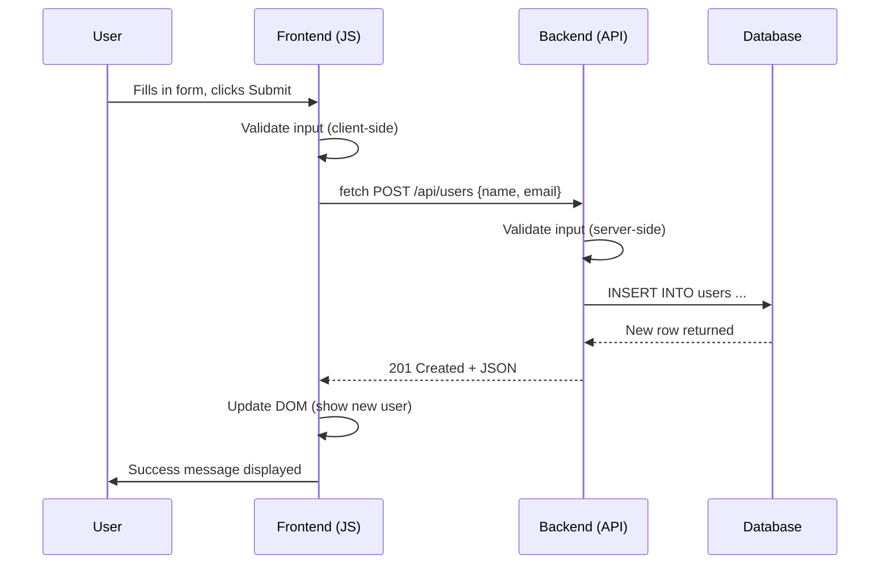

# [FS-3.6] Frontend/Backend Integration

## Why This Matters

A working frontend and a working backend mean nothing if they can't **talk to each other correctly**. Integration is where most full-stack bugs live — data sent in the wrong format, errors not handled, state out of sync.

For AS91903, you must demonstrate data flowing from **frontend → API → database → frontend** and show how errors are handled at every step.

---

## The Data Flow

Every user action that involves data follows this path:



Both the frontend **and** the backend validate. Frontend validation improves the user experience; backend validation enforces security.

---

## Connecting Frontend to API

### The API Module Pattern

Keep all `fetch` calls in one file. This makes it easy to find and update API calls.

```javascript
// js/api.js

const API_BASE = '/api';

async function apiRequest(url, options = {}) {
    const response = await fetch(`${API_BASE}${url}`, {
        headers: {
            'Content-Type': 'application/json',
            ...options.headers
        },
        ...options
    });

    if (!response.ok) {
        const errorData = await response.json().catch(() => ({}));
        throw new Error(errorData.error || `HTTP ${response.status}`);
    }

    if (response.status === 204) return null;
    return response.json();
}

// Exported functions for each endpoint
async function getUsers() {
    return apiRequest('/users');
}

async function getUser(id) {
    return apiRequest(`/users/${id}`);
}

async function createUser(data) {
    return apiRequest('/users', {
        method: 'POST',
        body: JSON.stringify(data)
    });
}

async function updateUser(id, data) {
    return apiRequest(`/users/${id}`, {
        method: 'PUT',
        body: JSON.stringify(data)
    });
}

async function deleteUser(id) {
    return apiRequest(`/users/${id}`, {
        method: 'DELETE'
    });
}
```

### Using the API Module

```javascript
// js/app.js

// Load and display users
async function loadUsers() {
    const container = document.getElementById('user-list');
    container.textContent = 'Loading...';

    try {
        const users = await getUsers();
        container.innerHTML = '';
        users.forEach(user => {
            container.appendChild(createUserCard(user));
        });
    } catch (error) {
        container.textContent = 'Failed to load users.';
        console.error('Load users error:', error);
    }
}

// Handle form submission
document.getElementById('user-form').addEventListener('submit', async (event) => {
    event.preventDefault();
    const statusEl = document.getElementById('form-status');

    const name = document.getElementById('name').value.trim();
    const email = document.getElementById('email').value.trim();

    // Client-side validation
    if (!name || !email) {
        statusEl.textContent = 'Please fill in all fields.';
        return;
    }

    try {
        statusEl.textContent = 'Creating user...';
        const newUser = await createUser({ name, email });
        statusEl.textContent = `User "${newUser.name}" created successfully.`;
        document.getElementById('user-form').reset();
        loadUsers();  // refresh the list
    } catch (error) {
        statusEl.textContent = `Error: ${error.message}`;
    }
});

// Initial load
document.addEventListener('DOMContentLoaded', loadUsers);
```

---

## Error Handling Across Layers

Errors can occur at **every layer**. Handle each appropriately.

### Layer-by-Layer Error Handling

| Layer | Error Example | How to Handle |
|-------|---------------|---------------|
| **Frontend (validation)** | Empty required field | Show inline message before sending |
| **Network** | Server unreachable | Catch fetch error; show "Connection failed" |
| **Backend (validation)** | Invalid email format | Return 400 + error message |
| **Backend (logic)** | Duplicate email | Return 409 + "Email already exists" |
| **Backend (not found)** | User ID doesn't exist | Return 404 + "User not found" |
| **Database** | Connection failed | Return 500 + "Internal server error" (log details on server) |

### Frontend Error Display

```javascript
function showError(element, message) {
    element.textContent = message;
    element.classList.add('error');
    element.classList.remove('success');
}

function showSuccess(element, message) {
    element.textContent = message;
    element.classList.add('success');
    element.classList.remove('error');
}
```

```css
.error { color: #d32f2f; }
.success { color: #388e3c; }
```

### Backend Error Consistency

Always return errors in the same format:

```javascript
// Express middleware for 404 (place after all routes)
app.use((req, res) => {
    res.status(404).json({ error: 'Endpoint not found' });
});

// Express middleware for unhandled errors
app.use((err, req, res, next) => {
    console.error('Unhandled error:', err);
    res.status(500).json({ error: 'Internal server error' });
});
```

---

## Loading States

Users should always know what's happening. Show **loading indicators** during API calls.

```javascript
async function loadUsers() {
    const container = document.getElementById('user-list');
    const loader = document.getElementById('loader');

    loader.style.display = 'block';
    container.innerHTML = '';

    try {
        const users = await getUsers();
        users.forEach(user => {
            container.appendChild(createUserCard(user));
        });
    } catch (error) {
        container.innerHTML = '<p class="error">Failed to load data.</p>';
    } finally {
        loader.style.display = 'none';
    }
}
```

```html
<div id="loader" style="display: none;">Loading...</div>
<div id="user-list"></div>
```

---

## CORS: Cross-Origin Requests

During development, your frontend (e.g., `http://localhost:5500`) and backend (e.g., `http://localhost:3000`) run on different ports. Browsers block these **cross-origin** requests by default.

### Fix: Enable CORS on the Backend

```javascript
// Express
const cors = require('cors');
app.use(cors());  // allow all origins (development only)
```

```python
# Flask
from flask_cors import CORS
CORS(app)  # allow all origins (development only)
```

> In production, restrict CORS to specific origins: `cors({ origin: 'https://yourdomain.com' })`

---

## Form Handling Pattern

A complete form submission flow:

```html
<form id="user-form">
    <div>
        <label for="name">Name:</label>
        <input type="text" id="name" required>
        <span class="field-error" id="name-error"></span>
    </div>
    <div>
        <label for="email">Email:</label>
        <input type="email" id="email" required>
        <span class="field-error" id="email-error"></span>
    </div>
    <button type="submit" id="submit-btn">Create User</button>
    <p id="form-status"></p>
</form>
```

```javascript
document.getElementById('user-form').addEventListener('submit', async (event) => {
    event.preventDefault();
    clearErrors();

    const name = document.getElementById('name').value.trim();
    const email = document.getElementById('email').value.trim();

    // Client-side validation
    let valid = true;
    if (!name) {
        document.getElementById('name-error').textContent = 'Name is required';
        valid = false;
    }
    if (!email) {
        document.getElementById('email-error').textContent = 'Email is required';
        valid = false;
    }
    if (!valid) return;

    // Disable button during request
    const btn = document.getElementById('submit-btn');
    btn.disabled = true;
    btn.textContent = 'Creating...';

    try {
        const user = await createUser({ name, email });
        showSuccess(document.getElementById('form-status'), 'User created!');
        document.getElementById('user-form').reset();
        loadUsers();
    } catch (error) {
        showError(document.getElementById('form-status'), error.message);
    } finally {
        btn.disabled = false;
        btn.textContent = 'Create User';
    }
});

function clearErrors() {
    document.querySelectorAll('.field-error').forEach(el => el.textContent = '');
    document.getElementById('form-status').textContent = '';
}
```

---

## Delete with Confirmation

```javascript
async function handleDelete(userId, userName) {
    if (!confirm(`Delete ${userName}? This cannot be undone.`)) {
        return;
    }

    try {
        await deleteUser(userId);
        loadUsers();  // refresh the list
    } catch (error) {
        alert(`Failed to delete: ${error.message}`);
    }
}
```

---

## Debugging Integration Issues

When something breaks between frontend and backend:

### 1. Check the Network Tab

Open browser DevTools → Network tab. Look at:
- **Request URL** — is it correct?
- **Request method** — GET, POST, PUT, DELETE?
- **Request body** — is the data in the right format?
- **Response status** — 200, 400, 404, 500?
- **Response body** — what did the server return?

### 2. Check the Server Console

Your backend should log every request. Look for:
- Did the request arrive?
- What error was thrown?
- What SQL query ran?

### 3. Common Integration Bugs

| Symptom | Likely Cause |
|---------|-------------|
| `CORS error` in console | Backend doesn't have CORS enabled |
| `404 Not Found` | URL is wrong or route isn't registered |
| `400 Bad Request` | Request body is missing or wrong format |
| `500 Internal Server Error` | Backend bug — check server logs |
| Data shows `[object Object]` | Using `innerHTML` instead of `textContent`, or not parsing JSON |
| Form submits but page reloads | Missing `event.preventDefault()` |
| Data doesn't appear | Forgot to call the load function, or DOM element ID is wrong |

---

## Integration Testing Checklist

Test each of these before submitting your AS91903 project:

- [ ] GET all resources — list displays correctly
- [ ] GET single resource — detail view works
- [ ] POST new resource — form creates data, list refreshes
- [ ] PUT update resource — edit form saves changes
- [ ] DELETE resource — confirmation prompt, item removed
- [ ] Invalid input — client-side validation shows errors
- [ ] Invalid input — server-side validation returns 400
- [ ] Resource not found — 404 handled gracefully
- [ ] Server down — frontend shows error message, doesn't crash
- [ ] Page load — loading state shows while data fetches

---

## Common Mistakes

1. **No client-side validation** — sends bad data to the server unnecessarily
2. **No error handling on fetch** — app crashes or shows blank page when API fails
3. **No loading states** — user sees nothing while waiting for data
4. **Forgetting `event.preventDefault()`** — form submission reloads the page
5. **Mismatched field names** — frontend sends `userName`, backend expects `name`
6. **Not checking the Network tab** — debugging by guessing instead of inspecting

---

## Key Vocabulary

- **CORS:** Cross-Origin Resource Sharing — browser security mechanism for cross-domain requests
- **Client-side validation:** Checking input in the browser before sending to the server
- **Integration:** Connecting frontend, backend, and database so they work together
- **Loading state:** Visual feedback shown while waiting for an API response
- **Network tab:** Browser DevTools panel showing HTTP requests and responses
- **Server-side validation:** Checking input on the backend (security-critical)

---

## Next Steps

Continue to [7. Testing & Deployment](07_testing-deployment.mdx) to learn how to test your full-stack application and deploy it.

---

*End of Topic 6: Frontend/Backend Integration*
