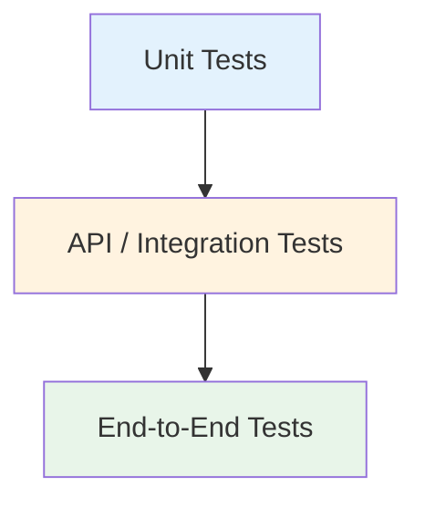

# [FS-3.7] Testing & Deployment

## Why This Matters

A web application that only works on your laptop is not finished. Testing verifies it works **correctly**; deployment makes it **accessible**. Both are required for AS91903.

Your submission must include testing evidence across all layers and setup instructions that let someone else run your application.

---

## Testing a Full-Stack Application

Full-stack testing happens at three levels:



| Level | What It Tests | Tools |
|-------|---------------|-------|
| **Unit tests** | Individual functions in isolation | Jest, pytest |
| **API tests** | Backend endpoints return correct responses | Supertest, pytest + requests |
| **End-to-end (E2E)** | Full user workflow through the browser | Manual testing, Playwright |

For AS91903, focus on **unit tests** and **API tests**. Manual end-to-end testing with documented results is also acceptable.

---

## Unit Testing

Test individual functions without calling the API or database.

### JavaScript (Jest)

```javascript
// utils/validation.js
function isValidEmail(email) {
    return typeof email === 'string' && email.includes('@') && email.includes('.');
}
module.exports = { isValidEmail };

// tests/validation.test.js
const { isValidEmail } = require('../utils/validation');

test('accepts valid email', () => {
    expect(isValidEmail('alice@school.nz')).toBe(true);
});

test('rejects email without @', () => {
    expect(isValidEmail('aliceschool.nz')).toBe(false);
});

test('rejects empty string', () => {
    expect(isValidEmail('')).toBe(false);
});

test('rejects non-string input', () => {
    expect(isValidEmail(null)).toBe(false);
    expect(isValidEmail(42)).toBe(false);
});
```

```bash
npx jest tests/validation.test.js --verbose
```

### Python (pytest)

```python
# utils/validation.py
def is_valid_email(email):
    return isinstance(email, str) and '@' in email and '.' in email

# tests/test_validation.py
from utils.validation import is_valid_email

def test_accepts_valid_email():
    assert is_valid_email('alice@school.nz') is True

def test_rejects_email_without_at():
    assert is_valid_email('aliceschool.nz') is False

def test_rejects_empty_string():
    assert is_valid_email('') is False

def test_rejects_non_string():
    assert is_valid_email(None) is False
    assert is_valid_email(42) is False
```

```bash
pytest tests/test_validation.py -v
```

---

## API Testing

Test that your endpoints return the correct status codes and data.

### JavaScript (Supertest + Jest)

```javascript
// tests/api.test.js
const request = require('supertest');
const app = require('../server');

describe('GET /api/users', () => {
    test('returns 200 and an array', async () => {
        const res = await request(app).get('/api/users');
        expect(res.status).toBe(200);
        expect(Array.isArray(res.body)).toBe(true);
    });
});

describe('POST /api/users', () => {
    test('creates a user and returns 201', async () => {
        const res = await request(app)
            .post('/api/users')
            .send({ name: 'Test User', email: 'test@example.com' });
        expect(res.status).toBe(201);
        expect(res.body.name).toBe('Test User');
        expect(res.body.id).toBeDefined();
    });

    test('returns 400 when name is missing', async () => {
        const res = await request(app)
            .post('/api/users')
            .send({ email: 'test@example.com' });
        expect(res.status).toBe(400);
        expect(res.body.error).toBeDefined();
    });

    test('returns 400 when email is missing', async () => {
        const res = await request(app)
            .post('/api/users')
            .send({ name: 'Test User' });
        expect(res.status).toBe(400);
    });
});

describe('GET /api/users/:id', () => {
    test('returns 404 for non-existent user', async () => {
        const res = await request(app).get('/api/users/99999');
        expect(res.status).toBe(404);
    });
});

describe('DELETE /api/users/:id', () => {
    test('returns 204 on successful delete', async () => {
        // Create a user first
        const created = await request(app)
            .post('/api/users')
            .send({ name: 'To Delete', email: 'delete@example.com' });

        const res = await request(app).delete(`/api/users/${created.body.id}`);
        expect(res.status).toBe(204);
    });
});
```

### Python (pytest + Flask test client)

```python
# tests/test_api.py
import pytest
from app import app

@pytest.fixture
def client():
    app.config['TESTING'] = True
    with app.test_client() as client:
        yield client

def test_get_users_returns_200(client):
    response = client.get('/api/users')
    assert response.status_code == 200
    assert isinstance(response.get_json(), list)

def test_create_user_returns_201(client):
    response = client.post('/api/users', json={
        'name': 'Test User',
        'email': 'test@example.com'
    })
    assert response.status_code == 201
    assert response.get_json()['name'] == 'Test User'

def test_create_user_without_name_returns_400(client):
    response = client.post('/api/users', json={
        'email': 'test@example.com'
    })
    assert response.status_code == 400

def test_get_nonexistent_user_returns_404(client):
    response = client.get('/api/users/99999')
    assert response.status_code == 404
```

---

## Manual Testing Checklist

For end-to-end testing, walk through each user workflow and document the results:

| # | Test | Steps | Expected | Actual | Pass? |
|---|------|-------|----------|--------|-------|
| 1 | View user list | Open homepage | Users displayed | | |
| 2 | Create user | Fill form, submit | User appears in list, success message | | |
| 3 | Create with empty name | Leave name blank, submit | Error message shown, no API call | | |
| 4 | Create with invalid email | Enter "abc", submit | Error message shown | | |
| 5 | Edit user | Click edit, change name, save | Updated name in list | | |
| 6 | Delete user | Click delete, confirm | User removed from list | | |
| 7 | Delete — cancel | Click delete, cancel | User still in list | | |
| 8 | Server down | Stop backend, try to load | Error message, no crash | | |
| 9 | Mobile view | Resize to 375px width | Layout adapts, all features work | | |
| 10 | Page refresh | Reload after creating user | Data persists (from database) | | |

Fill in the "Actual" and "Pass?" columns as you test. Screenshot failures.

---

## Deployment

Deployment makes your application accessible on a server instead of just your laptop.

### What You Need

1. **A server** — a computer running your backend 24/7
2. **A database** — hosted database accessible from the server
3. **Static file hosting** (if SPA) — somewhere to serve your frontend files
4. **Environment variables** — production configuration (database URL, secret keys)

### Deployment Options

| Platform | Free Tier | Best For |
|----------|-----------|----------|
| **Render** | Yes | Node.js, Python, PostgreSQL |
| **Railway** | Limited | Full-stack with database |
| **Fly.io** | Yes | Docker-based deployments |
| **Vercel** | Yes | Frontend + serverless functions |
| **PythonAnywhere** | Yes | Flask/Django apps |

### Deployment Checklist

- [ ] Remove `debug=True` (Flask) or set `NODE_ENV=production`
- [ ] Set environment variables on the hosting platform
- [ ] Database is hosted (not SQLite on a server)
- [ ] CORS restricted to your frontend domain
- [ ] `.env` file is **not** committed to git
- [ ] `README.md` has setup and deployment instructions

---

## README: Setup Instructions

Your AS91903 submission must include instructions so someone else can run your application.

### Template

```markdown
# [Project Name]

## Description
[What the application does — 2-3 sentences]

## Tech Stack
- Frontend: HTML, CSS, JavaScript
- Backend: Node.js + Express
- Database: PostgreSQL

## Setup Instructions

### Prerequisites
- Node.js 18+
- PostgreSQL 14+

### Installation
1. Clone the repository:
   git clone https://github.com/username/project.git
   cd project

2. Install dependencies:
   npm install

3. Create database:
   createdb myapp
   psql myapp < schema.sql

4. Configure environment:
   cp .env.example .env
   # Edit .env with your database credentials

5. Start the server:
   npm start

6. Open http://localhost:3000 in your browser

## API Endpoints
[Link to API documentation or table]

## Running Tests
npm test
```

---

## Production vs Development

| Concern | Development | Production |
|---------|-------------|------------|
| **Debug mode** | On (detailed errors) | Off (generic errors) |
| **Database** | Local (SQLite, local PostgreSQL) | Hosted (remote PostgreSQL) |
| **CORS** | Allow all origins | Restrict to your domain |
| **Secrets** | In `.env` file | In platform environment variables |
| **HTTPS** | Not required | Required |
| **Error details** | Shown in browser | Logged on server only |

---

## Test Evidence for AS91903

Your submission should include:

| Evidence | Format |
|----------|--------|
| Unit test results | Terminal output or screenshot of passing tests |
| API test results | Terminal output showing status codes |
| Manual test plan | Completed table with actual results |
| Bug fix log | Journal entries documenting bugs found and fixed |
| Deployment URL or instructions | README with clear setup steps |

---

## Common Mistakes

1. **No automated tests** — only manual testing; hard to repeat and verify
2. **Testing only the happy path** — no error cases, no boundary testing
3. **No setup instructions** — the app can't run on a different machine
4. **Debug mode in production** — exposes internal errors and stack traces
5. **Hardcoded localhost URLs** — frontend calls `http://localhost:3000` in production
6. **No test evidence** — tests exist but no screenshots or output logs submitted

---

## Key Vocabulary

- **API test:** Testing backend endpoints return correct responses
- **CI/CD:** Continuous Integration / Continuous Deployment — automated testing and deployment
- **Deployment:** Making an application accessible on a server
- **E2E test:** End-to-end test — testing the full user workflow
- **Environment variable:** Configuration stored outside source code
- **Production:** The live version of your application
- **README:** Documentation file explaining how to set up and run the project
- **Unit test:** Testing a single function in isolation

---

*End of Topic 7: Testing & Deployment*
