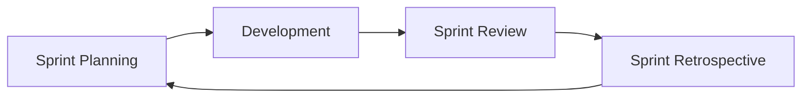
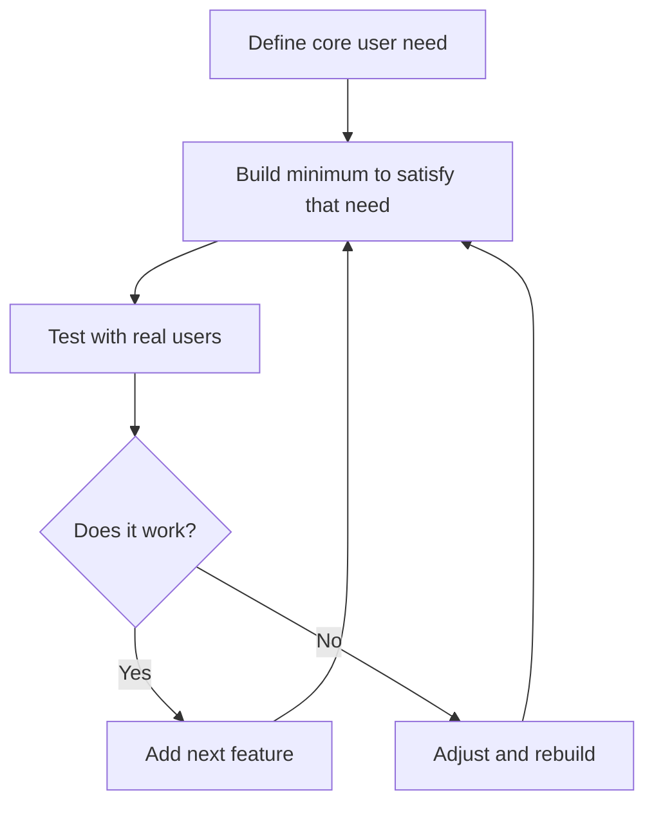

# [SE-4.2] Agile Methodologies

## Why This Matters

Most software teams today describe themselves as "Agile". Understanding what that actually means — and where it falls short — is essential for working in the industry and for managing your own project effectively.

---

## What Is Agile?

Agile is a **set of values and principles** for software development, not a specific process. It emerged from the **Agile Manifesto**, published in 2001 by 17 software developers who were frustrated with the rigid, document-heavy approaches of the time.

### The Four Core Values

> *"We are uncovering better ways of developing software by doing it and helping others do it. Through this work we have come to value..."*

| Agile values... | ...over |
|-----------------|---------|
| **Individuals and interactions** | Processes and tools |
| **Working software** | Comprehensive documentation |
| **Customer collaboration** | Contract negotiation |
| **Responding to change** | Following a plan |

This does **not** mean the right column is worthless — it means the left column is prioritised when there is a conflict.

### The Core Idea

Rather than planning everything upfront and building it all at once, Agile breaks work into short cycles. You build a small piece, get feedback, adjust, and repeat. The goal is to **reduce the risk of building the wrong thing**.

Recommended video: [The Agile Manifesto - 4 Agile Values Explained](https://www.youtube.com/watch?v=rf8Gi2RLKWQ)

<iframe width="560" height="315" src="https://www.youtube.com/embed/rf8Gi2RLKWQ" title="YouTube video player" frameborder="0" allow="accelerometer; autoplay; clipboard-write; encrypted-media; gyroscope; picture-in-picture; web-share" referrerpolicy="strict-origin-when-cross-origin" allowfullscreen></iframe>

---

## Sprints

A **sprint** is a fixed-length development cycle, typically **1–2 weeks**, in which a team plans, builds, and reviews a defined set of work.

### The Sprint Cycle

| Event | Purpose |
|-------|---------|
| **Sprint Planning** | Decide which backlog tasks to complete this sprint |
| **Daily Standup** | Brief daily check-in: what did you do, what will you do, any blockers? |
| **Sprint Review** | Demo working software to stakeholders |
| **Sprint Retrospective** | Reflect: what went well, what didn't, what to improve |

### Sprints for Your Project

For a school project, a sprint might be a single week:

- **Monday:** Plan — pick 3–5 cards from your backlog and move them to "To Do"
- **Tuesday–Thursday:** Build — move cards through "In Progress" → "Review"
- **Friday:** Review — test what you built, update your board, note what's left

The key discipline is **finishing what you started** before pulling in new work.

---

## MVP — Minimum Viable Product

An **MVP** is the smallest version of your product that still delivers real value to a user.

It is not a prototype. It is not a demo. It is a **working product** — just with the minimum set of features that makes it useful.

### Why MVP Matters

| Without MVP thinking | With MVP thinking |
|----------------------|--------------------|
| Build everything, release once | Release early, learn fast |
| Discover problems late (expensive) | Discover problems early (cheap) |
| Risk: spent 3 months on features nobody wanted | Risk is small and correctable |

### Defining Your MVP

Ask: **"What is the one core thing my app must do for it to be worth using?"**

For a recipe-sharing app, the MVP might be:
- A user can add a recipe with a title, ingredients, and method
- A user can view a list of all recipes
- A user can view a single recipe

Everything else — user accounts, search, ratings, images — is **not** the MVP. Get the core loop working first.

Recommended video: [What is MVP? Minimum Viable Product Explained with Real Examples](https://www.youtube.com/watch?v=MHqz8oNSraI)

<iframe width="560" height="315" src="https://www.youtube.com/embed/MHqz8oNSraI" title="YouTube video player" frameborder="0" allow="accelerometer; autoplay; clipboard-write; encrypted-media; gyroscope; picture-in-picture; web-share" referrerpolicy="strict-origin-when-cross-origin" allowfullscreen></iframe>

---

## Scrum: The Most Common Agile Framework

**Scrum** is the most widely used Agile framework. It gives structure to the sprint cycle with defined roles and artefacts:

| Role | Responsibility |
|------|---------------|
| **Product Owner** | Owns the backlog, prioritises work, represents stakeholders |
| **Scrum Master** | Facilitates the process, removes blockers |
| **Development Team** | Does the actual building |

| Artefact | Description |
|----------|-------------|
| **Product Backlog** | The full prioritised list of all work to be done |
| **Sprint Backlog** | The subset of work selected for the current sprint |
| **Increment** | The working software produced by a sprint |

For your project, you are acting as all three roles. Being aware of the distinction helps you notice when you are avoiding "Product Owner" decisions (what to prioritise) or neglecting "Scrum Master" responsibilities (fixing your own blockers).

Recommended video: [Scrum in 20 mins... (with examples)](https://www.youtube.com/watch?v=SWDhGSZNF9M)

<iframe width="560" height="315" src="https://www.youtube.com/embed/SWDhGSZNF9M" title="YouTube video player" frameborder="0" allow="accelerometer; autoplay; clipboard-write; encrypted-media; gyroscope; picture-in-picture; web-share" referrerpolicy="strict-origin-when-cross-origin" allowfullscreen></iframe>

---

## The Challenges With Agile

Agile is widely adopted, but it is also widely criticised — including by some of its original authors. The gap between Agile in theory and Agile in practice has grown significantly since 2001.

### 1. Agile in Name Only ("Dark Agile")

Many organisations adopted Agile vocabulary — sprints, standups, backlogs — without adopting the underlying values. The result is:

- Daily standups that are really status reports to management
- "Sprints" with no flexibility to change direction
- Story points used as productivity metrics to pressure developers
- Continuous delivery of features with no time for reflection or improvement

Ron Jeffries, one of the original Agile Manifesto signatories, wrote in 2018: *"I should never have called it Agile."* He argued that what he had envisioned — developer-led, humane, quality-focused — had been co-opted into a management tool for extracting more output faster.

### 2. Velocity and Estimation Pressure

Agile teams use **story points** to estimate task complexity. In theory, this measures effort, not time. In practice:

- Managers often track velocity (story points per sprint) as a productivity metric
- Teams "inflate" estimates to avoid appearing slow
- The number becomes detached from actual complexity
- Individual developers are compared by their point output — which was never the intended use

### 3. The Agile Industrial Complex

A certification and consultancy industry has grown around Agile. The **Scrum Alliance**, **PMI**, and others sell certifications (CSM, PSM, SAFe) that can cost hundreds to thousands of dollars. Critics argue:

- The most valuable Agile skills come from practice, not certification
- Large frameworks like **SAFe (Scaled Agile Framework)** add so much structure that they reintroduce the bureaucracy Agile was designed to eliminate
- "Transformation" consultants often impose Agile top-down — the opposite of how it is supposed to work

### 4. It Does Not Suit Every Project

Agile assumes:
- Requirements will change (if they won't, upfront planning is fine)
- You can get regular feedback (if you can't, the short cycle has no value)
- The team is co-located or well-integrated (remote-first Agile is genuinely harder)

Some domains — safety-critical systems, hardware, regulated industries — require extensive upfront design and documentation. Forcing Agile onto these projects can be counterproductive.

### 5. Sprint Pressure and Developer Burnout

The constant cycle of planning, delivery, and review — with no end in sight — can create sustained pressure. Without deliberate effort:

- Technical debt accumulates because there is always something to ship
- There is no space for refactoring, documentation, or learning
- The "sustainable pace" principle from the Manifesto is routinely ignored

### The Honest Summary

Agile's core ideas — short feedback loops, working software over documentation, responding to change — remain sound. The problems arise when it is applied as a rigid process, used as a management control mechanism, or treated as universally applicable.

> A good rule of thumb: if Agile is being imposed on developers by managers, it is probably not Agile.

---

## Key Vocabulary

- **Agile:** A set of values and principles for iterative, feedback-driven software development
- **Backlog:** The prioritised list of all remaining work
- **Daily Standup:** A brief daily team sync to surface blockers and coordinate
- **MVP:** Minimum Viable Product — the smallest version of a product that delivers real value
- **Scrum:** The most popular Agile framework, organising work into sprints with defined roles
- **Sprint:** A fixed-length development cycle (typically 1–2 weeks)
- **Story Points:** Relative units for estimating task complexity
- **Velocity:** The average number of story points a team completes per sprint
- **WIP Limit:** A constraint on how many tasks can be in progress simultaneously

---

## Next Steps

Continue to [3. Waterfall Methodology](03_waterfall.mdx) to see how a sequential approach compares — and when it is actually the better choice.

---

*End of Topic 2: Agile Methodologies*
