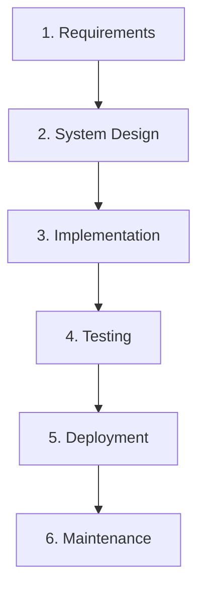

# [SE-4.3] Waterfall Methodology

## Why This Matters

Before Agile existed, nearly all software was built using a sequential, phase-based approach now called **Waterfall**. Understanding it is not just historical context — Waterfall is still the right choice for certain projects, and many real-world teams use hybrid approaches that draw from both.

---

## What Is Waterfall?

Waterfall is a **linear, sequential development process** where each phase must be fully completed before the next begins. Like water flowing down a cliff, progress moves in one direction only.

The name comes from the direction of flow — and the implication that going **back up** the waterfall is difficult and costly.

Recommended video: [What is the Waterfall Model and How Does it Work?](https://www.youtube.com/watch?v=bNLcRdrSQAU)
<iframe width="560" height="315" src="https://www.youtube.com/embed/bNLcRdrSQAU" title="YouTube video player" frameborder="0" allow="accelerometer; autoplay; clipboard-write; encrypted-media; gyroscope; picture-in-picture; web-share" referrerpolicy="strict-origin-when-cross-origin" allowfullscreen></iframe>

---

## The Six Phases

### 1. Requirements

All requirements are gathered and documented **before any design begins**.

- What should the system do?
- What are the constraints? (performance, security, budget, deadline)
- Who are the stakeholders and what do they need?

The output is a **Requirements Specification** document — often hundreds of pages for large projects.

### 2. System Design

The technical architecture is designed based on the requirements.

- Database schema
- System architecture (servers, services, APIs)
- UI wireframes and mockups
- Technology choices

No code is written yet. The output is a **Design Specification**.

### 3. Implementation

Developers write the code, following the design specification.

- This is often the longest phase
- Developers are expected to follow the spec, not make design decisions
- Changes to requirements at this stage are expensive

### 4. Testing

The completed system is tested against the requirements.

- Unit testing, integration testing, user acceptance testing
- Bugs are fixed
- If a fundamental design flaw is found here, it may require going back to phase 2

### 5. Deployment

The system is released to users.

- Often a single, large release event
- User training and documentation are delivered
- The system goes live

### 6. Maintenance

Ongoing support, bug fixes, and minor enhancements after release.

- Not new features — those would require starting a new project cycle
- The phase that often runs indefinitely

Recommended video: [The Most Comprehensive Explanation of the Software Development Life Cycle (SDLC) in 7 Minutes!](https://www.youtube.com/watch?v=mmVXL0LzLks)
<iframe width="560" height="315" src="https://www.youtube.com/embed/mmVXL0LzLks" title="YouTube video player" frameborder="0" allow="accelerometer; autoplay; clipboard-write; encrypted-media; gyroscope; picture-in-picture; web-share" referrerpolicy="strict-origin-when-cross-origin" allowfullscreen></iframe>

---

## Where Waterfall Works Well

Waterfall is not inherently inferior to Agile. It is a better fit when:

| Condition | Why Waterfall fits |
|-----------|-------------------|
| **Requirements are fixed and well-understood** | No need to iterate if you already know exactly what to build |
| **The domain is safety-critical** | Medical devices, aviation, nuclear systems need exhaustive documentation and traceability |
| **Regulatory compliance is required** | Some industries legally require documented design approval before implementation |
| **The team is large and geographically distributed** | Detailed specifications reduce the need for constant coordination |
| **The client wants a fixed price and fixed scope** | Contracts are easier to write and enforce with Waterfall |

**Examples:** hospital patient management systems, government infrastructure software, embedded systems in vehicles, defence contracts.

---

## Where Waterfall Fails

| Problem | What goes wrong |
|---------|----------------|
| **Requirements change** | Any change after phase 1 is expensive — redesign, rework, re-test |
| **Users don't know what they want until they see it** | A 200-page spec doesn't reveal usability problems — a working prototype does |
| **Long time to first working software** | Stakeholders may wait 12–18 months before seeing anything functional |
| **Testing is too late** | Bugs found in phase 4 are far more expensive to fix than bugs found in phase 2 |
| **No feedback loops** | If the original requirements were wrong, you build the wrong thing — perfectly |

The classic failure: a system is delivered on time and on budget, exactly to spec, and nobody uses it because the requirements were wrong from the start.

---

## Agile vs Waterfall — Side by Side

| Dimension | Waterfall | Agile |
|-----------|-----------|-------|
| **Planning** | All upfront | Continuous |
| **Requirements** | Fixed at the start | Expected to evolve |
| **Delivery** | Single release at the end | Regular incremental releases |
| **Feedback** | After deployment | Every sprint |
| **Change** | Costly and resisted | Expected and welcomed |
| **Documentation** | Extensive | Lightweight ("just enough") |
| **Risk** | High (discovered late) | Lower (discovered early) |
| **Best for** | Stable, well-defined problems | Evolving, exploratory problems |
| **Worst for** | Projects where requirements change | Safety-critical, fixed-contract work |

Recommended video: [If You're Choosing Agile or Waterfall… Watch This First](https://www.youtube.com/watch?v=5RocT_OdQcA)
<iframe width="560" height="315" src="https://www.youtube.com/embed/5RocT_OdQcA" title="YouTube video player" frameborder="0" allow="accelerometer; autoplay; clipboard-write; encrypted-media; gyroscope; picture-in-picture; web-share" referrerpolicy="strict-origin-when-cross-origin" allowfullscreen></iframe>

---

## Hybrid Approaches

Most real-world teams do not use pure Agile or pure Waterfall. Common hybrids include:

- **Waterfall for architecture, Agile for features** — design the system structure upfront, then build individual features in sprints
- **Agile with "phase gates"** — use sprints but require formal sign-off at key milestones (common in regulated industries)
- **Scrumban** — combines Scrum's sprints with Kanban's visual board and WIP limits

For your project, a lightweight hybrid is realistic: define your architecture and MVP upfront (Waterfall-like), then build feature by feature in weekly sprints (Agile-like).

---

## A Note on History

Waterfall is often traced to a 1970 paper by Winston Royce — but that paper actually **argued that pure sequential development was flawed** and advocated for iteration. The term "Waterfall" itself was coined by its critics.

The broader lesson: methodologies are tools. The question is never "which is better?" — it is "which fits this project, this team, and these constraints?"

---

## Key Vocabulary

- **Phase Gate:** A formal checkpoint where a project must be reviewed and approved before proceeding to the next phase
- **Requirements Specification:** A document that defines what a system must do, produced at the start of a Waterfall project
- **Sequential Development:** A process where each phase must complete before the next begins
- **Traceability:** The ability to link every line of code or test back to a specific requirement — critical in safety-critical Waterfall projects
- **Waterfall:** A linear software development process that moves through fixed phases in sequence

---

## Next Steps

Return to [2. Agile Methodologies](02_agile.mdx) to compare the two approaches, or continue to [4. Version Control with Git](04_version-control.mdx) to learn how to manage your code throughout whichever process you use.

---

*End of Topic 3: Waterfall Methodology*
