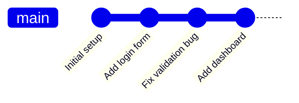
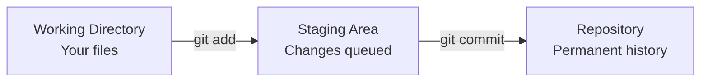
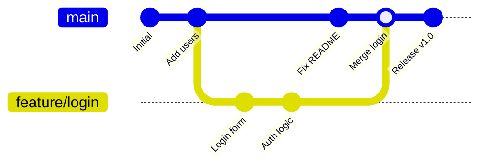
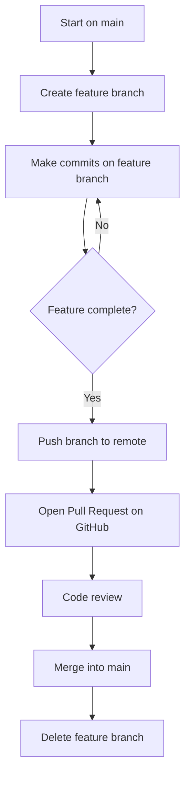

# [SE-4.4] Version Control with Git

## Why This Matters

Every professional software team uses version control. It is not optional, and it is not just a backup tool — it is how teams collaborate on code without overwriting each other's work, how they recover from mistakes, and how they track the full history of a project. Understanding Git is a baseline expectation in any computing career.

---

## What Is Version Control?

Version control is a system that **records changes to files over time** so that you can recall specific versions later. Without it, collaboration typically looks like this:

- `project_final.py`
- `project_final_v2.py`
- `project_final_ACTUAL.py`
- `project_final_ACTUAL_brian.py`

Version control replaces this chaos with a structured, searchable history of every change ever made — who made it, when, and why.

Recommended video: [What is Git? Explained in 2 Minutes!](https://www.youtube.com/watch?v=2ReR1YJrNOM)
<iframe width="560" height="315" src="https://www.youtube.com/embed/2ReR1YJrNOM" title="YouTube video player" frameborder="0" allow="accelerometer; autoplay; clipboard-write; encrypted-media; gyroscope; picture-in-picture; web-share" referrerpolicy="strict-origin-when-cross-origin" allowfullscreen></iframe>

---

## Git vs GitHub

These are not the same thing:

| | Git | GitHub |
|--|-----|--------|
| **What it is** | A version control tool that runs on your machine | A cloud hosting platform for Git repositories |
| **Where it lives** | Local (your computer) | Remote (the internet) |
| **Who makes it** | Originally Linus Torvalds, open source | Microsoft |
| **Required?** | Yes — Git is the engine | No — but standard in industry |

Git can be used entirely without GitHub (locally, or with other remotes like GitLab or Bitbucket). GitHub cannot be used without Git.

---

## Core Concepts

### Repository (Repo)

A **repository** is a folder that Git is tracking. It contains your project files plus a hidden `.git/` folder that stores the entire history of every change.

```
my-project/
├── .git/          ← Git stores everything here (do not touch)
├── main.py
├── utils.py
└── README.md
```

### Commit

A **commit** is a snapshot of your project at a specific point in time. Each commit has:

- A unique identifier (a hash, e.g. `a3f8c21`)
- A commit message describing what changed
- A reference to the previous commit (its "parent")
- The author and timestamp

Commits form a **chain of history**:



### Staging Area

Git has a three-stage process before a commit is created:



- **Working directory** — files you are actively editing
- **Staging area** — changes you have selected to include in the next commit
- **Repository** — the committed history

This separation lets you commit only part of your changes at a time.

### Branch

A **branch** is an independent line of development. The default branch is usually called `main`. When you create a branch, you get your own copy of the history to work on without affecting `main`.



Branches are cheap and fast in Git — creating one takes milliseconds. Using them is considered good practice even for solo projects.

### Merge

**Merging** combines the history of two branches. If the same file was changed in both branches, Git will attempt to **auto-merge** the changes. If it cannot determine the correct result, it creates a **merge conflict** that must be resolved manually.

### Remote

A **remote** is a version of the repository hosted elsewhere (e.g. GitHub). You push your local commits to the remote, and pull others' commits down from it.

---

## Essential Git Commands

| Command | What it does |
|---------|-------------|
| `git init` | Initialise a new Git repository in the current folder |
| `git clone <url>` | Copy a remote repository to your local machine |
| `git status` | Show the current state of the working directory and staging area |
| `git add <file>` | Stage a file for the next commit |
| `git add .` | Stage all changed files |
| `git commit -m "message"` | Create a commit with a description |
| `git log` | View the commit history |
| `git branch` | List branches |
| `git branch <name>` | Create a new branch |
| `git checkout <name>` | Switch to a branch |
| `git checkout -b <name>` | Create and switch to a new branch in one step |
| `git merge <branch>` | Merge a branch into the current branch |
| `git push` | Upload local commits to the remote |
| `git pull` | Download and merge remote commits |
| `git diff` | Show unstaged changes |

Recommended video: [Git Tutorial for Beginners: Learn Git in 1 Hour](https://www.youtube.com/watch?v=8JJ101D3knE)
<iframe width="560" height="315" src="https://www.youtube.com/embed/8JJ101D3knE" title="YouTube video player" frameborder="0" allow="accelerometer; autoplay; clipboard-write; encrypted-media; gyroscope; picture-in-picture; web-share" referrerpolicy="strict-origin-when-cross-origin" allowfullscreen></iframe>

---

## Writing Good Commit Messages

A commit message is a note to your future self (and your team). Bad commit messages make a project's history useless.

| Bad | Good |
|-----|------|
| `fix` | `Fix null pointer error in login validator` |
| `update` | `Update README with setup instructions` |
| `asdfgh` | `Add user dashboard with activity feed` |
| `changes` | `Refactor database connection to use connection pooling` |

**Convention:** Write in the imperative tense as if completing the sentence *"This commit will..."*

- `Add login form` ✓
- `Added login form` ✗
- `Adding login form` ✗

---

## A Feature Branch Workflow

The most common workflow for small teams:



1. `main` always contains working, releasable code
2. All new work happens on a named feature branch
3. When the feature is done, it is merged back into `main` via a **pull request**
4. A pull request is a request to merge — it is also an opportunity for code review

---

## Resolving Merge Conflicts

When two branches change the same part of the same file, Git cannot decide which version is correct. It marks the conflict in the file:

```
<<<<<<< HEAD
    return user.is_authenticated()
=======
    return user.check_auth_token()
>>>>>>> feature/auth-refactor
```

- Everything between `<<<<<<< HEAD` and `=======` is from your current branch
- Everything between `=======` and `>>>>>>>` is from the branch being merged

You must manually edit the file to the correct state, then stage and commit it.

```bash
# After editing the file to resolve the conflict:
git add conflicted_file.py
git commit -m "Resolve merge conflict in authentication check"
```

---

## `.gitignore`

Not everything in your project folder should be tracked by Git. A `.gitignore` file tells Git which files to ignore.

```
# Example .gitignore
__pycache__/
*.pyc
.env
venv/
node_modules/
.DS_Store
```

**Always ignore:**
- Environment files (`.env`) — these often contain passwords and API keys
- Dependency folders (`node_modules/`, `venv/`) — these can be regenerated and are often thousands of files
- Build outputs — anything that can be generated from source should not be tracked

---

## Version Control in Your Project

For your 13DGT project, Git is not optional — it is part of demonstrating good software engineering practice. You should:

- Commit **regularly** (at least after each working session)
- Use **meaningful commit messages** that describe what you built or fixed
- Use **branches** for significant features or experiments
- Push to GitHub so your work is backed up and reviewable
- Reference your commits in your design documentation as evidence of an iterative development process

Your commit history is part of your project evidence. An empty history, or three giant commits the night before the deadline, tells a very different story than consistent, incremental commits over several weeks.

---

## Key Vocabulary

- **Branch:** An independent line of development within a repository; branches allow parallel work without affecting the main codebase
- **Clone:** A copy of a remote repository downloaded to a local machine
- **Commit:** A snapshot of the project at a specific point in time, stored permanently in the repository history
- **Feature Branch Workflow:** A branching strategy where each new feature is developed on its own branch and merged into main when complete
- **Git:** A distributed version control system that tracks changes to files over time
- **GitHub:** A cloud platform for hosting Git repositories, enabling collaboration and code review
- **Merge:** The act of combining the history of two branches into one
- **Merge Conflict:** A situation where Git cannot automatically reconcile changes from two branches because the same section of a file was modified differently in each
- **Pull Request (PR):** A request to merge one branch into another, typically used for code review before merging
- **Remote:** A version of a Git repository hosted on a server (e.g. GitHub), used for collaboration and backup
- **Repository:** A directory tracked by Git, containing project files and the full history of all changes
- **Staging Area:** A preparation zone where changes are queued before being committed to the repository
- **Version Control:** A system for recording and managing changes to files over time, enabling collaboration, rollback, and history tracking
- **.gitignore:** A file that tells Git which files and folders to exclude from tracking

---

## Next Steps

Return to [3. Waterfall Methodology](03_waterfall.mdx) to compare how version control fits into different development processes, or continue to the next topic in the unit to apply these practices in your own project.

---

*End of Topic 4: Version Control with Git*
