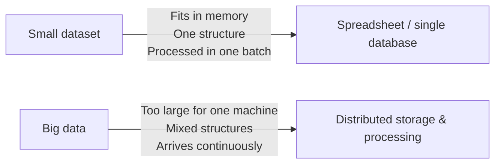

# [CS-5.1] Characteristics of Big Data

## Why This Matters

"Big data" doesn't just mean "a lot of data" — a library with ten million books isn't big data. What makes data *big* in the computer science sense is a combination of properties that break the tools and techniques used for ordinary datasets. Every 91908 Big Data question assumes you can name and apply these properties accurately, so this is the vocabulary the rest of the topic builds on.

---

## What Is Big Data?

**Big data** refers to datasets that are too large, too fast-moving, or too varied in structure to be efficiently stored, processed, or analysed using traditional single-computer methods (e.g. one spreadsheet, one relational database on one machine).

The standard way to describe *why* a dataset counts as "big" is the **three Vs**, named directly in the 2026 specification:

| V | Meaning | Example |
|---|---------|---------|
| **Volume** | The sheer amount of data being generated and stored | X (Twitter) generates hundreds of millions of posts per day worldwide |
| **Variety** | Data exists in many different formats and structures at once | Numeric like-counts, timestamps, free-text captions, images, video, geolocation |
| **Velocity** | The speed at which data is generated and needs to be processed | Trending topics need near-real-time analysis to stay relevant within minutes |

The specification adds "**etc.**" after these three, and two further Vs are commonly taught alongside them:

- **Veracity** — how trustworthy, accurate, or noisy the data is (e.g. bot accounts, spam, deliberately false posts)
- **Value** — whether the data is actually useful once processed (huge volume is worthless if it can't be turned into insight)

You don't need to memorise a fixed list — the spec explicitly leaves it open — but you should be able to **define each V precisely** and **apply it to a named scenario**, not just recite it.

---

## Big Data vs "Just a Lot of Data"

A common mistake is treating "big data" as a synonym for "large file". The distinction matters because it explains *why* new tools are needed at all.

A school's enrolment spreadsheet is large but not "big data" — it's one consistent structure, updated occasionally, and fits comfortably on one computer. A social media platform's post stream is big data — it never stops arriving (velocity), it mixes text, images and video (variety), and no single machine could hold or process all of it (volume).

---

## Worked Example: A Real Case Study

Google's 2020 **COVID-19 Community Mobility Report** for New Zealand is a good real-world illustration of all three Vs at once:

- **Volume** — the report is built from location history data drawn from a very large population of device users across the country
- **Velocity** — Google needed to generate and publish the report within days of the national lockdown beginning on 25 March 2020, showing near-daily movement trends
- **Variety** — the report combines structured numeric drops (e.g. "retail and recreation: −91% compared to baseline"), time-series line graphs, and free-text explanatory statements about privacy methodology, all describing the same underlying dataset

*(Source: `91908-res-2021.pdf`, Resource E, and `91908-exm-2021.pdf`, Question Three.)*

### Past-paper style question

> **What are the 3 V's of big data? Provide an example of each from the case study.**
> *(Adapted from `91908-cat-A-2023.pdf` and `91908-cat-B-2023.pdf`, Question Two (a), asked about TikTok and X respectively.)*

**How to answer well:**
- Define each V in a full sentence — don't just name it
- Pick **one concrete detail from the given case study** per V, not a generic example from memory
- If the case study doesn't obviously supply one V (e.g. veracity), say so and explain what evidence *would* show it — this demonstrates understanding rather than guessing

---

## Applying This to an Unfamiliar Context

The exam will very likely give you a platform or organisation you haven't studied in class. Practise this transfer skill now: for **any** unfamiliar big-data scenario, ask yourself:

1. How much data, and how is that scale visible in the scenario? → **Volume**
2. What different formats or structures does the data come in? → **Variety**
3. How quickly does new data arrive, and does the use case need it processed immediately? → **Velocity**
4. How would you know if some of the data was wrong, fake, or unreliable? → **Veracity**
5. What would make this data actually useful, versus just large? → **Value**

---

## Key Vocabulary

- **Big data:** Datasets too large, fast, or varied to be handled by traditional single-machine tools
- **Volume:** The scale/amount of data generated and stored
- **Variety:** The range of formats and structures data exists in
- **Velocity:** The speed of data generation and the need for timely processing
- **Veracity:** The trustworthiness and accuracy of data
- **Value:** Whether processed data yields useful, actionable insight

---

## Next Steps

Continue to [2. Generation, Processing & Formats](02_big-data-generation-and-formats.mdx) to see where all this data actually comes from, and why structured and unstructured data need different treatment.

---

*End of Topic 1: Characteristics of Big Data*
