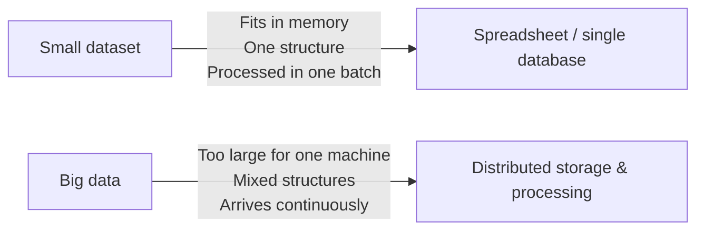

import { ArticleShell, Kicker, Headline, Dek, Byline, Hero, Lede, Callout, KeyTerms, CheckWork, Roadmap, UnitLinks } from '@site/src/components/ArticleKit';

<ArticleShell>

<Kicker>Computer Science · Big Data · Topic 1 of 5</Kicker>

<Headline>A library with ten million books isn't big data.</Headline>

<Dek>"Big data" doesn't just mean "a lot of data." What makes data *big*, in the computer science sense, is a combination of properties that break the tools and techniques used for ordinary datasets — and every 91908 Big Data question assumes you can name and apply them accurately.</Dek>

<Byline>
  <strong>AS91908</strong> · Big Data
  ·
  Vocabulary this whole topic builds on
</Byline>

<Hero src="/img/13DGT/big-data/hero-01-big-data-characteristics.jpg" alt="A hand holding a white smartphone showing a grid of photos in a social media feed." caption="Photo: Georgia de Lotz / Unsplash" />

<Lede>

**Goal:** define each of the "Vs" of big data precisely, and apply them to a named, real case study.

| Section | What it covers |
|---|---|
| What is big data? | The three Vs (and two more), straight from the specification |
| Big data vs "just a lot of data" | Why the distinction changes what tools you need |
| Worked example | Google's 2020 NZ Community Mobility Report, all three Vs at once |
| Applying this to an unfamiliar context | A five-question checklist for any new scenario |

</Lede>

## What is big data?

**Big data** refers to datasets that are too large, too fast-moving, or too varied in structure to be efficiently stored, processed, or analysed using traditional single-computer methods (e.g. one spreadsheet, one relational database on one machine).

The standard way to describe *why* a dataset counts as "big" is the **three Vs**, named directly in the 2026 specification:

| V | Meaning | Example |
|---|---------|---------|
| **Volume** | The sheer amount of data being generated and stored | X (Twitter) generates hundreds of millions of posts per day worldwide |
| **Variety** | Data exists in many different formats and structures at once | Numeric like-counts, timestamps, free-text captions, images, video, geolocation |
| **Velocity** | The speed at which data is generated and needs to be processed | Trending topics need near-real-time analysis to stay relevant within minutes |

The specification adds "**etc.**" after these three, and two further Vs are commonly taught alongside them:

- **Veracity** — how trustworthy, accurate, or noisy the data is (e.g. bot accounts, spam, deliberately false posts)
- **Value** — whether the data is actually useful once processed (huge volume is worthless if it can't be turned into insight)

You don't need to memorise a fixed list — the spec explicitly leaves it open — but you should be able to **define each V precisely** and **apply it to a named scenario**, not just recite it.

## Big data vs "just a lot of data"

A common mistake is treating "big data" as a synonym for "large file." The distinction matters because it explains *why* new tools are needed at all.

A school's enrolment spreadsheet is large but not "big data" — it's one consistent structure, updated occasionally, and fits comfortably on one computer. A social media platform's post stream is big data — it never stops arriving (velocity), it mixes text, images and video (variety), and no single machine could hold or process all of it (volume).

<Callout kind="case" title="Case file: Google's COVID-19 Community Mobility Report">

Google's 2020 **COVID-19 Community Mobility Report** for New Zealand is a good real-world illustration of all three Vs at once:

- **Volume** — the report is built from location history data drawn from a very large population of device users across the country
- **Velocity** — Google needed to generate and publish the report within days of the national lockdown beginning on 25 March 2020, showing near-daily movement trends
- **Variety** — the report combines structured numeric drops (e.g. "retail and recreation: −91% compared to baseline"), time-series line graphs, and free-text explanatory statements about privacy methodology, all describing the same underlying dataset

*(Source: `91908-res-2021.pdf`, Resource E, and `91908-exm-2021.pdf`, Question Three.)*

</Callout>

<Callout kind="example" title="Past-paper practice">

> **What are the 3 V's of big data? Provide an example of each from the case study.**
> *(Adapted from `91908-cat-A-2023.pdf` and `91908-cat-B-2023.pdf`, Question Two (a), asked about TikTok and X respectively.)*

<CheckWork label="Reveal how to answer well">

- Define each V in a full sentence — don't just name it
- Pick **one concrete detail from the given case study** per V, not a generic example from memory
- If the case study doesn't obviously supply one V (e.g. veracity), say so and explain what evidence *would* show it — this demonstrates understanding rather than guessing

</CheckWork>

</Callout>

## Applying this to an unfamiliar context

<Callout kind="activity">

The exam will very likely give you a platform or organisation you haven't studied in class. Practise this transfer skill now: for **any** unfamiliar big-data scenario, ask yourself:

1. How much data, and how is that scale visible in the scenario? → **Volume**
2. What different formats or structures does the data come in? → **Variety**
3. How quickly does new data arrive, and does the use case need it processed immediately? → **Velocity**
4. How would you know if some of the data was wrong, fake, or unreliable? → **Veracity**
5. What would make this data actually useful, versus just large? → **Value**

</Callout>

## Exit question

Pick a platform you use every day and explain, in your own words, why it counts as "big data" rather than just "a lot of data" — naming at least three Vs.

<KeyTerms terms={['big data', 'volume', 'variety', 'velocity', 'veracity', 'value']} />

<Roadmap length={5} current={1} />

<UnitLinks>

[← Back to Big Data overview](README.mdx)

[Next → Topic 2: Generation, Processing & Formats](02_big-data-generation-and-formats.mdx)

</UnitLinks>

</ArticleShell>
