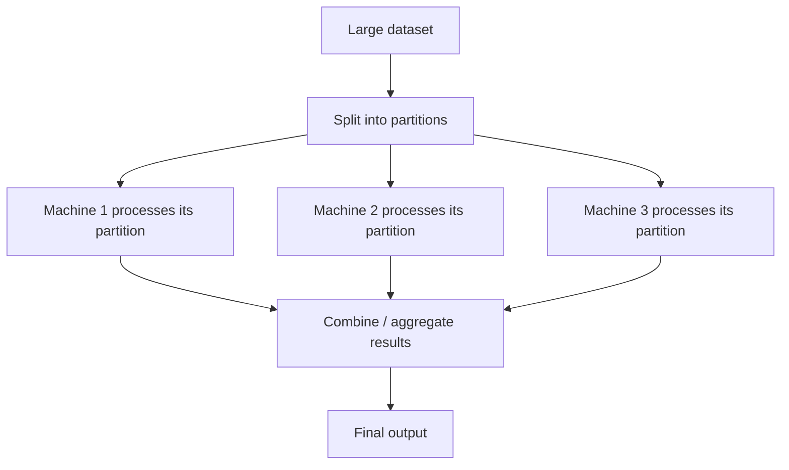

import { ArticleShell, Kicker, Headline, Dek, Byline, Hero, Lede, Callout, KeyTerms, CheckWork, Roadmap, UnitLinks } from '@site/src/components/ArticleKit';

<ArticleShell>

<Kicker>Computer Science · Big Data · Topic 4 of 5</Kicker>

<Headline>No single computer holds the data behind your "For You" feed.</Headline>

<Dek>The specification explicitly asks for "tools and technologies used in big data," and flags that you should be ready to explain overlap with other computer science areas — especially AI. This topic covers how systems actually store and process datasets too large for one machine, and how machine learning turns processed data into patterns and predictions.</Dek>

<Byline>
  <strong>AS91908</strong> · Big Data
  ·
  Overlaps with: Artificial Intelligence
</Byline>

<Hero src="/img/13DGT/big-data/hero-04-big-data-tools-and-technologies.jpg" alt="A server rack with bundles of fiber optic cables plugged into networking equipment." caption="Photo: Taylor Vick / Unsplash" />

<Lede>

**Goal:** explain how distributed storage and processing work at a conceptual level, and describe how AI/ML turns big data into predictions — including the specific challenges of applying it at this scale.

| Section | What it covers |
|---|---|
| Storage | Matching the storage type to the data's shape |
| Distributed processing | Splitting work across many machines, and batch vs stream |
| AI and machine learning on big data | The mechanism behind recommendations and predictions |
| Worked example | Applying AI/ML to a named platform, straight from a past paper |

</Lede>

## Storage: matching the tool to the data shape

From [Topic 2](02_big-data-generation-and-formats.mdx), structured and unstructured data need different homes.

| Data shape | Typical storage | Why |
|---|---|---|
| **Structured** | Relational (SQL) database | Fixed schema means rows/columns can be indexed and queried precisely |
| **Unstructured / semi-structured** | NoSQL database, distributed file system, object storage | No fixed schema — needs flexible storage that doesn't force data into rows and columns |
| **Very large volumes of either** | Distributed storage across many machines | No single machine has enough capacity or I/O speed to hold or serve it alone |

## Distributed processing: splitting the work

When a dataset is too large for one computer to process in reasonable time, the standard approach is to **split the work across many machines and combine the results**. This is the core idea behind distributed processing frameworks (e.g. Hadoop, Spark) — you don't need to know a specific product's internals for 91908, but you should be able to explain the underlying mechanism:

- **Partitioning** — the dataset is divided into chunks
- **Parallel processing** — many machines work on their chunk simultaneously, rather than one machine working through the whole dataset sequentially
- **Aggregation** — the partial results are combined into a single final answer

This is why big data processing can scale: doubling the number of machines roughly halves the processing time for a task that splits cleanly, which is not possible on a single computer no matter how powerful.

**Batch vs stream processing** is a related distinction worth knowing:

| | Batch processing | Stream processing |
|---|---|---|
| **When it runs** | On a schedule, over data already collected | Continuously, as data arrives |
| **Good for** | Large historical analysis where some delay is acceptable | Time-sensitive tasks (trending topics, fraud alerts) |
| **Trade-off** | Higher latency, but can do more thorough analysis | Lower latency, but each item is usually processed with less context |

## Artificial intelligence and machine learning on big data

This is where big data most directly overlaps with another computer science area. AI/ML techniques are what actually turn a large processed dataset into a **pattern, prediction, or recommendation** — this is the mechanism behind "For You" feeds, fraud detection, and predictive maintenance alike.

At a conceptual level:

1. A model is given a large volume of **historical, labelled or structured** data (e.g. which past posts a user engaged with)
2. It identifies **patterns/correlations** in that data
3. It uses those patterns to make a **prediction** about new, unseen data (e.g. which new post this user is likely to engage with)

<Callout kind="watch" title="Challenges of applying AI/ML to big data specifically">

- **Bias amplification** — if the training data has a bias (see [Topic 3](03_big-data-interpretation-and-display.mdx)), the model doesn't just repeat it, it can systematically reinforce it (e.g. only ever recommending content similar to what a user already engages with, narrowing what they see over time)
- **Data quality** — unstructured or noisy data must be reliably processed into structured features first, and errors here propagate into the model's output
- **Computational cost** — training and continually updating a model on a genuinely huge, constantly-growing dataset requires significant processing power
- **Explainability** — with very large datasets and complex models, it can be difficult even for the organisation running the model to fully explain *why* it made a specific prediction

</Callout>

<Callout kind="example" title="Past-paper practice">

> **(i) How can techniques such as artificial intelligence or machine learning be applied to large datasets to uncover patterns and insights? (ii) What are some possible challenges and considerations in using artificial intelligence or machine learning on big data from [the platform]?**
> *(`91908-cat-A-2023.pdf` / `91908-cat-B-2023.pdf`, Question Two (e).)*

<CheckWork label="Reveal how to answer well">

- For (i): describe the mechanism in general terms (train on historical structured/processed data → detect patterns → apply to new data to predict/recommend), then ground it in the platform — e.g. a recommendation algorithm using past watch/engagement data to predict what to show next
- For (ii): pick **two or three specific challenges** from the list above rather than listing all of them briefly — depth on fewer points scores better than a shallow list. Bias amplification and data quality are usually the strongest fits for a social media case study

</CheckWork>

</Callout>

## Exit question

Explain, in your own words, why doubling the number of machines in a distributed system can roughly halve processing time for some tasks but not others.

<KeyTerms terms={['distributed processing', 'partitioning', 'batch processing', 'stream processing', 'machine learning (ML)', 'bias amplification', 'explainability']} />

<Roadmap length={5} current={4} />

<UnitLinks>

[← Back to Topic 3: Interpretation, Bias & Display](03_big-data-interpretation-and-display.mdx)

[Next → Topic 5: Privacy, Ethics & Governance](05_big-data-privacy-ethics-governance.mdx)

</UnitLinks>

</ArticleShell>
