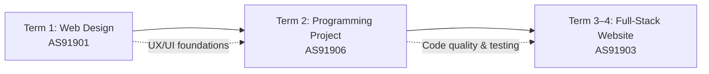

# Year 13 Digital Technologies – Course Notes

These course notes explain the **key concepts, skills, and processes** used throughout the Year 13 Digital Technologies programme.

They are designed to:
- support lesson learning
- support independent revision
- align directly with assessment requirements (AS91901, AS91906, AS91903)
- help you explain *what you did and why*

These notes do **not** replace lessons, formative checkpoints, or practical work.

---

## Programme Overview

Year 13 Digital Technologies is structured around three significant achievement standards, each building on previous knowledge and industry practices:

You will:

1. **Learn UX/UI design thinking** and apply it to build user-centred websites
2. **Master programming** through a focused project demonstrating algorithm design, testing discipline, and code quality
3. **Develop full-stack capability** by integrating frontend, backend, database, and API technologies into a cohesive web application
4. **Build professional practices** by documenting your decisions, iterating based on feedback, and verifying your understanding through live explanation

---

## Three Achievement Standards

### Unit 1: Web Design (AS91901) – Term 1

**Focus:** User experience (UX) and user interface (UI) design  
**Duration:** ~4 weeks

What you will learn:
- how to understand user needs and accessibility principles
- how to design websites that are usable, accessible, and visually effective
- how to test your designs with real users and iterate based on feedback
- how to document and justify your design decisions

**Key concepts:**
- User research and personas
- Wireframing and prototyping
- Accessibility compliance (WCAG 2.1)
- User testing and usability evaluation
- Design iteration and feedback loops

### Unit 2: Programming Project (AS91906) – Term 2

**Focus:** Algorithm design, implementation, testing, and code quality  
**Duration:** ~10 weeks

What you will learn:
- how to design efficient algorithms and data structures
- how to implement programs with clear, maintainable code
- how to write comprehensive tests and systematically debug failures
- how to document your development process and explain your logic
- how to manage a multi-week individual project from specification to completion

**Key concepts:**
- Algorithm design and optimization
- Control structures and data structures
- Code quality (readability, naming, documentation)
- Testing strategies (unit tests, edge cases, error handling)
- Development process (planning, implementation, testing, iteration)
- Version control (git) and commit history as evidence

### Unit 3: Full-Stack Website Project (AS91903) – Term 3–4

**Focus:** End-to-end web application development (frontend, backend, database, API integration)  
**Duration:** ~10 weeks

What you will learn:
- how to architect and design a multi-tier web application
- how to build responsive frontends that communicate with backend APIs
- how to design and implement RESTful APIs and database schemas
- how to test and debug integration between frontend and backend systems
- how to manage a complex, multi-component project with continuous evidence of progress

**Key concepts:**
- Frontend technologies (HTML, CSS, JavaScript frameworks)
- Backend development (API design, server-side logic)
- Database design (relational or NoSQL data models)
- Frontend/backend integration and API contracts
- Testing strategies (unit, integration, end-to-end)
- Deployment and environment configuration

---

## How These Notes Fit Into Assessment

Each unit's course notes are organized to support assessment requirements:

- **Key Concepts** sections list the essential ideas you must understand and be able to explain
- **Core Explanation** sections provide clear definitions and rationale
- **Worked Examples** show correct reasoning and decision-making
- **Common Misconceptions** help you avoid predictable errors
- **Assessment Relevance** sections connect notes to what will be assessed
- **External Resources** (videos, tools) support diverse learning styles

**Important:** Assessment success depends on **evidence of your thinking**, not just finished work.

This means:
- You must be able to explain design and code decisions in interviews with your teacher
- Your process (wireframes, pseudocode, commit history, test logs) is part of the evidence
- Understanding matters more than a perfect end product

---

## About Assessment in Year 13 Digital Technologies

### Continuous Formative Checkpoints

Rather than one large submission per standard, each assessment includes **weekly or fortnightly micro-deliverables**:

- **Unit 1 (AS91901):** Weekly design critique sessions, iteration journals, user testing notes
- **Unit 2 (AS91906):** Weekly code walkthroughs, test execution logs, commit history
- **Unit 3 (AS91903):** Fortnightly API design reviews, integration testing sessions, progress journals

These checkpoints make your progress visible and help you stay on track. They also help your teacher verify that *you* understand your own work.

### Evidence of Understanding

All assessments include a requirement for **live explanation or recorded walkthrough** where you demonstrate your understanding:

- In **Web Design**, you explain your design rationale in a live critique session
- In **Programming**, you walk through your code logic and explain testing decisions
- In **Full-Stack**, you demonstrate how frontend and backend integrate and handle edge cases

This is non-negotiable and protects the integrity of assessment.

---

## About AI Use in Digital Technologies

AI tools (ChatGPT, Copilot, Midjourney, etc.) are powerful but can mask learning gaps.

**The core rule:** You must understand and be able to explain anything you submit.

If you use AI to help:
- Understand a concept (e.g., "explain REST API design") ✓ Acceptable
- Generate design inspiration or colour palettes ✓ Acceptable (with citation)
- Debug a specific error by explaining your code to you ✓ Acceptable (if you verify the fix)

If you use AI to:
- Generate final code without understanding it ✗ Not acceptable
- Create wireframes or prototypes you can't explain ✗ Not acceptable
- Fake user testing feedback or reflection ✗ Not acceptable

Your teacher will verify your understanding through live code walkthroughs, design explanations, and live debugging. If you can't explain something, it's not acceptable evidence, regardless of how polished it looks.

See [AI_Use_Guidance_Y13_Digital_Technologies.md](../student-resources/AI_Use_Guidance_Y13_Digital_Technologies.md) for detailed guidance.

---

## How to Use These Notes

1. **Before class:** Read the key concepts and core explanation sections to prepare
2. **During class:** Refer to worked examples and diagrams; ask questions about misconceptions
3. **During practice and assessment:** Use notes to refresh your memory; cross-reference with specification requirements
4. **During review and iteration:** Use notes to verify you're addressing assessment criteria
5. **For live explanation preparation:** Review notes to structure how you'll explain your work

These notes are **reference material**, not a replacement for active learning and practice.

---

## Structure of This Course

Navigate the units below:

- [Unit 1: Web Design & UX Principles](01_web-design/index.md) – Designing user-centred websites
- [Unit 2: Programming Project](02_programming/index.md) – Algorithm design, implementation, testing
- [Unit 3: Full-Stack Website Development](03_full-stack/index.md) – Frontend, backend, APIs, integration

---

## Key Vocabulary

Essential terms you'll use throughout the year:

- **Algorithm:** A step-by-step procedure to solve a problem
- **API (Application Programming Interface):** A set of rules that defines how software components communicate
- **Accessibility:** The design principle that products should be usable by everyone, including people with disabilities
- **Backend:** Server-side code and databases that process data and business logic
- **Debugging:** The process of finding and fixing errors in code
- **Frontend:** Client-side code (HTML, CSS, JavaScript) that users interact with directly
- **Integration:** The process of connecting separate components (frontend + backend, for example)
- **Iteration:** Repeating a cycle of design, test, feedback, and improvement
- **RESTful API:** An API designed following REST (Representational State Transfer) principles
- **User Testing:** Observing real users interact with your design to identify usability issues
- **Wireframe:** A low-fidelity sketch of a website layout, focusing on structure rather than visual design

---

## External Resources (Optional but Recommended)

These resources are genuinely useful for revision and deeper understanding:

### General Web Development
- **[MDN Web Docs](https://developer.mozilla.org/)** – Authoritative reference for HTML, CSS, JavaScript, APIs
- **[Can I Use](https://caniuse.com/)** – Compatibility matrix for web features across browsers

### Video Resources
- **[Web Design for Everybody (Coursera)](https://www.youtube.com/playlist?list=PLyRfGyyLjxC5fZmqpkKVvHv8MqGNkdKeR)** – UX/UI and responsive design principles
- **[The Net Ninja – JavaScript Basics](https://www.youtube.com/playlist?list=PLW-cdBlHSVsEwvlrQ-cWGEOfbicvsmNoz)** – Clear JavaScript fundamentals
- **[Fireship – Web Development in 100 Seconds](https://www.youtube.com/playlist?list=PL0vfts4VzfNiI1BsIK0KL8nQFjilS-ctn)** – Quick, visual overviews of web concepts
- **[Kevin Powell – CSS Tutorials](https://www.youtube.com/kepowob)** – Modern CSS techniques and layouts

---

## Document Control

- **Version:** 1.0.0
- **Last Updated:** 17 January 2026
- **Status:** Student-facing
- **Jurisdiction:** New Zealand (NCEA Level 3)

---

*End of Year 13 Digital Technologies Course Overview*
