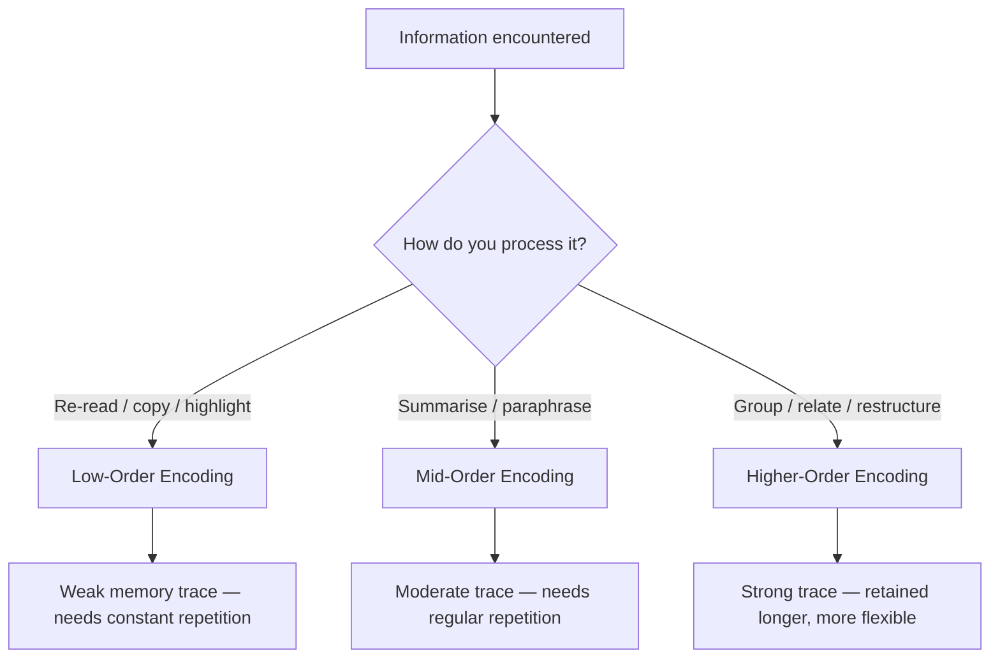
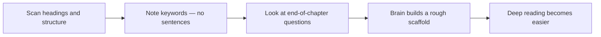
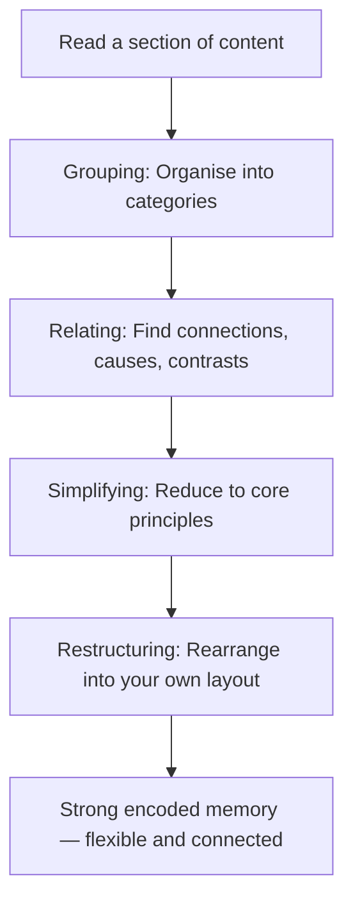
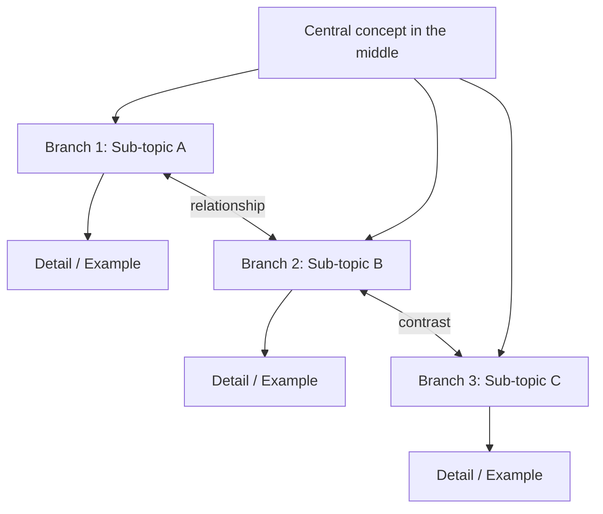
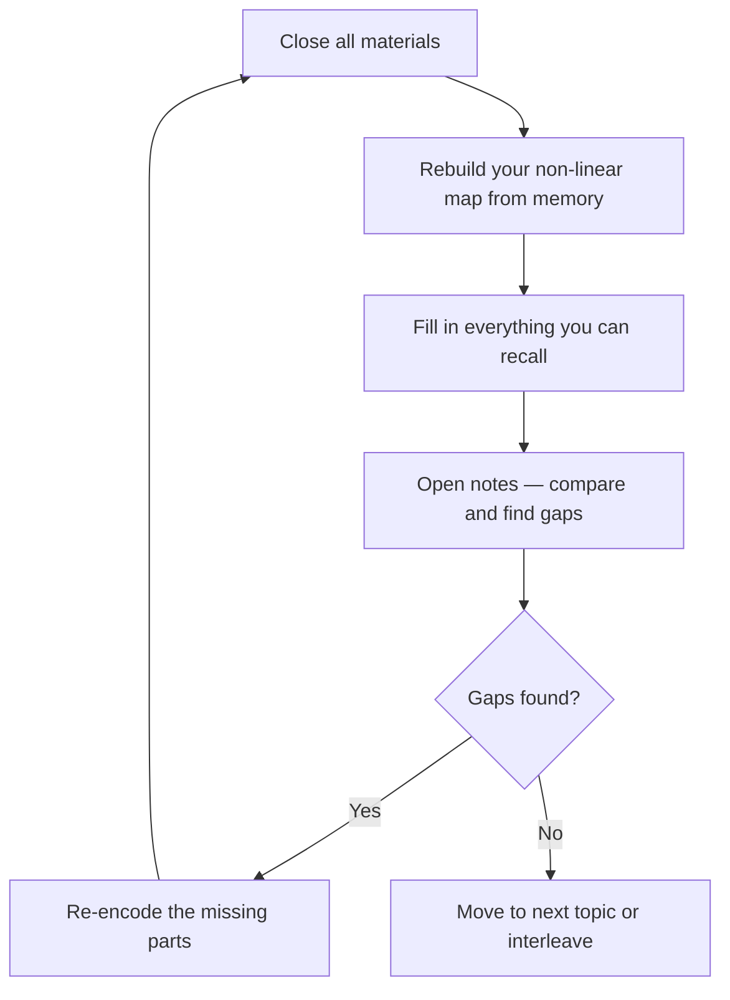
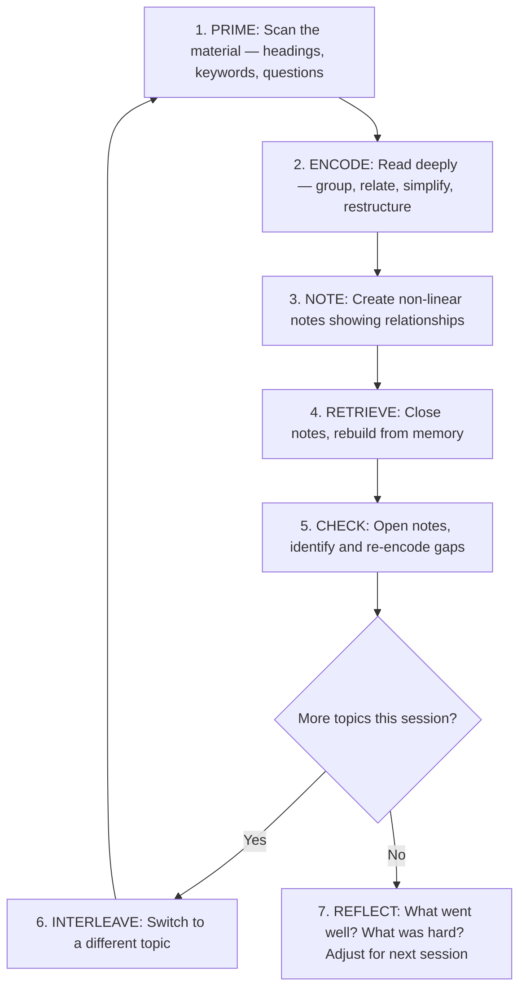
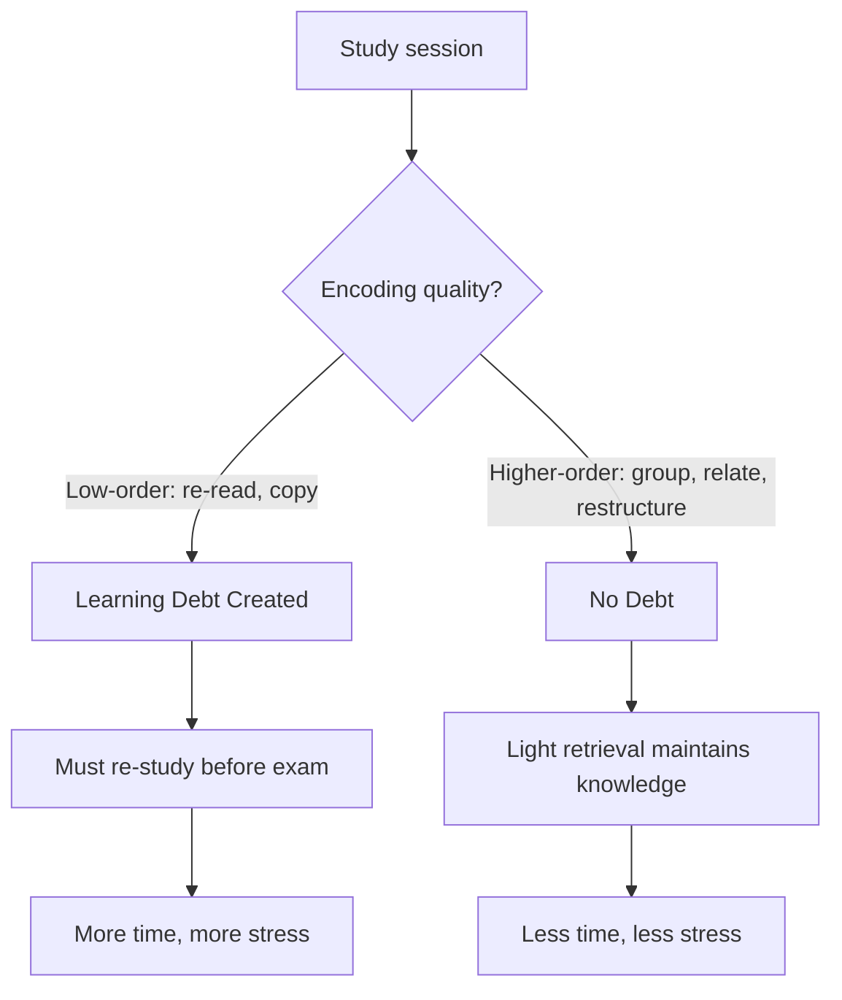
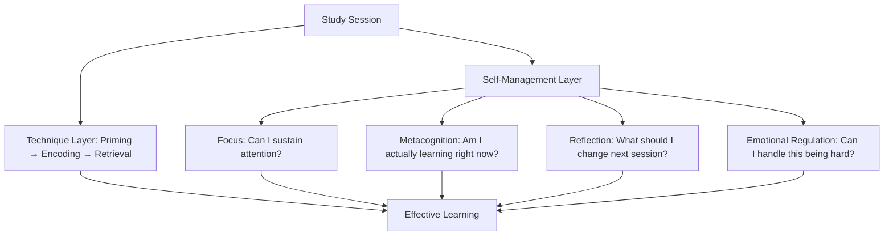

# Justin Sung's Learning Techniques — Higher-Order Learning

> **Audience:** High school students (Years 9–13)  
> **Purpose:** Summarise the core learning techniques taught by Dr Justin Sung (iCanStudy), explain the science behind them, and provide practical steps you can try immediately.  
> **Source:** Dr Justin Sung's publicly available YouTube content, the iCanStudy programme curriculum, and the HUDLE™ framework. This is a summary — not a substitute for his full course.

---

## Who Is Justin Sung?

Dr Justin Sung is a medical doctor turned learning coach. He founded **iCanStudy**, an evidence-based learning programme used by over 30,000 students and professionals worldwide. His approach is rooted in cognitive science — specifically **levels of processing theory**, **cognitive load management**, and **self-regulated learning**.

His central argument:

> Most students use **low-order** study methods (re-reading, copying, highlighting) that feel productive but create shallow memory traces. **Higher-order** methods — grouping, relating, restructuring — require more effort but produce deeper, longer-lasting understanding.

---

## The Core Problem: Low-Order vs Higher-Order Learning

Justin Sung divides study techniques into a spectrum from low-order to higher-order processing:

| Level | What it looks like | Memory strength |
|---|---|---|
| **Low-order** | Re-reading, copying notes, highlighting, passive flashcards | Weak — forgotten quickly |
| **Mid-order** | Summarising, basic mind maps, paraphrasing | Moderate — requires lots of repetition |
| **Higher-order** | Grouping, finding relationships, restructuring, applying to new contexts | Strong — retained long-term with less repetition |

The key insight: **the way you process information during study determines how well you remember and use it later.** Spending 3 hours on low-order study can be less effective than 45 minutes of higher-order encoding.

---

## The Study Session Framework

Justin Sung structures a study session into distinct phases. Each phase has a specific cognitive purpose.

### 1. Priming

Before reading or studying a topic in depth, **scan it first**. Don't try to learn — just get familiar.

**What to do:**
- Scan headings, subheadings, diagrams, and bold terms
- Read the first and last sentence of each section
- Look at any questions or exercises at the end
- Note keywords — don't write sentences

**Why it works:**  
Priming reduces cognitive load. When you encounter the material a second time, your brain already has a rough scaffold — so it can focus on understanding instead of orienting.

**Watch: Spend 1 Hour Studying to Save 20 Hrs Later (Priming)**
<iframe width="560" height="315" src="https://www.youtube.com/embed/tkkey3ADfCI" title="YouTube video player" frameborder="0" allow="accelerometer; autoplay; clipboard-write; encrypted-media; gyroscope; picture-in-picture; web-share" referrerpolicy="strict-origin-when-cross-origin" allowfullscreen></iframe>

---

### 2. Encoding (Deep Processing)

This is the core of Justin Sung's method. Encoding is the process of **actively building meaning** from what you read — not just recording it.

There are several encoding techniques he teaches, in rough order of increasing power:

#### a) Grouping

Take a list of facts or ideas and **organise them into categories**. Don't just copy them in the order the textbook presents them — restructure them in a way that makes sense to you.

| Type | Example |
|---|---|
| **Ordered grouping** | Steps in a process arranged chronologically |
| **Unordered grouping** | Related concepts clustered by theme (e.g., "things that affect X") |
| **Hierarchical grouping** | Big ideas at the top, details nested underneath |

#### b) Relating (Finding Connections)

Go beyond grouping — actively ask:
- How does this idea **connect** to that idea?
- What is the **cause** and what is the **effect**?
- How is this **similar to** or **different from** something I already know?
- What would happen **if this changed**?

#### c) Simplifying

Take a complex idea and reduce it to its **essential principle**. If you can explain it simply, you understand it deeply.

#### d) Restructuring

Rearrange the material into a layout that matches **how your brain connects the ideas** — not how the textbook ordered them. This is where non-linear notes come in.

**Watch: How To Encode Information Like A Genius (12 Rules)**
<iframe width="560" height="315" src="https://www.youtube.com/embed/jdMJcrqZuC8" title="YouTube video player" frameborder="0" allow="accelerometer; autoplay; clipboard-write; encrypted-media; gyroscope; picture-in-picture; web-share" referrerpolicy="strict-origin-when-cross-origin" allowfullscreen></iframe>

---

### 3. Non-Linear Note-Taking

This is one of Justin Sung's most distinctive recommendations. Instead of writing notes top-to-bottom in lines, use a **spatial, non-linear layout** — similar to mind maps but with more emphasis on relationships.

#### Linear vs Non-Linear Notes

| Linear notes | Non-linear notes |
|---|---|
| Written top to bottom, left to right | Spread across the page spatially |
| Follow the textbook's order | Follow **your understanding's** order |
| Easy to write, hard to review | Harder to write, much faster to review |
| Show sequence | Show **relationships** |

#### How to take non-linear notes

1. **Start with a central concept** in the middle of the page (or screen)
2. **Branch out** to related ideas — not in the order they appeared, but grouped by meaning
3. **Draw connections** between branches (arrows, lines, labels)
4. Use **short keywords**, not full sentences
5. **Reorganise** as you learn more — move things, redraw connections
6. Use an **infinite canvas tool** (e.g., Concepts app, Excalidraw, Miro, or large paper)

**Watch: Upgrade Your Note-Taking the Easy Way (Flow-Based Notes)**
<iframe width="560" height="315" src="https://www.youtube.com/embed/3uDROfnx2TE" title="YouTube video player" frameborder="0" allow="accelerometer; autoplay; clipboard-write; encrypted-media; gyroscope; picture-in-picture; web-share" referrerpolicy="strict-origin-when-cross-origin" allowfullscreen></iframe>

> **Key principle:** The act of deciding *where to place* an idea on the page is itself a form of encoding. It forces you to think about how ideas relate — which is the whole point.

---

### 4. Retrieval (Active Recall)

After encoding, **close your materials and try to rebuild** what you learned from memory.

**What to do:**
- Close the textbook or notes
- On a blank page, draw out the non-linear map from memory
- Fill in as much as you can
- Open your notes and check what you missed
- Focus extra attention on the gaps

This is more effective than re-reading because **retrieval strengthens memory traces** — the effort of pulling information out of your head is what makes it stick.

---

### 5. Interleaving

Instead of studying one topic exhaustively before moving to the next, **alternate between topics** within a session.

| Blocked practice | Interleaved practice |
|---|---|
| Topic A → Topic A → Topic A → Topic B | Topic A → Topic B → Topic A → Topic C |
| Feels easier | Feels harder |
| Creates **illusion** of mastery | Creates **actual** flexible knowledge |

**Why it works:**  
Interleaving forces your brain to discriminate between topics — "Is this a Topic A situation or a Topic B situation?" — which is exactly what assessments require.

---

## The Full Study Session — Putting It All Together

A complete study session using Justin Sung's techniques follows this flow:

---

## The Learning Debt Concept

Justin Sung warns against **learning debt** — the accumulation of poorly encoded material that you plan to "revise later."

| Concept | Meaning |
|---|---|
| **Learning debt** | Material you studied but didn't encode well — requires future rework |
| **No debt** | Material encoded deeply the first time — only needs light retrieval to maintain |

> Every hour you spend on low-order study creates **debt** — you'll need to spend more hours later to compensate. Higher-order encoding upfront **eliminates most of that debt.**

---

## The HUDLE™ Framework

Justin Sung's iCanStudy programme is built on the **HUDLE™** framework — a model for training learning skills systematically:

| Letter | Component | Meaning |
|---|---|---|
| **H** | Higher-order learning | Processing information at a deep, connected level |
| **U** | Unconventional methods | Moving beyond mainstream study advice (re-reading, highlighting) |
| **D** | Deliberate practice | Treating learning itself as a skill you train intentionally |
| **L** | Lifelong application | Skills that transfer across subjects, careers, and life stages |
| **E** | Evidence-based | Grounded in cognitive science and learning psychology |

---

## The Self-Management Layer

Justin Sung emphasises that technique alone is not enough. You also need to manage:

- **Focus and attention** — building the ability to sustain deep work
- **Metacognition** — thinking about how you're thinking ("Am I actually encoding, or just reading?")
- **Reflection** — reviewing your study process after each session, not just the content
- **Emotional regulation** — handling frustration, boredom, and overwhelm without defaulting to low-order coping strategies

---

## Common Misconceptions

| Misconception | Reality |
|---|---|
| "More hours = better grades" | **Quality of processing** matters more than time spent |
| "I need to memorise everything" | Focus on **understanding relationships** — details attach to strong frameworks |
| "Mind maps are just pretty notes" | A mind map only works if it forces you to **think about structure and connections** — decorating is irrelevant |
| "Flashcards are the best tool" | Flashcards are useful for **low-order details** (dates, vocab) but poor for **higher-order understanding** |
| "I should study one subject for hours" | **Interleaving** is harder but produces more flexible knowledge |
| "This method should feel easy" | Higher-order encoding **feels harder** — that's the signal it's working |

---

## Practical Quick Start — Try This Week

If you want to experiment with Justin Sung's approach, start with **one subject** and **one session**:

1.  Pick a topic you find difficult
2.  Spend 5 minutes **priming** (scanning)
3.  Read one section, stop, and ask "**How does this relate to X?**"
4.  Draw a **non-linear map** of that section without looking
5.  Check your gaps and fix them

---

*End of Justin Sung's Learning Techniques*