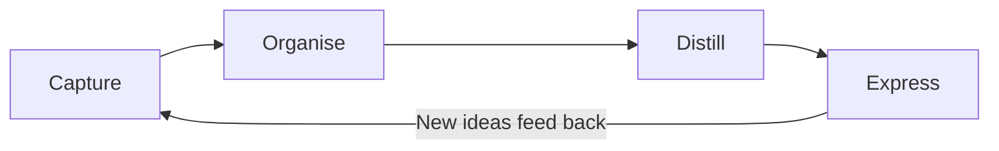
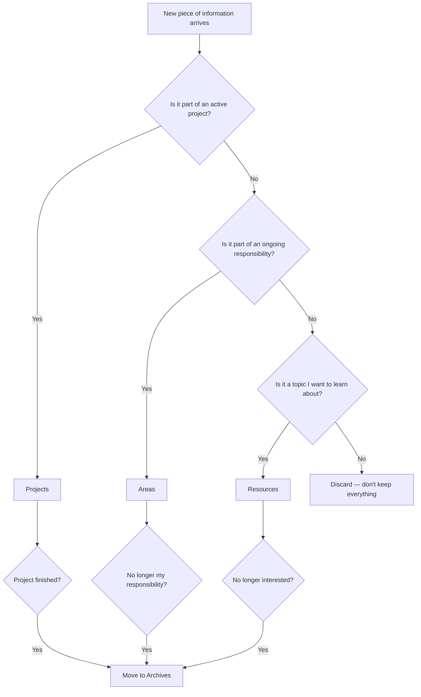
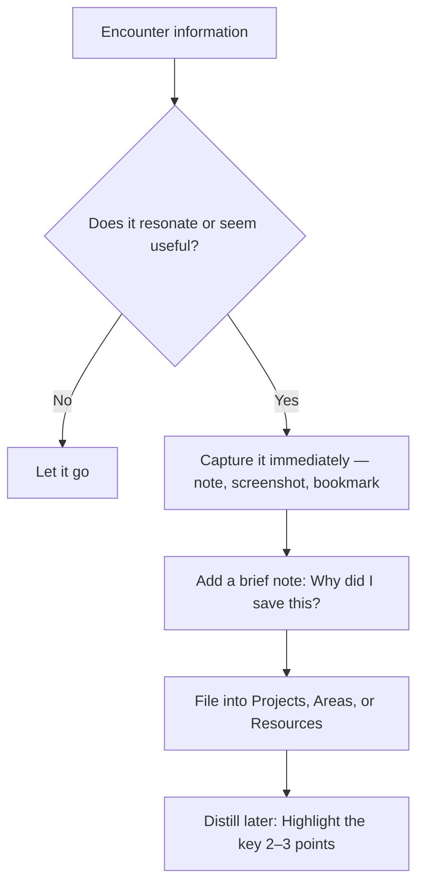
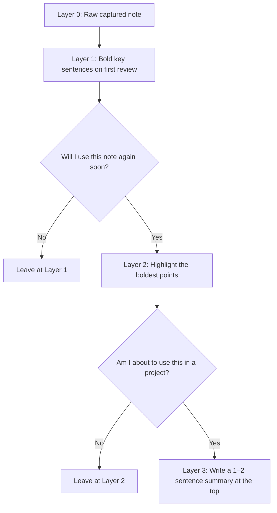
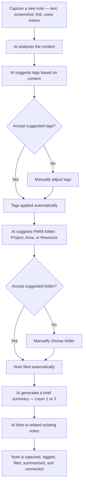
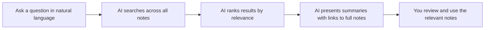
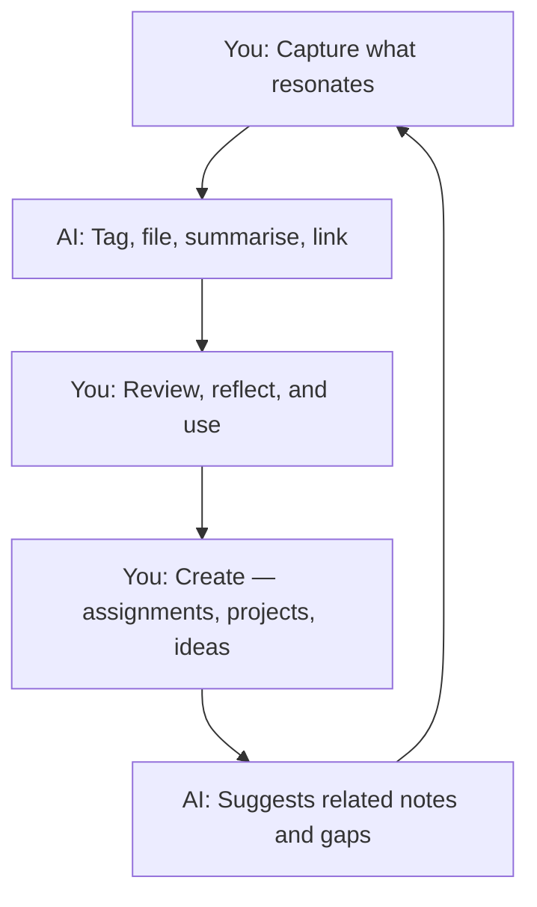
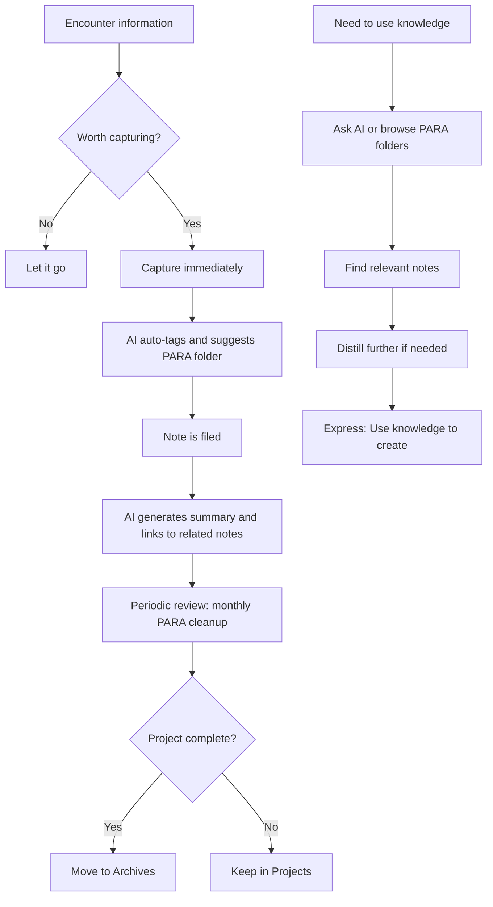

# Building a Second Brain & the PARA Method

> **Audience:** High school students (Years 9–13)  
> **Purpose:** Introduce the concept of a "Second Brain" — a personal system for capturing, organising, and retrieving knowledge — and the PARA framework that underpins it.

---

## The Problem

You consume far more information than you can hold in your head:
- lessons, tutorials, and videos
- websites, articles, and social media posts
- project notes, code snippets, and design ideas
- conversations, feedback, and personal reflections

Most of this is **lost within days** unless you have a system to capture it.

The solution is not to remember more.  
The solution is to **offload remembering** to a trusted external system.

---

## What Is a "Second Brain"?

A Second Brain is a **personal knowledge management system** — a place outside your head where you store, organise, and retrieve everything you learn and think.

The term was popularised by **Tiago Forte**, who argues that the most valuable skill in the information age is not learning more, but **organising what you already know** so you can find and use it when it matters.

### Core Principles

| Principle | What it means |
|---|---|
| **Capture** | Save anything that resonates — don't rely on memory |
| **Organise** | File information by *how you will use it*, not by *where it came from* |
| **Distill** | Summarise and highlight so future-you can scan quickly |
| **Express** | Use your stored knowledge to create — assignments, projects, ideas |

These four steps form the **CODE** workflow:

### What goes into a Second Brain?

- Class notes and summaries
- Screenshots of useful diagrams or code
- Links to helpful videos or tutorials
- Your own reflections and "aha" moments
- Project plans, checklists, and templates
- Feedback from teachers
- Quotes, definitions, and key concepts

The rule is simple: **if it might be useful later, capture it now.**

---

## The PARA Method

PARA is an **organising framework** — four top-level folders that cover everything in your life.

| Folder | Contains | Time horizon |
|---|---|---|
| **P** — Projects | Active work with a deadline and a clear outcome | Days to weeks |
| **A** — Areas | Ongoing responsibilities you maintain over time | Continuous |
| **R** — Resources | Topics you're interested in or learning about | Reference |
| **A** — Archives | Completed or inactive items from the other three | Done |

### How PARA differs from traditional folders

Most people organise by **subject** (Science, Maths, DGT) or by **type** (Documents, Images, Notes).

PARA organises by **actionability** — how close something is to being used right now.

### PARA in practice — a student example

| Folder | Example contents |
|---|---|
| **Projects** | `11DGT Assessment 1 — Programming`, `Science Fair Poster`, `English Essay Draft` |
| **Areas** | `School`, `Part-time Job`, `Health & Fitness`, `Music Practice` |
| **Resources** | `GDScript Reference`, `Blender Shortcuts`, `Design Principles`, `Study Techniques` |
| **Archives** | `Year 10 DGT Notes`, `Completed Science Fair 2025`, `Old English Essays` |

### Rules for using PARA

1. **Every item lives in exactly one folder** — no duplicates across categories
2. **Projects have a finish line** — if it doesn't have a deadline or deliverable, it's an Area
3. **Move, don't delete** — when a project finishes, move it to Archives (you may need it later)
4. **Review monthly** — spend 10 minutes moving completed projects to Archives and cleaning up

---

## The Capture Habit

The most important part of a Second Brain is not the tool — it is the **habit of capturing**.

### What to capture

| Capture this | Why |
|---|---|
| Ideas that surprise you | Surprise = new understanding |
| Things you want to remember | If you have to think "I should remember this", write it down |
| Useful examples or explanations | Saves time when revising or doing assessments |
| Your own summaries | Rephrasing proves understanding |
| Mistakes and corrections | Learning from errors is high-value |

### When to capture

- During or immediately after class
- While watching a tutorial or reading
- When an idea occurs to you (even outside school)
- During project work — capture decisions and reasoning

### The process

---

## Distilling — Progressive Summarisation

Captured notes are only useful if you can **scan them quickly** later. Tiago Forte recommends **Progressive Summarisation** — a layered highlighting system:

| Layer | What you do | When |
|---|---|---|
| **Layer 0** | Original captured note | At capture time |
| **Layer 1** | Bold the key sentences | First review |
| **Layer 2** | Highlight the boldest points | Second review |
| **Layer 3** | Write a 1–2 sentence executive summary at the top | When preparing to use the note |

You do **not** summarise everything to Layer 3. Most notes stay at Layer 0 or 1. Only notes you actively reuse get progressively distilled.

---

## Tools for a Student Second Brain

You do not need expensive or complex software. Any tool that lets you **capture quickly**, **organise into folders**, and **search** will work.

| Tool | Type | Good for |
|---|---|---|
| **Notion** | All-in-one workspace | Full PARA setup, databases, templates |
| **Obsidian** | Local Markdown notes | Linked notes, graph view, privacy |
| **Google Keep / Apple Notes** | Quick capture | Fast capture on your phone |
| **OneNote** | Notebook-style | Freeform notes, drawing, class notebooks |
| **Google Drive / OneDrive** | File storage | Organising documents, slides, and media |
| **A physical notebook** | Paper | Sketch-noting, diagrams, no distractions |

The best tool is the one you **actually use consistently**.

---

## AI as an Organising Agent — A Modern Take

Traditional Second Brain systems rely on **you** to tag, file, and summarise every piece of information. This creates friction — and friction kills habits.

Modern AI tools can act as a **tagging and organising agent**, handling the tedious parts of knowledge management so you can focus on thinking.

### What AI can do in a Second Brain

| Task | How AI helps |
|---|---|
| **Auto-tagging** | AI reads your captured note and suggests or applies tags (e.g., `#programming`, `#assessment`, `#game-design`) |
| **Auto-filing** | AI classifies a new note into the correct PARA folder based on its content |
| **Summarisation** | AI generates a Layer 2 or Layer 3 summary so you don't have to |
| **Linking** | AI identifies related notes you've already captured and suggests connections |
| **Search** | Instead of keyword search, you ask a question in natural language and AI finds the relevant notes |
| **Gap detection** | AI reviews your notes for a topic and flags areas where you have no coverage |

### The AI-assisted capture-and-organise flow

### The AI-assisted retrieval flow

Instead of browsing folders or remembering where you saved something, you ask:

> *"What notes do I have about input validation in GDScript?"*  
> *"Show me everything related to my programming assessment."*  
> *"What did I learn about the IPO model?"*

### Tools that support AI-assisted organising

| Tool | AI capabilities |
|---|---|
| **Notion AI** | Summarisation, auto-fill databases, Q&A over your workspace |
| **Mem** | AI-first — auto-organises notes, no folders required, smart search |
| **Obsidian + plugins** | Community plugins for AI tagging, linking, and summarisation (e.g., Smart Connections, Copilot) |
| **Microsoft Copilot + OneNote** | Summarise pages, generate to-do lists, answer questions from your notebooks |
| **Google NotebookLM** | Upload sources, ask questions, AI generates study guides and summaries |
| **Reflect** | AI-powered backlinks, summarisation, and daily review |

### Important boundaries

AI is an **organising assistant**, not a replacement for thinking.

| AI should | AI should not |
|---|---|
| Tag and file your notes | Decide what is important to you |
| Summarise what you captured | Replace your own understanding |
| Find connections you missed | Generate notes you never wrote |
| Speed up retrieval | Become the only place you "think" |

The value of a Second Brain is that **you** captured the information because it mattered to you. AI helps you **find and structure** it — but the thinking is still yours.

---

## Putting It All Together

A complete Second Brain workflow — traditional + AI-enhanced:

### Weekly review checklist

- [ ] Clear your capture inbox — file or discard every item
- [ ] Check each active Project — is it still active? Move to Archives if done
- [ ] Review Areas — any new responsibilities to add?
- [ ] Scan Resources — anything no longer interesting? Archive it
- [ ] Let AI suggest connections or gaps you may have missed

---

## Summary

| Concept | One-sentence summary |
|---|---|
| **Second Brain** | An external system where you store everything you learn so you can find and use it later |
| **CODE** | Capture → Organise → Distill → Express |
| **PARA** | Organise by actionability: Projects, Areas, Resources, Archives |
| **Progressive Summarisation** | Layer highlights over time — only invest effort in notes you reuse |
| **AI as organiser** | Let AI handle tagging, filing, and summarising — you handle the thinking |

Start small. Pick one tool, set up four PARA folders, and commit to capturing for one week. The system grows with you.

---

*End of Building a Second Brain & the PARA Method*
